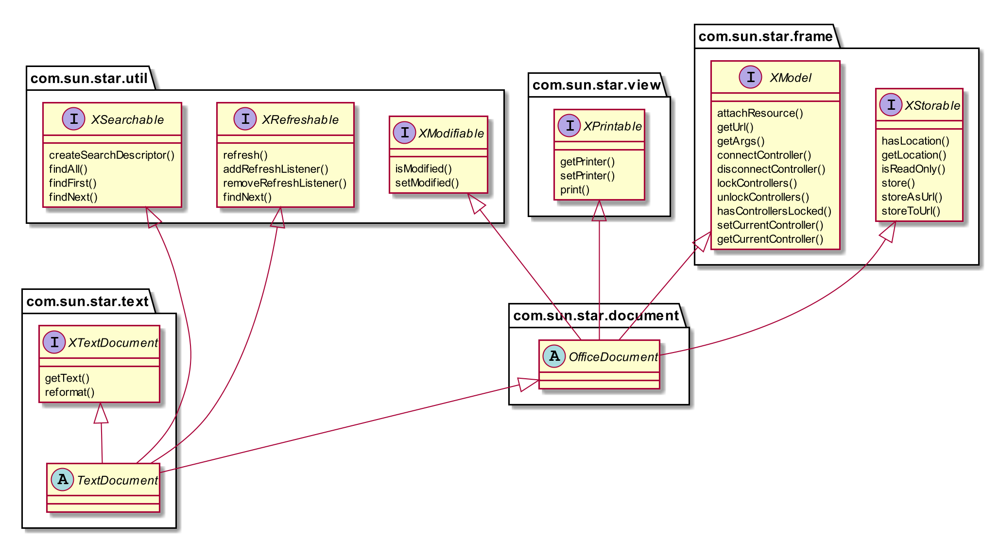
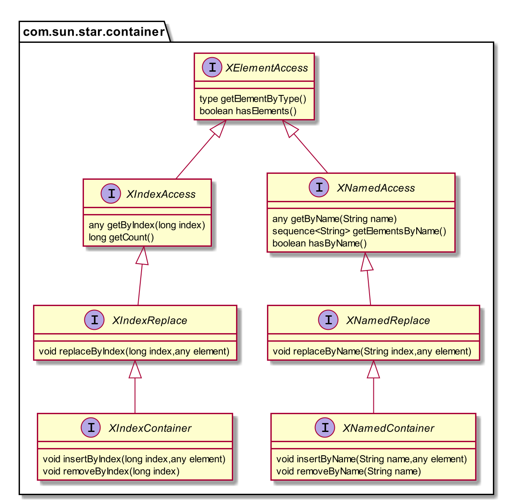
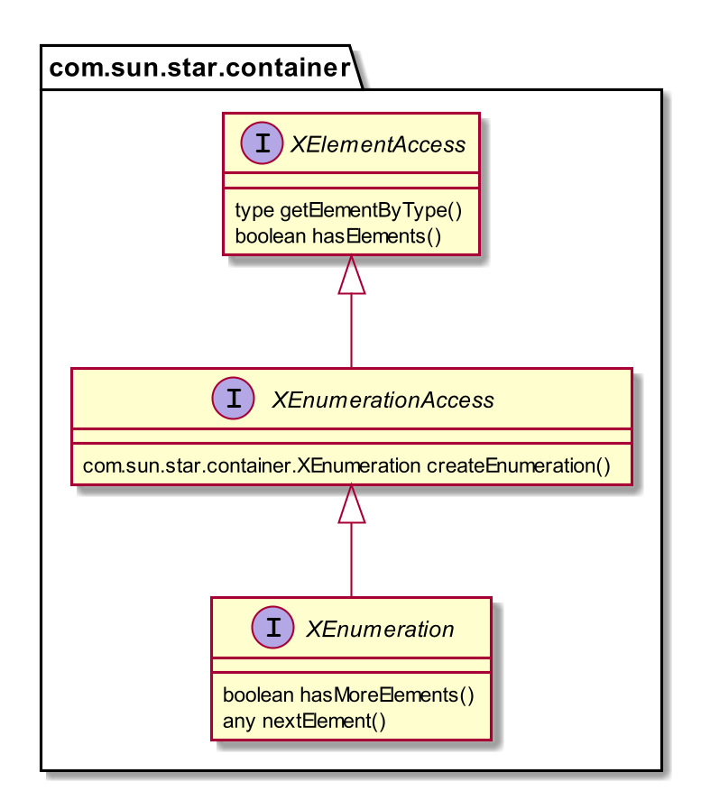
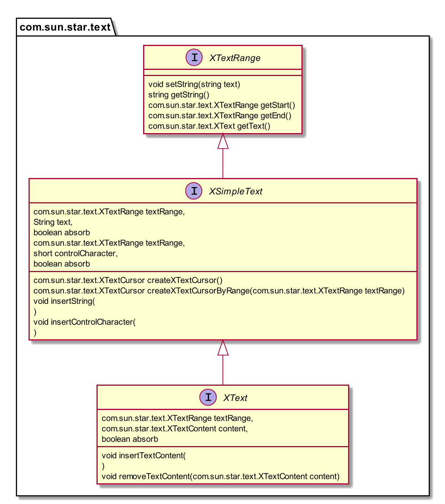
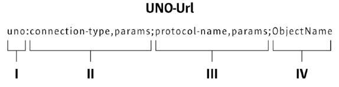
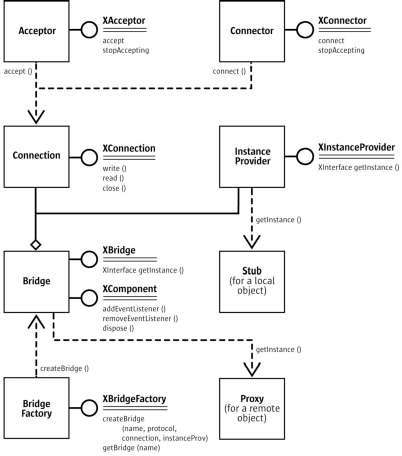
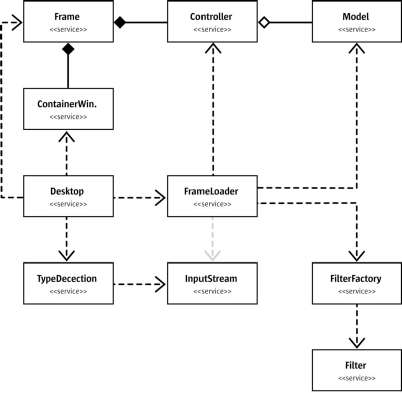
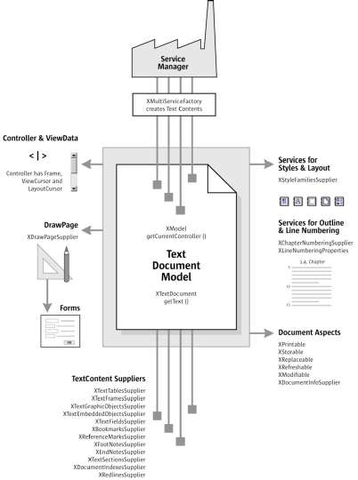

= OpenOffice开发者手册
BladeMasterKing <wang_jiansheng@hotmail.com>
v1.0 , 2020-07-06
:doctype: book
:encoding: utf-8
:lang: zh_cn
:toc: left
:numbered:

:toc:

== 起步
=== 简介
[%heardbreaks]
UNO(Universal Network Objects)是OpenOffice的基本组件，支持的编程语言是JAVA和C++

==== 第一次接触
[%heardbreaks]
自从OpenOffice 2.0 开始，获得一个使用UNO功能和office功能的工作环境很简单。下面演示了如何编写和构建一个初始化UNO的小程序，这意味着从内部连接office，或者在必要时开启一个新的office进程，并且它告诉你它是否能够获取ofice service manager对象提供的office component context。

代码：
[source,java]
----
public class FirstUnoContact{
    public static void main(String[] args){
        try{
            //获取远程office组件上下文
            com.sun.star.uno.XComponentContext xContext = com.sun.star.comp.helper.Bootstrap.bootstrap();
            System.out.println("Connected to a running office ...");
            com.sun.star.lang.XMultiComponentFactory xMCF = xContext.getServiceManager();
            String available = (xMCF != null ? "available" : "not available");
            System.outprintln("remote ServiceManager is" + available);
        } catch(java.lang.Exception e){
            e.printStackTrace();
        } finally {
            System.exit(0);
        }
    }
}
----

==== Service Managers
[%heardbreaks]
UNO服务管理器，可以被认为是创建服务的工厂。目前，将服务看作UNO对象就足够了，这些对象可用于执行特定的任务。稍后，我们将为术语服务给出更精确的定义。例如，以下服务是可用的

* com.sun.star.frame.Desktop + 
维护加载的文档：用于加载文档，获取当前文档，并访问所有加载的文档
* com.sun.star.configuration.ConfigurationProvider + 
生产访问OpenOffice的配置，在软件 Tools > Options对话框的配置
* com.sun.star.sdb.DatabaseContext + 
保存在OpenOffice中注册的数据库
* com.sun.star.system.SystemShellExecute
执行在当前平台注册的应用注册的系统命令或文档
* com.sun.star.text.GlobalSettings
管理文本文档的全局视图和打印设置

服务总是有一个组件上下文，包含创建服务的服务管理器和其他用于服务的数据。
_FirstUnoContact_ 类文件被认为是一个OpenOffice进程的客户端，在这方面OpenOffice是服务端。服务端有自己的组件上下文和服务管理器，这些允许客户端程序访问来使用 _office_ 功能，客户端程序初始化UNO并从OpenOffice进程得到组件上下文。在内部，初始化流程创建本地服务管理器，建立一个运行OpenOffice进程(如果有必要将启动一个新的进程)的管道连接并返回远程组件上下文。第一步，这是唯一需要了解的内容。_com.sun.star.comp.helper.Bootstrap.bootstrap()_ 方法初始化UNO并返回一个运行的OpenOffice进程的远程组件上下文(RemoteComponentContext)，你可以发现关于引导UNO的更多细节，在UNO概念中，不同连接类型的机会以及如何建立到UNO服务器进程的连接。

在第一步初始化之后，可以调用 _com.sun.star.uno.XComponentContext:getServiceManager()_ 从组件上下文来获取远程服务管理器，提供通过API来访问office 的功能。

==== 失败的连接
远程连接在以下条件下可能会失败： 

* 客户端程序应该能检测到错误。例如有时网桥可能不可用，连接到office、执行某个任务然后退出的简单客户端应该停止工作，并在出现错误时通知用户。 
* 需要长时间运行的客户端不应该假设对初始对象的引用在客户机的整个运行时都是有效的。即使因为某种原因客户端连接中断，也应该在不久后恢复。当连接失败时，一个健壮的、长时间运行的客户端应该停止当前的工作，通知用户连接不可用，并释放对远程进程的引用。当用户尝试重复最后一个操作时，客户端应该尝试重新构建连接，不要因为连接暂时不可用而强迫用户重新启动程序。

当网桥不可用并尝试访问时，客户端连接抛出异常(com.sun.star.lang.DisposedException)，每当在程序中访问远程时，以将远程引用设置为null并相应地通知用户这样的方式捕获此异常。如果您的客户端被设计为运行较长时间，那么当您发现新的远程引用为空时，请做好获取这些引用的准备。

处理连接丢失的更复杂的方法是在底层桥接对象上注册侦听器。在章节UNO进程间通信中展示了怎样写连接感知的客户端。

=== 如何在OpenOffice中获取对象
____
我们上下文中的对象是一个软件工件，它具有您可以调用的方法。对象需要使用OpenOffice.org做一些事情。但是你从哪里得到它们呢?
____

==== 新建对象
通常，新建对象或首次访问必要的对象，由OpenOffice的服务管理器来提供。在 _FirstLoadComponent_ 实例中，远程服务管理器创建了远程 _Desktop_ 对象用来处理应用窗口和加载文档。
[source,java]
----
Object desktop = xRemoteServiceManager.createInstanceWithContext("com.sun.star.frame.Desktop", xRemoteContext);
----

==== 文档对象
文档对象代表文件已经使用OpenOffice打开，由 _Desktop_ 对象创建，其 _loadComponentFromURL()_ 方法可以实现这个目标。

==== 其他对象提供的对象
对象可以分发其他对象，有两个案例：

* 可以通过OpenOffice API中的get方法获得，被设计为提供该特性的对象不可分割的一部分的特性，从get方法获取对象是很常见的。例如， _getSheets()_ 是每个Calc文档必须的 ，_getText()_ 对于Writer文档是必须的，_getDrawpages()_ 对于每个Draw文档是必须的。加载文档后，使用这些方法获取相应文档的Sheets、Text和Drawpages对象。特定于对象的get方法是获取对象的一项重要技术。
* 对于一个对象的体系结构来说，不被认为是不可或缺的特性可以通过一组通用的方法来访问。在OpenOffice中，这些特性被叫做属性，并使用了泛型方法，例如 _getPropertyValue(String propertyName)_ 方法来访问他们。在某些情况下，这样的非整体特性作为对象来提供，因此，getPropertyValue()方法可以是对象的另一个来源。例如，电子表格的页面样式有 _RightPageHeaderContent_ 和 _LeftPageHeaderContent_ 属性，它们包含电子表格文档的页面标题部分的对象。通用的 _getPropertyValue()_ 方法有时可以提供你需要的对象。

==== 对象集合
[%hardbreaks]
对象可以是一组类似对象中的元素，在集合中，要访问一个对象，你需要知道如何从集合中获取特定元素。OpenOffice的API允许四种方式在集合中提供元素。前三种方式是具有元素访问方法的对象，允许通过名称、索引或枚举进行访问。第四种方法是一个没有访问方法，但可以作为数组直接使用的元素序列。怎样使用这些元素集合稍后讨论。
对象的设计者根据对象的特殊条件，决定提供哪些机会，例如它如何远程执行，或者哪些访问方法最好与实现一起工作。

=== 使用对象

使用OpenOffice的API对象包含以下内容：

* 首先，我们将学习UNO对象、接口、服务、特性和属性的概念，并且了解UNO的使用方法。
* 然后，我们将首次使用OpenOffice.org文档，并给出OpenOffice.org API中最常见类型的用法提示。
* 最后，我们将介绍一些公共接口，这些接口允许您跨所有OpenOffice文档类型使用文本、表和绘图。

==== 对象、接口、服务
[%hardbreaks]
*对象*
在UNO中，对象是一种软件构件，它具有可以调用的方法和可以获取和设置的属性。对象提供的方法和属性通过它所支持的接口集合指定。
*接口*
接口指定一组属性和方法，它们共同定义对象的一个切面。例如， _com.sun.star.resource.XResourceBundle_ 接口指定了 _Parent_ 属性， _getLocale()_ 和 _getDirectElement()_ 方法。
[source,java]
----
interface XResourceBundle: com::sun::star::container::XNameAccess {
    [attribute] XResourceBundle Parent;
    com::sun::star::lang::Locale getLocale();
    any getDirectElement([in] string key);
}
----
[%hardbreaks]
为了允许重用这些接口规范，接口可以继承一个或多个其他接口（例如， _com.sun.star.resource.XResourceBundle_ 继承了 _com.sun.star.container.XNameAccess_ 所有的属性和方法）。OpenOffice 2.0 引入了接口的多重继承，即实现多个接口的能力。
严格来说，UNO中不需要接口的属性。每个属性能够表示为获取属性值的一种方法和设置属性值的另一种方法的组合（或者只使用一个方法获取只读属性的值）。然而，在UNO的接口中包含属性有两个很好的理由：第一，这种get和set值结合的方式已经足够广泛来保证额外的扩展；第二，通过属性，接口设计者可以更好地表达对象不同特性之间的细微差别。属性可用于那些不被认为是对象的整体或结构部分的特性，显式方法被保留用于访问核心特性。在历史上，UNO对象通常支持一组许多独立的接口，这些接口对应于它的许多不同方面。使用多继承接口，就不那么需要这样做了，因为一个对象现在只支持一个接口，该接口继承自构成对象各个方面的所有其他接口。
*服务*
历史上，在UNO中“服务”一词的含义并不明确。从OpenOffice 2.0 开始，底层概念变得更加清晰。不幸的是，在UNO中“服务”这个术语还有两种不同的含义。在下面，我们将使用术语“新型服务”来表示实体，符合清晰的OpenOffice 2.0 的概念，而我们使用“旧式服务”来表示一个实体，只符合历史，更模糊的概念。使问题更加复杂的是，在UNO之外的上下文中，服务这个术语通常具有不同的含义。
虽然从技术上讲应该不再需要老式的服务，但是OpenOffice的API仍然广泛地使用它们以保持向后兼容。因此，在使用OpenOffice的API时，请准备好同时使用这两种服务概念。
*新型服务*
[source,java]
----
module com { module sun { module star { module bridge {
    serviceUnoUrlResolver: XUnoUrlResolver;
}; }; }; };
----
[%hardbreaks]
指定支持某个接口（例如 _com.sun.star.bridge.XUnoUrlResolver_）的对象，在某个服务名称（如 _com.sun.star.bridge.UnoUrlResolver_）下可用，在组件上下文的服务管理器。(在形式上，“新型服务”被称为基于单接口的服务。)
各种UNO语言绑定提供了特殊的构造，只要给定合适的组件上下文，就可以容易地获得这种新型服务的实例;请参阅Java语言绑定和c++语言绑定。
*旧型服务（正式称谓是“基于累加的服务”）*
[source,java]
----
module com { module sun { module star { module frame {serviceDesktop {
    service Frame;
    interface XDesktop;
    interface XComponentLoader;
    interface com::sun::star::document::XEventBroadcaster;
};
}; }; }; };
----
用于指定以下任何一项：

* 一般的约定是，如果一个对象被记录为支持某个旧样式的服务，那么您可以期望该对象支持由服务本身导出的所有接口和任何继承的服务。例如， _com.sun.star.frame.XFrames:queryFrames_ 返回了一序列的对象，它应该全部支持旧型服务 _com.sun.star.frame.Frame_ ，这些所有的接口都是 _com.sun.star.frame.Frame_ 导出的。
* 另外，一个旧形式的服务可以指定一个或多个属性：
[source,java]
----
module com { module sun { module star { module frame {service Frame {
    interface com::sun::star::frame::XFrame;
    interface com::sun::star::frame::XDispatchProvider;
    // ...
    [property] string Title;
    [property, optional] XDispatchRecorderSupplier RecorderSupplier;
    // ...
};
}; }; }; };
----
与接口属性相似的是，它们描述了对象的附加特性,主要的区别是接口属性可以直接访问，而旧式服务的属性通常通过像 _com.sun.star.beans.XPropertySet_ 这样的通用接口访问，通常，接口属性用于表示对象的整体特性，而属性则表示附加的、更不稳定的特性。

* 一些旧式服务打算在组件上下文的服务管理器中可用。例如，_com.sun.star.frame.Desktop_ 服务能够在组件上下文的服务管理器的 _"com.sun.star.frame.Desktop"_ 服务名称下实例化。（问题是无法判断给定的旧式服务是否打算在组件上下文中可用;而使用新样式的服务则会显式地显示该意图）
* 其他旧式服务被设计成由其他服务继承的通用超级服务。例如，_com.sun.star.document.OfficeDocument_ 服务作为所有不同类型的具体文档服务的通用基础，像 _com.sun.star.text.TextDocument_ 和 _com.sun.star.drawing.DrawingDocument_ 。（多继承接口现在是表达这种通用基础服务的首选机制。）
* 而其他旧式服务只列出属性，根本不导出任何接口。与其他类型的旧式服务那样指定特定对象支持的接口不同，此类服务用于记录一组相关属性，例如，_com.sun.star.document.MediaDescriptor_ 服务列举出所有可以传递给 _com.sun.star.frame.XComponentLoader:loadComponentFromURL_ 的属性。

属性是对象的一个特性，通常不被认为是对象的整体或结构部分，因此可以通过通用的 _getPropertyValue()/setPropertyValue()_ 方法来处理，而不是通过专门的get方法，比如getPrinter()来处理。旧式服务提供一种特殊的语法来列出对象的所有属性。包含属性的对象只需要支持 _com.sun.star.beans.XPropertySet_ 接口准备处理各种属性。典型的例子是字符或段落格式的属性。使用属性，可以通过调用 _setPropertyValues()_ 来设置对象的多个特性，这将极大地提高远程性能。例如，段落支持 _setPropertyValues()_ 方法是通过 _com.sun.star.beans.XMultiPropertySet_ 接口。

==== 使用服务
引入接口和服务的概念有以下原因：

* *接口和服务将规范从实现中剥离* +
接口或服务的规范是抽象的，也就是说，它没有定义支持特定功能的对象如何在内部完成此工作。通过OpenOffice的API的抽象规范，可以从API中提取实现，并在需要时安装不同的实现。
* *服务名允许按规范名而不是按类名创建实例* +
在Java或c++中，使用new操作符创建类实例。这种方法受到限制:您获得的类是硬编码的。在不编辑代码的情况下，您不能稍后通过另一个类来交换它。服务的概念解决了这个问题。OpenOffice中的中心对象工厂(全局服务管理器)被要求创建可用于特定目的的对象，而无需定义其内部实现。这是可能的，因为可以根据服务名称从工厂订购服务，并且工厂决定返回哪个服务实现。获得哪个实现没有区别，您只使用定义良好的服务接口。

*接口*

如果抽象接口是细粒度的（如果它们很小，并且只描述了一个物体的单一方面），则其可重用性更强。为了描述对象的许多方面，对象可以实现这些细粒度接口中的多个接口。由于能够实现多个接口，因此可以使用相同的代码访问类似对象的类似方面。例如，许多对象支持文本：文本可以在文档主体、文本框、页眉和页脚、脚注、表格单元格和绘图形状中找到。这些对象都支持相同的接口，因此过程可以使用getText()从这些对象中检索文本。

下图展示了旧式服务 _com.sun.star.text.TextDocument_ 的服务、接口和方法，使用UML符号显示的。在此图中，服务显示在左侧。服务之间的箭头表示上层服务(箭头)提供的服务被低层服务继承。这些服务导出的接口显示在右侧。OpenOffice的API中的所有接口名称都以X开头，以便与其他实体的名称区别开来。每个接口都包含方法，这些方法列在接口下面。

[%hardbreaks]
_TextDocument_ 对象提供了 _com.sun.star.text.TextDocument_ 服务，服务实现了 _XTextDocument_ , _XSearchable_ , _XRefreshable_ 三个接口，这些接口提供了例如 _getText()_ 方法将文本添加到文档，_findAll()_ 来查找整篇文档。
如箭头所示，_com.sun.star.text.TextDocument_ 也继承了 _com.sun.star.document.OfficeDocument_ 提供的所有接口，所以这些也提供给 _TextDocument_ 对象。这些接口处理OpenOffice应用程序常见的任务：打印 _XPrintable_，排序 _XStorable_，修改 _XModifiable_，模型处理 _XModel_。
图中显示的接口只是 _TextDocument_对象的强制接口，TextDocument具有可选的属性和接口，其中包括属性CharacterCount、ParagraphCount和WordCount，以及接口XPropertySet，如果属性存在，则必须支持该接口。OpenOffice中TextDocument服务的实现还支持必需的和所有可选的接口。在TextDocument这一章详细描述了TextDocument的用法。
c++和Java在访问方法时要求提供接口名。旧式的服务可能提供几个接口来跟踪。新型服务更容易使用，因为它们只有一个接口: multiple-inheritance接口，所以所有方法都通过同一个接口访问。

[%hardbreaks]
*使用接口*
每个UNO对象都必须通过其接口访问这一事实在Java和 c++等语言中具有影响，在这些语言中，编译器需要正确的对象引用类型，然后才能从它调用方法。在Java或c++中，通常只需在访问对象实现的接口之前强制转换对象。当使用UNO对象时，情况就不同了:当您希望访问对象支持的接口的方法，但编译器还不知道时，您必须要求UNO环境为您获取适当的引用。只有这样，你才能安全地抛下它。
ava UNO环境有一个为此目的的方法queryInterface()。乍一看，它看起来很复杂，但是一旦您理解了queryInterface()是关于跨进程边界安全转换UNO类型的，您将很快习惯它。看一下第二个示例FirstLoadComponent.java(如果您在计算机上安装了SDK，则在示例目录中)，其中创建了一个新的桌面对象，然后使用queryInterface()方法获取com.sun.star.frame.XComponentLoader接口。

[source,java]
----
Object desktop = xRemoteServiceManager.createInstanceWithContext( "com.sun.star.frame.Desktop", xRemoteContext);
XComponentLoader xComponentLoader = (XComponentLoader) UnoRuntime.queryInterface(XComponentLoader.class, desktop);
----
我们通知服务管理器它的工厂调用 _createInstanceWithContext()_ 方法创建 _com.sun.star.frame.Desktop_  这个方法被定义为返回一个Java对象类型，这并不奇怪——毕竟工厂必须能够返回任何类型:
[source,java]
----
java.lang.Object createInstanceWithContext(String serviceName, XComponentContext context)
----
我们接收的对象是com.sun.star.frame.Desktop服务。要点是，虽然我们知道我们在工厂中订购的对象是一个DesktopUnoUrlResolver，并在其他接口中导出XComponentLoader接口，但是编译器不知道。因此，我们必须使用UNO运行时环境来询问或查询接口XComponentLoader，因为我们希望在这个接口上使用loadComponentFromURL()方法。方法queryInterface()确保我们获得一个可以转换为所需接口类型的引用，无论目标对象是本地对象还是远程对象.在Java UNO语言绑定中有两种queryInterface定义:

[source,java]
----
java.lang.Object UnoRuntime.queryInterface(java.lang.Class targetInterface, Object sourceObject)
java.lang.Object UnoRuntime.queryInterface(com.sun.star.uno.Type targetInterface, Object sourceObject)
----
因为UnoRuntime.queryInterface()被指定为返回java.lang。与工厂方法createInstanceWithContext()一样，我们仍然必须显式地将接口引用转换为所需的类型。区别在于，在queryInterface()之后，我们可以安全地将对象转换为我们的接口类型，而且最重要的是，该引用现在甚至可以与另一个进程中的对象一起工作。下面是queryInterface()调用，一步一步解释:
[source,java]
----
 XComponentLoader xComponentLoader = (XComponentLoader) UnoRuntime.queryInterface(XComponentLoader.class, desktop);
----
XComponentLoader是我们希望使用的接口，因此我们定义一个名为XComponentLoader的XComponentLoader变量(下端x)来存储我们从queryInterface中期望的接口。然后查询桌面对象的XComponentLoader接口，传入XComponentLoader.class作为目标接口，桌面作为源对象。最后，我们将结果转换为XComponentLoader，并将结果引用分配给变量XComponentLoader。如果源对象不支持我们要查询的接口，queryInterface()将返回null。

在Java中，当您有一个对象的引用，该对象已知支持您需要的接口，但您还没有适当的引用类型时，调用queryInterface()是必要的。幸运的是，您不仅可以从java.lang中使用queryInterface()。对象源类型，但是你也可以从另一个接口引用查询一个接口，像这样:
[source,java]
----
// loading a blank spreadsheet document gives us its XComponent interface: XComponent xComponent = xComponentLoader.loadComponentFromURL( "private:factory/scalc", "_blank", 0, loadProps);
  // now we query the interface XSpreadsheetDocument from xComponent
XSpreadsheetDocument xSpreadsheetDocument = (XSpreadsheetDocument)UnoRuntime.queryInterface(
XSpreadsheetDocument.class, xComponent);
----
此外，如果方法已经定义为返回接口类型，则不需要查询接口，但可以立即使用其方法。在上面的代码片段中，loadComponentFromURL方法被指定为返回com.sun.star.lang。如果您想要得到文档被关闭的通知，那么您可以直接在XComponent变量上调用XComponent方法addEventListener()和removeEventListener()。c++中对应的步骤是通过一个Reference<>模板完成的，该模板以源实例为参数:
[source,java]
----
 // instantiate a sample service with the servicemanager. Reference< XInterface > rInstance =
 rServiceManager->createInstanceWithContext( OUString::createFromAscii("com.sun.star.frame.Desktop" ), rComponentContext );
// Query for the XComponentLoader interface
Reference< XComponentLoader > rComponentLoader( rInstance, UNO_QUERY );
----
在OpenOffice.org Basic中，不需要查询接口;基本的运行时引擎会在内部处理这个问题。随着OpenOffice.org API中多继承接口的增加，显式查询Java或c++中特定接口的需求将减少。例如，假设的接口
[source,java]
----
interface XBase1 {   void fun1();
  };
  interface XBase2 {
      void fun2();
  };
  interface XBoth { // inherits from both XBase1 and XBase2
      interface XBase1;
      interface XBase2;
  };
  interface XFactory {
      XBoth getBoth();};
----
您可以直接在通过XFactory.getBoth()获得的引用上调用fun1()和fun2()，而无需查询XBase1或XBase2。

*使用属性*
对象必须通过允许您使用属性的接口提供其属性。这些接口的最基本形式是接口com.sun.star.beans.XPropertySet。属性还有其他接口，比如com.sun.star.beans。XMultiPropertySet，它通过一个方法调用获取和设置多个属性。当属性出现在服务中时，始终支持XPropertySet。

在XPropertySet中，有两种方法进行属性访问，在Java中定义如下:
[source,java]
----
void setPropertyValue(String propertyName, Object propertyValue)
  Object getPropertyValue(String propertyName)
----
在FirstLoadComponent示例中，XPropertySet接口用于设置单元格对象的CellStyle属性。cell对象是com.sun.star.sheet。SheetCell，因此也支持com.sun.star.table。CellProperties服务，它有一个CellStyle属性。下面的代码解释了这个属性是如何设置的:
[source,java]
----
 // query the XPropertySet interface from cell object XPropertySet xCellProps =
 (XPropertySet)UnoRuntime.queryInterface(XPropertySet.class, xCell);
// set the CellStyle property xCellProps.setPropertyValue("CellStyle", "Result");
----
现在可以开始使用OpenOffice.org文档了。

==== 示例:处理电子表格文档
在本例中，我们将要求远程服务管理器提供远程桌面对象，并使用其loadComponentFromURL()方法创建一个新的电子表格文档。从文档中我们获得了它的sheets容器，我们在其中通过名称插入和访问一个新的工作表。在新的工作表中，我们将值输入A1和A2，并将它们汇总到A3中。汇总单元格的单元格样式将获得单元格样式结果，以便以斜体、粗体和下划线显示。最后，我们将新工作表设置为活动工作表，以便用户可以看到它。将这些导入行添加到上面的FirstConnection示例中:
[source,java]
----
import com.sun.star.beans.PropertyValue;
import com.sun.star.lang.XComponent;
import com.sun.star.sheet.XSpreadsheetDocument; import com.sun.star.sheet.XSpreadsheets; import com.sun.star.sheet.XSpreadsheet;
import com.sun.star.sheet.XSpreadsheetView; import com.sun.star.table.XCell;
import com.sun.star.frame.XModel;
import com.sun.star.frame.XController;
import com.sun.star.frame.XComponentLoader;
----
编辑useConnection方法如下:
[source,java]
----
protected void useConnection() throws Exception {
    try {
        // get the remote office component context
        xRemoteContext = Bootstrap.bootstrap();
        System.out.println("Connected to a running office ...");
        xRemoteServiceManager = xRemoteContext.getServiceManager();
    } catch( Exception e) {
        e.printStackTrace();
        System.exit(1);
    }
    try {
        // get the Desktop, we need its XComponentLoader interface to load a new document
        Object desktop = xRemoteServiceManager.createInstanceWithContext( "com.sun.star.frame.Desktop", xRemoteContext);
        // query the XComponentLoader interface from the desktop
        XComponentLoader xComponentLoader = (XComponentLoader)UnoRuntime.queryInterface(XComponentLoader.class, desktop);
        // create empty array of PropertyValue structs, needed for loadComponentFromURL
        PropertyValue[] loadProps = new PropertyValue[0];
        // load new calc file
        XComponent xSpreadsheetComponent = xComponentLoader.loadComponentFromURL("private:factory/scalc", "_blank", 0, loadProps);
        // query its XSpreadsheetDocument interface, we want to use getSheets()
        XSpreadsheetDocument xSpreadsheetDocument = (XSpreadsheetDocument)UnoRuntime.queryInterface(XSpreadsheetDocument.class, xSpreadsheetComponent);
        // use getSheets to get spreadsheets container
        XSpreadsheets xSpreadsheets = xSpreadsheetDocument.getSheets();
        //insert new sheet at position 0 and get it by name, then query its XSpreadsheet interface
        xSpreadsheets.insertNewByName("MySheet", (short)0);
        Object sheet = xSpreadsheets.getByName("MySheet");
        XSpreadsheet xSpreadsheet = (XSpreadsheet)UnoRuntime.queryInterface(XSpreadsheet.class, sheet);
        // use XSpreadsheet interface to get the cell A1 at position 0,0 and enter 21 as value
        XCell xCell = xSpreadsheet.getCellByPosition(0, 0); xCell.setValue(21);
        // enter another value into the cell A2 at position 0,1 xCell = xSpreadsheet.getCellByPosition(0, 1); xCell.setValue(21);
        // sum up the two cells
        xCell = xSpreadsheet.getCellByPosition(0, 2);
        xCell.setFormula("=sum(A1:A2)");
        // we want to access the cell property CellStyle, so query the cell's XPropertySet interface
        XPropertySet xCellProps = (XPropertySet)UnoRuntime.queryInterface(XPropertySet.class, xCell);
        // assign the cell style "Result" to our formula, which is available out of the box
        xCellProps.setPropertyValue("CellStyle", "Result");
        // we want to make our new sheet the current sheet, so we need to ask the model
        // for the controller: first query the XModel interface from our spreadsheet component
        XModel xSpreadsheetModel = (XModel)UnoRuntime.queryInterface(XModel.class,xSpreadsheetComponent);
        // then get the current controller from the model
        XController xSpreadsheetController = xSpreadsheetModel.getCurrentController();
        // get the XSpreadsheetView interface from the controller, we want to call its method
        // setActiveSheet
        XSpreadsheetView xSpreadsheetView = (XSpreadsheetView)UnoRuntime.queryInterface(XSpreadsheetView.class, xSpreadsheetController);
        // make our newly inserted sheet the active sheet using setActiveSheet
        xSpreadsheetView.setActiveSheet(xSpreadsheet);
    } catch( com.sun.star.lang.DisposedException e ) { 
        //works from Patch 1 xRemoteContext = null;
        throw e;
    }
}
----
或者，您可以从示例目录中添加FirstLoadComponent.java到当前项目中，它包含上面所示的更改。

==== 常见的类型
到目前为止，方法参数和返回值的文字和通用Java类型一直被当作OpenOffice.org API是为Java创建的。但是，必须理解UNO被设计成独立于语言的，因此具有自己的一组类型，必须将这些类型映射到语言绑定所需的适当类型。本节将简要描述类型映射。有关类型映射的详细信息，请参阅Professional UNO。

===== 基本类型
基本UNO类型(术语“basic”与OpenOffice.org basic无关)作为结构体的成员、方法返回类型或方法参数出现。下表显示了基本UNO类型，如果可用，还显示了它们与Java、c++和OpenOffice.org基本类型的确切映射。

.基本类型表
[width="100%",options="header,footer"]
|====================
| UNO | 类型描述 | JAVA | C++ | Basic
| void | 空值,只作为方法返回值 | void | void | - 
| boolean | boolean类型,true或false | boolean | sal_Bool | Boolean 
| byte | 有符号的8位整数字节 | byte | sal_Int8 | Integer 
| short | 有符号的16位整数字节 | short | sal_Int16 | Integer
| unsigned short | 无符号的16位整数字节| - | sal_uInt16 | -
| long | 有符号的32位整数字节 | int | sal_Int32 | Long
| unsigned long | 无符号的32位整数字节 | - | sal_uInt32 | -
| hyper | 有符号64位整数字节 | long | sal_Int64 | -
| unsigned long | 无符号的64位整数字节 | - | sal_uInt64 | -
| float | 单精度浮点型 | float | float | Single
| double | 双精度浮点型 | double | double | Double
| char | 16位Unicode字符类型(更准确地说:UTF-16代码单元) | char | sal_Unicode | -
|====================
对于在该表中没有精确映射的类型，有一些特殊条件。在有关类型的相应部分中检查有关这些类型的详细信息UNO语言绑定中的映射。

*字符串*

UNO认为字符串是简单类型，但由于它们在有些环境需要特殊处理，我们在这里单独讨论。

.字符串类型表
[width="100%",options="header,footer"]
|==========
| UNO | 描述 | JAVA | C++ | Basic
| string | Unicode字符串类型(更准确地说:Unicode标量值的字符串) | java.lang.String | rtl::OUString | String
|==========
在Java中，像使用本机java.lang.String对象一样使用UNO字符串。在c++中，本地字符字符串必须通过SAL转换函数转换为UNO Unicode字符串，通常是rtl::OUString类中的createFromAscii()函数:
[source,c++]
----
//C++
static OUString createFromAscii( const sal_Char * value ) throw();
----
在Basic中，Basic字符串透明地映射到UNO字符串。

*枚举和常量*

OpenOffice API使用许多枚举类型(称为枚举)和常量组(称为常量组)。枚举用来列出a中的每一个可能的值特定的上下文。常量组定义属性、参数、返回值和结构成员的可能值。例如，这是一个enum
[source,java]
----
com.sun.star.table.CellVertJustify
----
它描述了用于垂直调整表单元格内容的可能值。单元格的垂直调整是由它们的属性 _com.sun.star.table.CellProperties:VertJustify_ 决定的。根据 _CellVertJustify_，此属性的可能值是 _STANDARD_ 、_TOP_、_CENTER_和_BOTTOM_。
[source,java]
----
// adjust a cell content to the upper cell border
// The service com.sun.star.table.Cell includes the service
com.sun.star.table.CellProperties
// and therefore has a property VertJustify that controls the vertical cell
adjustment
// we have to use the XPropertySet interface of our Cell to set it
xCellProps.setPropertyValue("VertJustify",com.sun.star.table.CellVertJustify.TOP);
----
OpenOffice基本了解枚举类型和常量组。它们的用法很简单:
[source,Basic]
----
'OpenOffice.org Basic
oCellProps.VertJustify = com.sun.star.table.CellVertJustify.TOP
----
在c++中枚举和常量组与范围操作符一起使用::
[source,c++]
----
//C++
rCellProps->setPropertyValue(OUString::createFromAscii( "VertJustify"), ::com::sun::star::table::CellVertJustify.TOP);
----

*Struct*

OpenOffice API中的结构用于创建其他UNO类型的组合。它们对应于仅由公共成员变量组成的C结构体或Java类。虽然struct不封装数据，但它们更容易作为一个整体传输，而不是来回封送get()和set()调用。特别是，这对远程通信有好处。
方法可以访问struct成员。(点)操作符如in:
[source,java]
----
aProperty.Name = "ReadOnly";
----
在Java、c++和OpenOffice Basic中，关键字new实例化结构。在OLE自动化中，使用com.sun.star.reflection。CoreReflection获得UNO结构。不要使用服务管理器创建结构体。
[source,java]
----
//In Java:
PropertyValue aProperty= new PropertyValue();
'In OpenOffice.org Basic
Dim aProperty as new com.sun.star.beans.PropertyValue
----

*Any*

OpenOffice API经常使用any类型，它是其他环境中已知的变体类型的对应物。any类型包含一个任意的UNO类型。any类型特别用于通用的UNO接口。
出现any的例子是以下常用方法的方法参数和返回值:

.Any
[width="100%",options="header,footer"]
|====================
| 接口 | 返回任意类型 | 任意类型参数
| XPropertySet | any getPropertyValue(string propertyName) | void setPropertyValue(any value)
| XNameContainer | any getByName(string name) | void replaceByName(string name,any element) void insertByName(string name,any element)
| XIndexContainer | any getByIndex(long index) | void replaceByIndex(long index, any element) void insertByIndex(long index, any element)
| XEnumeration | any nextElement() | -
|====================
[%hardbreaks]
_any_ 类型也出现在 _com.sun.star.beans.PropertyValue_ 的结构中。
这个 _struct_ 有两个成员变量，_Name_ 和 _Value_，并且普遍存在于 _PropertyValue_ 结构体的集合中，其中每个 _PropertyValue_ 都是一个键值对，通过名称和值描述属性。如果需要设置这种 _PropertyValue struct_的值，则必须指定 _any_类型，并且如果从 _PropertyValue_读取，则必须能够解释包含的 _any_。如何做到这一点取决于你的语言。
在Java中，any类型被映射到 _java.lang.Object_，但是还有一个特殊的Java类 _com.sun.star.uno.Any_，主要用于普通对象不明确的情况。这里有两条简单的经验法则:

* 当你想传递一个any值时，总是传递一个java.lang.Object或Java UNO对象。
例如，如果使用setPropertyValue()设置目标对象中具有非接口类型的属性，则必须传入 _java.lang.Object_的新值。如果新值是Java的原始类型，使用对应的对象类型:
[source,java]
----
xCellProps.setPropertyValue("CharWeight", new Double(200.0));
----
另一个例子是你想为 _loadComponentFromURL_使用的PropertyValue结构:
[source,java]
----
PropertyValue aProperty = new PropertyValue();
aProperty.Name = "ReadOnly";
aProperty.Value = Boolean.TRUE;
----
* 当接收到any实例时，始终使用 _com.sun.star.uno.AnyConverter_ 检索其值。
需要仔细查看 _AnyConverter_。例如，如果您希望获得一个包含原始Java类型的属性，您必须知道getPropertyValue()返回一个java.lang.Object，该对象包含包装在any值中的基元类型。
com.sun.star.uno.AnyConverter是此类对象的转换器。实际上，它可以做的不仅仅是转换，您可以在Java UNO引用中找到它的规范。下面的列表总结了AnyConverter中的转换函数:
[source,java]
----
static Object toArray(Object object)
static boolean toBoolean(Object object)
static byte toByte(Object object)
static char toChar(Object object)
static double toDouble(Object object)
static float toFloat(Object object)
static int toInt(Object object)
static long toLong(Object object)
static Object toObject(Class clazz, Object object)
static Object toObject(Type type, Object object)
static short toShort(Object object)
static String toString(Object object)
static Type toType(Object object)
static int toUnsignedInt(Object object)
static long toUnsignedLong(Object object)
static short toUnsignedShort(Object object)
----
它的用法很简单:
[source,java]
----
import com.sun.star.uno.AnyConverter;
long cellColor = AnyConverter.toLong(xCellProps.getPropertyValue("CharColor"));
----
为了方便，对于接口类型，你可以直接使用 _UnoRuntime.queryInterface()_而不需要首先调用 _AnyConverter.getobject()_:
[source,java]
----
import com.sun.star.uno.AnyConverter;import com.sun.star.uno.UnoRuntime;
Object ranges = xSpreadsheet.getPropertyValue("NamedRanges");
XNamedRanges ranges1 = (XNamedRanges) UnoRuntime.queryInterface(XNamedRanges.class, AnyConverter.toObject(XNamedRanges.class, r));
XNamedRanges ranges2 = (XNamedRanges)UnoRuntime.queryInterface( XNamedRanges.class, r);
----
在OpenOffice Basic中，any类型变成了变体:
[source,Basic]
----
'OpenOffice.org Basic
Dim cellColor as Variant
cellColor = oCellProps.CharColor
----
在c++中，对于 _Any_类型都有特殊的操作符:
[source,c++]
----
//C++ has >>= and <<= for Any (the pointed brackets are always left)
sal_Int32 cellColor;
Any any;
any = rCellProps->getPropertyValue(OUString::createFromAscii( "CharColor" ));
// extract the value from any
any >>= cellColor;
----

*Sequence*

序列是一种UNO类型值的同构集合，元素数量可变。在大多数当前语言绑定中，序列映射到数组。尽管这样的集合有时被实现为具有UNO中的元素访问方法的对象(例如，通过 _com.sun.star.container.XEnumeration_接口)，还有一个sequence类型，用于影响远程性能的场合。在API参考中，序列总是用尖括号写的:
[source,java]
----
// a sequence of strings is notated as follows in the API reference
sequence< string > aStringSequence;
----
在Java中，将序列视为数组。(但不要对空序列使用 _null_，而是使用通过 _new_ 创建的数组，长度为零。)此外，请记住，只有在创建Java对象数组时才会创建引用数组，而不会分配实际的对象。因此，必须使用new来创建数组本身，然后必须再次对每个对象使用new，并将新对象分配给数组。 _loadComponentFromURL_ 经常需要 _PropertyValue_ 结构的空序列:
[source,java]
----
// create an empty array of PropertyValue structs for loadComponentFromURL
PropertyValue[] emptyProps = new PropertyValue[0];
----
需要一个 _PropertyValue_ 结构序列来使用 _loadComponentFromURL()_ 的加载参数。_loadComponentFromURL()_ 和 _com.sun.star.document.MediaDescriptor_ 中可能存在的参数值。
[source,java]
----
// create an array with one PropertyValue struct for loadComponentFromURL, it contains references only
PropertyValue[] loadProps = new PropertyValue[1];
// instantiate PropertyValue struct and set its member fields
PropertyValue asTemplate = new PropertyValue();
asTemplate.Name = "AsTemplate";
asTemplate.Value = Boolean.TRUE;
// assign PropertyValue struct to first element in our array of references to PropertyValue structs
loadProps[0] = asTemplate;
// load calc file as template
XComponent xSpreadsheetComponent = xComponentLoader.loadComponentFromURL("file:///X:/share/samples/english/spreadsheets/OfficeSharingAssoc.sxc", "_blank", 0, loadProps);
----
在OpenOffice Basic中，一个简单的 _Dim_ 创建一个空数组。
[source,Basic]
----
'OpenOffice.org Basic
Dim loadProps() 'empty array
----
使用new和Dim创建一系列struct。
[source,Basic]
----
'OpenOffice.org Basic
Dim loadProps(0) as new com.sun.star.beans.PropertyValue 'one PropertyValue
----
在c++中，有一个用于序列的类模板。可以通过省略所需的元素数量来创建空序列。
[source,c++]
----
//C++
Sequence< ::com::sun::star::beans::PropertyValue > loadProperties; // empty sequence
----
如果您传递了一些元素，您将得到一个请求长度的数组。
[source,c++]
----
//C++
Sequence< ::com::sun::star::beans::PropertyValue > loadProps( 1 );
// the structs are default constructed
loadProps[0].Name = OUString::createFromAscii( "AsTemplate" );
loadProps[0].Handle <<= true;
Reference< XComponent > rComponent = rComponentLoader->loadComponentFromURL(OUString::createFromAscii("private:factory/swriter"), OUString::createFromAscii("_blank"), 0, loadProps);
----

===== 元素访问
[%hardbreak]
我们已经在如何 *在OpenOffice中获取对象一节* 中看到，对象集也可以通过元素访问方法提供。三种最重要的元素访问接口是 _com.sun.star.container.XNameContainer_ , _com.sun.star.container。XIndexContainer_ 和 _com.sun.star.container.XEnumeration_。
这三个元素访问接口是OpenOffice API的细粒度接口如何允许一致的对象设计的示例。
这三个接口都继承了 _XElementAccess_;因此，它们包括方法
[source,java]
----
type getElementType()
boolean hasElements()
----
查找关于一组元素的基本信息。方法hasElements()告诉集合是否包含任何元素;getElementType()方法告诉集合包含哪种类型。在Java和c++中，您可以通过com.sun.star.uno获取关于UNO类型的信息。类型，cf, Java UNO和c++ UNO引用。
_com.sun.star.container.XIndexContainer_ 和 _com.sun.star.container.XNameContainer_ 接口具有并行设计。考虑在UML表示法中这两个接口。

[%hardbreaks]
_XIndexAccess/XNameAccess_ 接口用于获取元素。_XIndexReplace/XNameReplace_ 接口允许您替换现有元素而不改变集合中的元素数量，而 _XIndexContainer/XNameContainer_ 接口允许您通过插入和删除元素来增加和减少元素数量。
许多命名或索引对象集不支持 _XIndexContainer_ 或 _XNameContainer_ 的整个继承层次结构，因为每个子类添加的功能并不总是符合任何元素集的逻辑。
_XEumerationAccess_ 接口与 _XElementAccess_ 接口下的命名和索引容器的工作方式不同。_XEnumerationAccess_ 不提供像 _XNameAccess_ 和 _XIndexAccess_ 这样的单一元素，但它创建了对象的枚举，该对象有方法去下一个元素，只要有更多的元素。

[%hardbreaks]
对象集有时支持所有元素访问方法，有些也只支持名称、索引或枚举访问。始终在API引用中查找各种类型，以查看哪些访问方法可用。
例如，接口com.sun.star.sheet上的方法getSheets()。指定XSpreadsheetDocument返回com.sun.star.sheet。从XNameContainer继承的XSpreadsheets接口。此外，API引用告诉您所提供的对象支持 _com.sun.star.sheet.Spreadsheets_ 服务，它定义除了XSpreadsheets之外的其他元素访问接口。
下面提供了一些示例，说明如何使用XNameAccess、XIndexAccess和XEnumerationAccess。

*Name Access*

按名称分发元素的基本接口是 _com.sun.star.container.XNameAccess_ 接口。它有三种方法:
[source,java]
----
any getByName( [in] string name)
sequence<string> getElementNames()
boolean hasByName( [in] string name)
----
在上面的FirstLoadComponent.java示例中，方法 _getSheets()_ 返回一个 _com.sun.star.sheet.XSpreadsheets_ 接口，它继承了 _XNameAccess_。因此，您可以使用getByName()从XSpreadsheets容器中通过名称获取工作表“MySheet”:
[source,java]
----
XSpreadsheets xSpreadsheets = xSpreadsheetDocument.getSheets();
Object sheet = xSpreadsheets.getByName("MySheet");
XSpreadsheet xSpreadsheet = (XSpreadsheet)UnoRuntime.queryInterface(XSpreadsheet.class, sheet);
// use XSpreadsheet interface to get the cell A1 at position 0,0 and enter 42 as value
XCell xCell = xSpreadsheet.getCellByPosition(0, 0);
----
由于getByName()返回一个any，在调用电子表格对象的方法之前，您必须使用AnyConverter.toObject()和/或UnoRuntime.queryInterface()。

*Index Access*

按索引分发元素的接口是 _com.sun.star.container.XIndexAccess_ 接口。它有两种方法:
[source,java]
----
any getByIndex( [in] long index)
long getCount()
----
FirstLoadComponent示例允许演示XIndexAccess。API引用告诉我们getSheets()返回的服务是com.sun.star.sheet。电子表格服务，不仅支持接口com.sun.star.sheet。XSpreadsheets，还有XIndexAccess。因此，表格可以通过索引访问，而不只是通过名称执行查询XIndexAccess接口从我们的xSpreadsheets变量:
[source,java]
----
XIndexAccess xSheetIndexAccess = (XIndexAccess)UnoRuntime.queryInterface(XIndexAccess.class, xSpreadsheets);
Object sheet = XSheetIndexAccess.getByIndex(0);
----

*Enumeration Access*

com.sun.star.container的接口。XEnumerationAccess创建枚举，它允许在一组对象之间移动。它有一个方法:
[source,java]
----
com.sun.star.container.XEnumeration createEnumeration()
----
从createEnumeration()获得的枚举对象支持接口com.sun.star.container.XEnumeration。通过这个接口，只要枚举中有更多的元素，我们就可以一直从枚举中提取元素。XEnumeration提供了以下方法:
[source,java]
----
boolean hasMoreElements()
any nextElement()
----
这意味着构建循环，如:
[source,java]
----
while (xCells.hasMoreElements()) {
    Object cell = xCells.nextElement();
    // do something with cell
}
----
[%hardbreaks]
例如，在电子表格中，您可以找出哪些单元格包含公式。生成的单元集作为XEnumerationAccess提供。
使用公式查询单元格的接口是 _com.sun.star.sheet.XCellRangesQuery_ 定义了一个方法XSheetCellRanges queryContentCells(short cellFlags)，该方法查询具有在常量组com.sun.star.sheet.CellFlags中定义的内容的单元格。其中一个标记是公式。从queryContentCells()中，我们接收到一个带有com.sun.star.sheet的对象。XSheetCellRanges接口，它有以下方法:
[source,java]
----
XEnumerationAccess getCells()
String getRangeAddressesAsString()
sequence< com.sun.star.table.CellRangeAddress > getRangeAddresses()
----
方法getCells()可以使用 _XEnumerationAccess_ 列出我们的FirstLoadComponent示例中的电子表格文档中的所有公式单元格和包含公式。
[source,java]
----
XCellRangesQuery xCellQuery = (XCellRangesQuery)UnoRuntime.queryInterface(XCellRangesQuery.class, sheet);
XSheetCellRanges xFormulaCells = xCellQuery.queryContentCells((short)com.sun.star.sheet.CellFlags.FORMULA);
XEnumerationAccess xFormulas = xFormulaCells.getCells();
XEnumeration xFormulaEnum = xFormulas.createEnumeration();
while (xFormulaEnum.hasMoreElements()) {
    Object formulaCell = xFormulaEnum.nextElement();
    // do something with formulaCell
    xCell = (XCell)UnoRuntime.queryInterface(XCell.class, formulaCell);
    XCellAddressable xCellAddress = (XCellAddressable)UnoRuntime.queryInterface(XCellAddressable.class, xCell);
    System.out.print("Formula cell in column " +
    xCellAddress.getCellAddress().Column
    + ", row " + xCellAddress.getCellAddress().Row
    + " contains " + xCell.getFormula());
}
----

*如何知道用哪种类型*

[%hardbreaks]
一个常见的问题是，在从方法接收到对象之后，决定对象真正具有什么功能。通过观察Java IDE中的代码完成情况，您可以发现从方法返回的对象的基本接口。您将注意到 _loadComponentFromURL()_ 返回一个 _com.sun.star.lang.XComponent_。
通过在NetBeans IDE中按Alt + F1，你可以阅读关于你正在使用的接口和服务的规范。
但是，方法只能指定为返回一种接口类型。从方法获得的接口通常比方法返回的接口支持更多的接口(特别是当这些接口的设计早于UNO中多继承接口类型的可用性时)。此外，接口不会告诉对象包含的任何属性。
因此，您应该使用本手册来了解如何工作。然后开始编写代码，使用代码完成和API引用。
此外，您可以尝试InstanceInspector，这是一个Java工具，它是OpenOffice SDK示例的一部分。它是一个Java组件，可以向office注册，并显示当前使用的对象的接口和属性。
在OpenOffice Basic中，可以使用以下基本属性检查对象。
[source,Basic]
----
sub main
oDocument = thiscomponent
msgBox(oDocument.dbg_methods)
msgBox(oDocument.dbg_properties)
msgBox(oDocument.dbg_supportedInterfaces)
end sub
----
对于复杂对象，这些msgBox调用将在屏幕外运行。试试下面的方法:
[source,Basic]
----
sub main
oDocument = thiscomponent
GlobalScope.BasicLibraries.LoadLibrary( "Tools" )
Call Tools.WritedbgInfo(oDocument)
end sub
----
这将生成一个新的Writer文档，其中包含检索到的信息。

===== 示例：文本、表格、图形入门

本节的目标是简要概述OpenOffice API中所有文档类型都通用的那些机制。OpenOffice的三个主要应用领域是文本、表格和绘图形状。要点是:文本、表格和绘图形状可以出现在所有三种文档类型中，无论您处理的是 _Writer_、 _Calc_ 或 _Draw/Impress_ 文件，但它们在任何地方都以相同的方式处理。掌握了通用机制后，就能够在所有文档类型中插入和使用文本、表格和绘图了。

*用于文本、表格和绘图的通用机制*

[%hardbreaks]
我们想强调共同点，因此我们从允许操作现有文本、表格和绘图的公共接口和属性开始。然后，我们将演示在每种文档类型中创建文本、表格和绘图的不同技术。
使用现有文本、表格和绘图的关键接口和属性如下:对于文本，接口 _com.sun.star.text.XText_ 包含更改实际文本和其他文本内容的方法(除了传统文本段落之外，文本内容的例子还有文本表、文本字段、图形对象和类似的东西，但这些内容不是在所有上下文中都可用的)。当我们在这里谈到文本时，我们指的是任何文本——文本文档中的文本、文本框架、页眉和页脚、表格单元格或绘图形状中的文本。_XText_ 是OpenOffice中所有文本的关键。

[%hardbreaks]
_com.sun.star.text.XText_ 的接口能够设置或获取作为单个字符串的文本，并定位文本的开头和结尾。此外，_XText_ 可以在文本中的任意位置插入字符串，并创建文本游标来选择和格式化文本。最后，XText通过 _insertTextContent_ 和 _removeTextContent_ 方法处理文本内容，尽管并非所有文本都接受常规文本以外的文本内容。实际上，XText通过继承 _com.sun.star.text.XSimpleText_ 涵盖了所有这些内容继承自 _com.sun.star.text.XTextRange_。
文本格式是通过 _com.sun.star.style.ParagraphProperties_ 和 _com.sun.star.style.CharacterProperties_ 服务中描述的属性进行的。
下面的示例方法 _manipulatetext()_ 添加文本，然后使用文本光标使用 _CharacterProperties_ 选择和格式化几个单词，然后插入更多文本。方法 _manipulatetext()_ 只包含 _XText_ 最基本的方法，所以它可以处理每个文本对象。特别是，它避免了 _insertTextContent()_，因为除了可以插入到所有文本对象中的常规文本之外，没有文本内容。
[source,java]
----
protected void manipulateText(XText xText) throws com.sun.star.uno.Exception {
    // simply set whole text as one string 
    xText.setString("He lay flat on the brown, pine-needled floor of the forest, "
    + "his chin on his folded arms, and high overhead the wind blew in the tops "
    + "of the pine trees.");
    // create text cursor for selecting and formatting
    XTextCursor xTextCursor = xText.createTextCursor();
    XPropertySet xCursorProps = (XPropertySet)UnoRuntime.queryInterface(
    XPropertySet.class, xTextCursor);
    // use cursor to select "He lay" and apply bold italic
    xTextCursor.gotoStart(false);
    xTextCursor.goRight((short)6, true);
    // from CharacterProperties
    xCursorProps.setPropertyValue("CharPosture",com.sun.star.awt.FontSlant.ITALIC);
    xCursorProps.setPropertyValue("CharWeight",new Float(com.sun.star.awt.FontWeight.BOLD));
    // add more text at the end of the text using insertString
    xTextCursor.gotoEnd(false);
    xText.insertString(xTextCursor, " The mountainside sloped gently where he lay; "
    + "but below it was steep and he could see the dark of the oiled road "
    + "winding through the pass. There was a stream alongside the road "
    + "and far down the pass he saw a mill beside the stream and the falling water "
    + "of the dam, white in the summer sunlight.", false);
    // after insertString the cursor is behind the inserted text, insert more text
    xText.insertString(xTextCursor, "\n \"Is that the mill?\" he asked.",false);
}
----
在表和单元格中，_com.sun.star.table.XCellRange_ 接口允许检索单元格和单元格的子例程。有了单元格后，可以通过接口 _com.sun.star.table.XCell_ 使用其公式或数值。

表格格式在文本表格和电子表格中有部分不同。文本表使用 _com.sun.star.text.TextTable_ 中指定的属性。而电子表格使用 _com.sun.star.table.CellProperties_。此外，还有一些表游标允许选择和格式化单元格范围和所包含的文本。但是自从一个 _com.sun.star.text.TextTableCursor_ 的工作原理与 _com.sun.star.sheet.SheetCellCursor_ 非常不同。我们将在关于文本和电子表格文档的章节中讨论它们。
[source,java]
----
protected void manipulateTable(XCellRange xCellRange) throws
com.sun.star.uno.Exception {
    String backColorPropertyName = "";
    XPropertySet xTableProps = null;
    // enter column titles and a cell value
    // Enter "Quotation" in A1, "Year" in B1. We use setString because we want to change the whole
    // cell text at once
    XCell xCell = xCellRange.getCellByPosition(0,0);
    XText xCellText = (XText)UnoRuntime.queryInterface(XText.class,xCell);
    xCellText.setString("Quotation");
    xCell = xCellRange.getCellByPosition(1,0);
    xCellText = (XText)UnoRuntime.queryInterface(XText.class, xCell);
    xCellText.setString("Year");
    // cell value
    xCell = xCellRange.getCellByPosition(1,1);
    xCell.setValue(1940);
    // select the table headers and get the cell properties
    XCellRange xSelectedCells = xCellRange.getCellRangeByName("A1:B1");
    XPropertySet xCellProps = (XPropertySet)UnoRuntime.queryInterface(
    XPropertySet.class, xSelectedCells);
    // format the color of the table headers and table borders
    // we need to distinguish text and spreadsheet tables:
    // - the property name for cell colors is different in text and sheet cells
    // - the common property for table borders is com.sun.star.table.TableBorder, but
    // we must apply the property TableBorder to the whole text table,
    // whereas we only want borders for spreadsheet cells with content.
    // XServiceInfo allows to distinguish text tables from spreadsheets
    XServiceInfo xServiceInfo = (XServiceInfo)UnoRuntime.queryInterface(XServiceInfo.class, xCellRange);
    // determine the correct property name for background color and the XPropertySet interface
    // for the cells that should get colored border lines
    if (xServiceInfo.supportsService("com.sun.star.sheet.Spreadsheet")) {
        backColorPropertyName = "CellBackColor";
        // select cells
        xSelectedCells = xCellRange.getCellRangeByName("A1:B2");
        // table properties only for selected cells
        xTableProps = (XPropertySet)UnoRuntime.queryInterface(
        XPropertySet.class, xSelectedCells);
    } else if(xServiceInfo.supportsService("com.sun.star.text.TextTable")) {
        backColorPropertyName = "BackColor";
        // table properties for whole table
        xTableProps = (XPropertySet)UnoRuntime.queryInterface(
        XPropertySet.class, xCellRange);
    }
    // set cell background color
    xCellProps.setPropertyValue(backColorPropertyName, new
    Integer(0x99CCFF));
    // set table borders
    // create description for blue line, width 10
    // colors are given in ARGB, comprised of four bytes for alpha-redgreen-
    blue as in 0xAARRGGBB
    BorderLine theLine = new BorderLine();
    theLine.Color = 0x000099;
    theLine.OuterLineWidth = 10;
    // apply line description to all border lines and make them valid
    TableBorder bord = new TableBorder();
    bord.VerticalLine = bord.HorizontalLine = bord.LeftLine = bord.RightLine = bord.TopLine = bord.BottomLine = theLine;
    bord.IsVerticalLineValid = bord.IsHorizontalLineValid =
    bord.IsLeftLineValid = bord.IsRightLineValid =
    bord.IsTopLineValid = bord.IsBottomLineValid = true;
    xTableProps.setPropertyValue("TableBorder", bord);
}
----
在绘制形状时，_com.sun.star.drawing.XShape_ 接口用于确定形状的位置和大小。

其他一切都是基于属性的格式问题，可以使用多种属性。org提供了11种不同的图形，它们是GUI(图形用户界面)中绘图工具的基础。其中六种形状有各自的属性，反映出它们的特征。这六种形状是:

* _com.sun.star.drawing.EllipseShape_ 用于圆形和椭圆.
* _com.sun.star.drawing.RectangleShape_ 用于盒子
* _com.sun.star.drawing.TextShape_ 用于文本框
* _com.sun.star.drawing.CaptionShape_ 用于标签
* _com.sun.star.drawing.MeasureShape_ 用于计量
* _com.sun.star.drawing.ConnectorShape_ 指的是可以“粘”到其他形状上以在它们之间画连接线的线。

五个形状没有单独的属性，它们共享在 _com.sun.star.drawing.PolyPolygonBezierDescriptor_ 服务中定义的属性:

* _com.sun.star.drawing.LineShape_ 线和箭头
* _com.sun.star.drawing.PolyLineShape_ 直线构成的开放图形
* _com.sun.star.drawing.PolyPolygonShape_ 一个或多个多边形组成的形状
* _com.sun.star.drawing.ClosedBezierShape_ 用于闭合的贝塞尔图形
* _com.sun.star.drawing.PolyPolygonBezierShape_ 多个多边形和贝塞尔图形组成的图形

这11种形状都使用了以下服务的属性:

* _com.sun.star.drawing.Shape_ 描述了所有形状的基本属性，如形状所属的层、防止移动和调整大小、样式名称、3D转换和名称。
* _com.sun.star.drawing.LineProperties_ 决定了形状的外观
* _com.sun.star.drawing.Text_ 本身没有属性，只有包含
** _com.sun.star.drawing.TextProperties_ 影响单元格中的编号、形状增长和文本对齐、文本动画和书写方向的文本属性。
** _com.sun.star.style.ParagraphProperties_ 与段落格式有关。
** _com.sun.star.style.CharacterProperties_ 格式化字符。
* _com.sun.star.drawing.ShadowProperties_ 处理图形的阴影
* _com.sun.star.drawing.RotationDescriptor_ 设置图形的旋转和裁剪
* _com.sun.star.drawing.FillProperties_ 只用于闭合的图形，用于描述图形如何填充
* _com.sun.star.presentation.Shape_ 向文档中的图形添加特效

考虑下面的例子，展示这些属性是如何工作的:
[source,java]
----
protected void manipulateShape(XShape xShape) throws com.sun.star.uno.Exception {
    // for usage of setSize and setPosition in interface XShape see method useDraw() below
    XPropertySet xShapeProps = (XPropertySet)UnoRuntime.queryInterface(XPropertySet.class, xShape);
    // colors are given in ARGB, comprised of four bytes for alpha-red-greenblue as in 0xAARRGGBB
    xShapeProps.setPropertyValue("FillColor", new Integer(0x99CCFF));
    xShapeProps.setPropertyValue("LineColor", new Integer(0x000099));
    // angles are given in hundredth degrees, rotate by 30 degrees
    xShapeProps.setPropertyValue("RotateAngle", new Integer(3000));
}
----

*创建文本、表格、图形*

以上三种 _manipulateXXX_ 方法均以文本、表格和形状对象为参数并改变它们。下面的方法展示了如何创建这样的文件对象在各种文档类型中。注意，所有文档都有自己的文档服务工厂来创建要插入到文档中的对象。除此之外这在很大程度上取决于文档类型。本节只演示不同的程序，解释可以在关于文本、电子表格和绘图文档的章节中找到。

首先，使用一个方便的小方法来创建新文档。
[source,java]
----
protected XComponent newDocComponent(String docType) throws java.lang.Exception {
    String loadUrl = "private:factory/" + docType;
    xRemoteServiceManager = this.getRemoteServiceManager(unoUrl);
    Object desktop = xRemoteServiceManager.createInstanceWithContext("com.sun.star.frame.Desktop", xRemoteContext);
    XComponentLoader xComponentLoader = (XComponentLoader)UnoRuntime.queryInterface(XComponentLoader.class, desktop);
    PropertyValue[] loadProps = new PropertyValue[0];
    return xComponentLoader.loadComponentFromURL(loadUrl, "_blank", 0,loadProps);
}
----

*Writer中的文本、表格和图形*

_useWriter_ 方法创建一个writer文档并操作它的文本，然后使用文档的内部服务管理器实例化一个文本表和一个形状，插入它们并操作表和形状。有关更详细的信息，请参考文本文档。
[source,java]
----
protected void useWriter() throws java.lang.Exception {
    try {
        // create new writer document and get text, then manipulate text
        XComponent xWriterComponent = newDocComponent("swriter");
        XTextDocument xTextDocument = (XTextDocument)UnoRuntime.queryInterface(XTextDocument.class,xWriterComponent);
        XText xText = xTextDocument.getText();
        manipulateText(xText);
        // get internal service factory of the document
        XMultiServiceFactory xWriterFactory = (XMultiServiceFactory)UnoRuntime.queryInterface(XMultiServiceFactory.class, xWriterComponent);
        // insert TextTable and get cell text, then manipulate text in cell
        Object table = xWriterFactory.createInstance("com.sun.star.text.TextTable");
        XTextContent xTextContentTable = (XTextContent)UnoRuntime.queryInterface(XTextContent.class, table);
        xText.insertTextContent(xText.getEnd(), xTextContentTable,false);
        XCellRange xCellRange = (XCellRange)UnoRuntime.queryInterface(XCellRange.class, table);
        XCell xCell = xCellRange.getCellByPosition(0, 1);
        XText xCellText = (XText)UnoRuntime.queryInterface(XText.class,xCell);
        manipulateText(xCellText);
        manipulateTable(xCellRange);
        // insert RectangleShape and get shape text, then manipulate text
        Object writerShape = xWriterFactory.createInstance("com.sun.star.drawing.RectangleShape");
        XShape xWriterShape = (XShape)UnoRuntime.queryInterface(XShape.class, writerShape);
        xWriterShape.setSize(new Size(10000, 10000));
        XTextContent xTextContentShape = (XTextContent)UnoRuntime.queryInterface(XTextContent.class,writerShape);
        xText.insertTextContent(xText.getEnd(), xTextContentShape,false);
        XPropertySet xShapeProps = (XPropertySet)UnoRuntime.queryInterface(XPropertySet.class, writerShape);
        // wrap text inside shape
        xShapeProps.setPropertyValue("TextContourFrame", new Boolean(true));
        XText xShapeText = (XText)UnoRuntime.queryInterface(XText.class,writerShape);
        manipulateText(xShapeText);
        manipulateShape(xWriterShape);
    } catch( com.sun.star.lang.DisposedException e ) {
        //works from Patch 1
        xRemoteContext = null;
        throw e;
    }
}
----

*Calc中的文本、表格和图形*

_useCalc_ 方法创建calc文档，使用其文档工厂创建形状并操作单元格文本、表格和形状。电子表格文档这一章讨论电子表格的所有方面。
[source,java]
----
protected void useCalc() throws java.lang.Exception {
    try {
        // create new calc document and manipulate cell text
        XComponent xCalcComponent = newDocComponent("scalc");
        XSpreadsheetDocument xSpreadsheetDocument = (XSpreadsheetDocument)UnoRuntime.queryInterface(XSpreadsheetDocument .class, xCalcComponent);
        Object sheets = xSpreadsheetDocument.getSheets();
        XIndexAccess xIndexedSheets = (XIndexAccess)UnoRuntime.queryInterface(XIndexAccess.class, sheets);
        Object sheet = xIndexedSheets.getByIndex(0);
        //get cell A2 in first sheet
        XCellRange xSpreadsheetCells = (XCellRange)UnoRuntime.queryInterface(XCellRange.class, sheet);
        XCell xCell = xSpreadsheetCells.getCellByPosition(0,1);
        XPropertySet xCellProps = (XPropertySet)UnoRuntime.queryInterface(XPropertySet.class, xCell);
        xCellProps.setPropertyValue("IsTextWrapped", new Boolean(true));
        XText xCellText = (XText)UnoRuntime.queryInterface(XText.class,xCell);
        manipulateText(xCellText);
        manipulateTable(xSpreadsheetCells);
        // get internal service factory of the document
        XMultiServiceFactory xCalcFactory = (XMultiServiceFactory)UnoRuntime.queryInterface(XMultiServiceFactory.class, xCalcComponent);
        // get Drawpage
        XDrawPageSupplier xDrawPageSupplier = (XDrawPageSupplier)UnoRuntime.queryInterface(XDrawPageSupplier.class,sheet);
        XDrawPage xDrawPage = xDrawPageSupplier.getDrawPage();
        // create and insert RectangleShape and get shape text, then manipulate text
        Object calcShape = xCalcFactory.createInstance("com.sun.star.drawing.RectangleShape");
        XShape xCalcShape = (XShape)UnoRuntime.queryInterface(XShape.class, calcShape);
        xCalcShape.setSize(new Size(10000, 10000));
        xCalcShape.setPosition(new Point(7000, 3000));
        xDrawPage.add(xCalcShape);
        XPropertySet xShapeProps = (XPropertySet)UnoRuntime.queryInterface(XPropertySet.class, calcShape);
        // wrap text inside shape
        xShapeProps.setPropertyValue("TextContourFrame", new Boolean(true));
        XText xShapeText = (XText)UnoRuntime.queryInterface(XText.class,calcShape);
        manipulateText(xShapeText);
        manipulateShape(xCalcShape);
    } catch( com.sun.star.lang.DisposedException e ) {
        //works from Patch 1
        xRemoteContext = null;
        throw e;
    }
}
----

*Draw中的图形和文本*

_useDraw_ 方法创建一个绘制文档，并使用其文档工厂实例化和添加一个形状，然后对该形状进行操作。绘图文档和演示文档这一章对绘图和演示提供了更多的信息。
[source,java]
----
protected void useDraw() throws java.lang.Exception {
    try {
        //create new draw document and insert ractangle shape
        XComponent xDrawComponent = new DocComponent("sdraw");
        XDrawPagesSupplier xDrawPagesSupplier = (XDrawPagesSupplier)UnoRuntime.queryInterface(XDrawPagesSupplier.class, xDrawComponent);
        Object drawPages = xDrawPagesSupplier.getDrawPages();
        XIndexAccess xIndexedDrawPages = (XIndexAccess)UnoRuntime.queryInterface(XIndexAccess.class, drawPages);
        Object drawPage = xIndexedDrawPages.getByIndex(0);
        XDrawPage xDrawPage = (XDrawPage)UnoRuntime.queryInterface(XDrawPage.class, drawPage);
        // get internal service factory of the document
        XMultiServiceFactory xDrawFactory = (XMultiServiceFactory)UnoRuntime.queryInterface(XMultiServiceFactory.class, xDrawComponent);
        Object drawShape = xDrawFactory.createInstance("com.sun.star.drawing.RectangleShape");
        XShape xDrawShape = (XShape)UnoRuntime.queryInterface(XShape.class, drawShape);
        xDrawShape.setSize(new Size(10000, 20000));
        xDrawShape.setPosition(new Point(5000, 5000));
        xDrawPage.add(xDrawShape);
        XText xShapeText = (XText)UnoRuntime.queryInterface(XText.class,
        drawShape);
        XPropertySet xShapeProps = (XPropertySet)UnoRuntime.queryInterface(XPropertySet.class, drawShape);
        // wrap text inside shape
        xShapeProps.setPropertyValue("TextContourFrame", new Boolean(true));
        manipulateText(xShapeText);
        manipulateShape(xDrawShape);
    } catch( com.sun.star.lang.DisposedException e ) {
        //works from Patch 1
        xRemoteContext = null;
        throw e;
    }
}
----

== 专业UNO

本章提供了关于UNO的深入信息以及在各种编程语言中使用UNO的信息。共分四部分:

* 专业UNO - 概述了UNO的体系结构。
* 专业UNO - API概念一节提供了有关API参考的背景信息。
* 专业UNO - UNO概念部分描述了UNO的机制，即它展示了UNO对象如何相互连接和通信。
* 专业UNO - UNO语言绑定小节详细介绍了来自Java、c++、OpenOffice Basic、COM自动化和CLI的UNO的使用。

=== 概述

UNO（通用网络对象）的目标是为跨编程语言和平台边界的网络对象提供一个环境。 UNO对象在任何地方运行和通信。 UNO通过提供以下基本框架来实现此目标：

* UNO对象以称为UNOIDL（UNO接口定义语言）的抽象元语言指定，该语言类似于CORBA IDL或MIDL。 根据UNOIDL规范，可以生成依赖于语言的头文件和库，以目标语言实现UNO对象。 编译和绑定库形式的UNO对象称为组件。组件必须支持某些基本接口才能在UNO环境中运行。
* 为了在目标环境中实例化组件，UNO使用工厂概念。该工厂称为服务管理器。它维护着一个已注册组件的数据库，这些组件可以通过名称来识别，并且可以通过名称来创建。服务管理器可能会要求Linux加载和实例化用C++编写的共享对象，或者可能会调用本地Java VM来实例化Java类。这对开发人员而言是透明的，无需关心组件的实现语言。通信仅通过UNOIDL中指定的接口调用进行。
* UNO提供了桥梁，可以在进程之间以及以不同实现语言编写的对象之间发送方法调用并接收返回值。 为此，远程网桥使用特殊的UNO远程协议（URP），套接字和管道均支持该协议。 桥接器的两端都必须是UNO环境，因此需要一种特定于语言的UNO运行时环境，以便以任何受支持的语言连接到另一个UNO进程。 这些运行时环境作为语言绑定提供。
* OpenOffice的大多数对象都可以在UNO环境中进行通信。OpenOffice可编程功能的规范称为OpenOffice API。

=== API概念

[%hardbreaks]
OpenOffice API是一种独立于语言的方法，用于指定OpenOffice的功能。其主要目标是提供一种API，以访问OpenOffice的功能，使用户能够通过自己的解决方案和新功能扩展功能，并使OpenOffice的内部实现可互换。

OpenOffice路线图的长期目标是将现有的OpenOffice拆分为多个小组件，这些小组件结合在一起即可提供完整的OpenOffice功能。这样的组件是可管理的，它们相互交互以提供高级功能，并且即使这些新的实现以不同的编程语言实现，它们也可以与提供相同功能的其他实现互换。当达到此目标时，API，组件和基本概念将提供一个构建工具包，它使OpenOffice不仅适用于具有预定义和静态功能的Office套件，而且适用于各种专用解决方案。本部分为您提供了对OpenOffice API背后概念的透彻理解。

在API参考中，存在UNOIDL数据类型，这些数据类型在API之外是未知的。该参考提供了抽象规范，有时使您不知道它们如何映射到您可以实际使用的实现。API参考的数据类型在“数据类型”中进行了说明。了解API参考中介绍了API规范与OpenOffice实现之间的关系。

=== 数据类型

API参考中的数据类型是UNO类型，必须将其映射到可以与OpenOffice API一起使用的任何编程语言的类型。在第一步中，介绍了最重要的UNO类型。但是，关于UNO中的简单类型，接口，属性和服务，还有很多要说的。如果您在UNO的专业水平上工作，那么您将想知道这些实体之间的特殊标志，条件和关系。

本节从希望使用OpenOffice API的开发人员的角度说明API参考的类型。如果您有兴趣编写自己的组件，并且必须定义新的接口和类型，请参阅“编写UNO组件”一章，其中描述了如何编写自己的UNOIDL规范以及如何创建UNO组件。

=== 简单类型

UNO提供了一组预定义的简单类型，下表中列出了这些类型

[width="100%",options="header,footer"]
|====================
| UNO类型 | 描述
| void | 空类型，仅用作方法返回类型在any之中。
| boolean | true或false
| byte | 有符号的8位整数类型（范围从-128到127，包括端点）。
| short | 带符号的16位整数类型（范围从-32768到32767，包括端点）。
| unsigned short | 无符号16位整数类型（过时）。
| long | 有符号的32位整数类型（范围从-2147483648到2147483647，含端点）。
| unsigned long | 无符号的32位整数类型（过时）。
| hyper | 有符号的64位整数类型（范围从
−9223372036854775808至9223372036854775807，含端点）。
| unsigned hyper | 无符号64位整数类型（过时）。
| float | IEC 60559单精度浮点型。
| double | IEC 60559双精度浮点型。
| char | 表示单个Unicode字符（更确切地说：单个UTF-16代码单元）。
| string | 表示Unicode字符串（更准确地说：Unicode标量值的字符串）。
| type | 描述所有UNO类型的元类型。
| any | 可以代表所有其他类型的值的特殊类型
|====================

关于语言绑定的章节Java语言绑定，C ++语言绑定，OpenOffice Basic和Automation Bridge描述了如何将这些类型映射到目标语言的类型

=== 任意类型

特殊类型any可以代表所有其他UNO类型的值。在目标语言中，任何类型都需要特殊处理。 Java中有一个AnyConverter，而C ++中有特殊的运算符。有关详细信息，请参见UNO语言绑定。

=== 接口

[%hardbreaks]
UNO对象之间的通信基于对象接口。 可以从对象的外部或内部看到接口。

接口从对象的外部提供对象的功能或特殊方面。接口通过发布覆盖对象某个方面的一组操作来提供对对象的访问，而无需告知对象内部信息。

接口的概念很自然，在日常生活中经常使用。接口允许创建彼此适合的事物而无需了解它们的内部细节。 一个简单的例子就是一个适合标准插座的电源插头或一个适合所有工作的手套。 它们都通过标准化使事物协同工作所必须满足的最低条件而起作用。

一个更高级的示例是简单电视系统的“远程控制方面”。电视系统的一个可能功能是遥控器。 远程控制功能可以通过 _XPower_ 和 _XChannel_ 接口来描述。下图显示了具有以下接口的 _RemoteControl_ 对象：

image::img/RemoteControl.jpg[RemoteControl]

_XPower_接口具有功能 _turnOn()_ 和 _turnOff()_ 以控制电源，而 _XChannel_ 接口具有功能 _select()_，_next()_，_previous()_ 以控制当前通道。这些接口的用户不在乎是否使用电视机随附的原始遥控器或通用遥控器，只要它能够执行这些功能即可。仅当界面所接口的某些功能无法与遥控器一起使用时，用户才会感到不满意。

从对象内部或从实现UNO对象的人员的角度来看，接口是抽象规范。OpenOffice API中所有接口的抽象规范的优势在于，用户和实施者可以签订合同，同意遵守该接口规范。 严格按照规范使用OpenOffice API的程序将始终有效，而实现者只要遵守合同，就可以对对象进行任何操作。

UNO使用接口类型来描述UNO对象的这些切面。按照惯例，所有接口名称都以字母X开头，以将它们与其他类型区分开。所有接口类型都必须直接或在继承层次结构中继承 _com.sun.star.uno.XInterface_ 根接口。_XInterface_ 在使用UNO接口中进行了说明。接口类型定义方法（有时也称为操作）以提供对指定UNO对象的访问。

接口允许通过封装对象数据的专用方法（成员函数）访问对象内部的数据。这些方法始终具有参数列表和返回值，并且它们可以定义智能错误处理的异常。

OpenOffice API中的异常概念可与Java或C ++中已知的异常概念相提并论。 没有明确说明，所有操作都可以引发 _com.sun.star.uno.RuntimeException_，但是必须指定所有其他异常。 UNO异常在“异常处理”部分中进行了说明。

请考虑以下两个示例，以UNOIDL（UNO接口定义语言）符号表示接口。UNOIDL接口类似于Java接口，并且方法看起来类似于Java方法签名。但是，在以下示例中，请注意方括号中的标志：
[source,java]
----
// base interface for all UNO interfaces
interface XInterface{
    any queryInterface( [in] type aType );
    [oneway] void acquire();
    [oneway] void release();
};
// fragment of the Interface com.sun.star.io.XInputStream
interface XInputStream: com::sun::star::uno::XInterface{
    long readBytes( [out] sequence<byte> aData,[in] long nBytesToRead )
    raises(com::sun::star::io::NotConnectedException,com::sun::star::io::BufferSizeExceededException,com::sun::star::io::IOException);
    ...
};
----
[oneway]标志指示如果基础方法调用系统确实支持此功能，则可以异步执行操作。 例如，UNO远程协议（URP）桥是支持单向呼叫的系统。

WARNING: 尽管规格和UNO单向功能的实现没有一般性问题，但是在几种API远程使用方案中，单向调用会在OpenOffice中导致死锁。因此，不要在新的OpenOffice UNO API中引入新的单向方法。

也有参数标志。 每个参数定义都以方向标记in，out或inout开头以指定参数的使用：

* _in_ 指定该参数仅用作输入参数
* _out_ 指定该参数仅用作输出参数
* _inout_ 指定该参数将用作输入和输出参数

这些参数标志未出现在API参考中。方法详细信息中说明了参数是[out]或[inout]参数的事实。

由方法组成的接口构成服务规范的基础。

=== 服务

我们已经看到，单继承接口仅描述对象的一个切面。但是，对象具有多个切面是很常见的。 UNO使用多重继承接口和服务来指定可以具有多个方面的完整对象。

OpenOffice对象只能从一个父对象继承服务，包括接口。但是，对象可以实现多个接口。 继承的方法可以由对象的父对象提供；实现的方法必须由对象本身提供。尽管OpenOffice不支持真正的多重继承，但是对象可以实现多个接口，这使它们看起来具有从其他几个对象继承的方法。在OpenOffice中使用术语多继承接口时，它实际上是指多接口实现。

第一步，将一个对象的所有各个切面（通常由单继承接口表示）组合在一起，形成一个多继承接口类型。 如果可以通过调用特定的工厂方法获得此类对象，则只需执行此步骤。指定了工厂方法以返回给定的多重继承接口类型的值。但是，如果这样的对象在全局组件上下文中可用作常规服务，则必须在第二步中提供服务描述。该服务描述将采用新样式，将服务名称（在该服务名称下，组件上下文中的服务可用）映射到给定的多继承接口类型。

为了向后兼容，还有一些老式的服务，这些服务包括一组支持特定功能的单继承接口和属性。 这样的服务也可以包括其他旧式服务。旧式服务的主要缺点在于，它不清楚是否描述可以通过特定工厂方法获得的对象（因此将没有新式服务描述），或者它是否描述了可以通过特定工厂方法获得的对象。可以在全局组件上下文中使用，因此将有一种新型的服务描述。

从UNO对象的用户的角度来看，该对象提供一个或有时甚至几个独立的，多重继承接口或API参考中描述的旧式服务。通过在接口中分组的方法调用以及通过属性（也通过特殊接口进行处理）来利用服务。因为仅通过接口提供对功能的访问，所以实现与想要使用对象的用户无关。

从UNO对象的实现者的角度来看，使用多重继承接口和旧式服务来独立于编程语言来定义功能，并且不给出有关对象内部实现的说明。支持所有指定的接口和属性。UNO对象有可能实现多个独立的多继承接口或旧式服务。有时，实现两个或多个独立的多继承接口或服务很有用，因为它们具有相关的功能，或者因为它们支持对象的不同视图。

RemoteControl服务图显示了接口和服务之间的关系。具有多个接口的老式服务的语言独立规范用于实现满足该规范的UNO对象。这种UNO对象有时称为“组件”，尽管该术语更正确地用于描述UNO环境内的部署实体。该插图使用了直接支持多个接口的旧式服务描述； 对于新样式的服务描述，唯一的区别是它将仅支持一个多重继承接口，而该继承又会继承其他接口。

具有电视机和遥控器的电视系统的功能可以根据服务规格来描述。上述 _XPower_ 和 _XChannel_ 接口将成为服务规范 _RemoteControl_ 的一部分。新服务TVSet由三个接口 _XPower_，_XChannel_ 和 _XStandby_ 组成，用于控制电源，频道选择，附加电源功能 _Standby()_ 和 _timer()_ 函数。

==== 引用接口

在服务定义中对接口的引用意味着该服务的实现必须提供指定的接口。但是，可选接口也是可能的。 如果多继承接口继承了一个可选接口，或者旧式服务包含一个可选接口则任何给定的UNO对象可能支持也可能不支持此接口。如果您使用UNO对象的可选接口，请始终检查 _queryInterface()_ 的结果是否等于null并做出相应的反应-否则，如果没有可选接口，您的代码将与实现不兼容，并且可能会导致null指针异常。以下UNOIDL片段显示了OpenOffice API中旧式 _com.sun.star.text.TextDocument_ 服务的规范的片段。 注意方括号中的标志是可选的，这使接口 _XFootnotesSupplier_ 和 _XEndnotesSupplier_ 成为非强制性的。

[source,java]
----
// com.sun.star.text.TextDocument
service TextDocument
{
...
interface com::sun::star::text::XTextDocument;
interface com::sun::star::util::XSearchable;
interface com::sun::star::util::XRefreshable;
[optional] interface com::sun::star::text::XFootnotesSupplier;
[optional] interface com::sun::star::text::XEndnotesSupplier;
...
};
----

==== 服务架构

新型服务可以具有构造函数，类似于接口方法：
[source,java]
----
service SomeService: XSomeInterface {
    create1();
    create2([in] long arg1, [in] string arg2);
    create3([in] any... rest);
};
----
在上面的示例中，存在三个显式构造函数，分别名为create1，create2和create3。 第一个没有参数，第二个有两个普通参数，第三个有一个特殊的rest参数，可以接受任意数量的任意值。 构造函数参数只能是[in]，rest参数必须是构造函数的唯一参数，并且必须为any类型； 另外，与接口方法不同，服务构造函数不指定返回类型。

各种语言绑定将UNO构造函数映射到特定于语言的构造，可以在给定组件上下文的客户端代码中使用它们来获取那些服务的实例。 一般约定（例如，遵循Java和C ++语言绑定）是将每个构造函数映射到具有相同名称的静态方法（resp。函数），该方法以<idls> com.sun作为第一个参数。 star.uno.XComponentContext </ idls>，后跟构造函数中指定的所有参数，并返回一个（适当类型的）服务实例。 如果无法获取实例，则会引发com.sun.star.uno.DeploymentException。 例如，上面的SomeService将映射到以下Java 1.5类：
[source,java]
----
public class SomeService {
    public static XSomeInterface create1(com.sun.star.uno.XComponentContext context) { ... }
    public static XSomeInterface create2(com.sun.star.uno.XComponentContext context, int arg1, String arg2) {... }
    public static XSomeInterface create3(com.sun.star.uno.XComponentContext context, Object... rest) { ... }
}
----
服务构造函数还可以具有异常规范（“raises(Exception1，...)”），其处理方式与异常规范相同接口方法。（如果构造函数没有异常规范，则只能抛出运行时异常，尤其是 _com.sun.star.uno.DeploymentException_。）

如果使用缩写形式编写了新式服务，请服务SomeService:XSomeInterface; 那么它有一个隐式构造函数。隐式构造函数的确切行为是特定于语言的，但通常被称为 _create_，除了 _com.sun.star.uno.XComponentContext_ 之外不接受任何参数，并且可能仅抛出运行时异常。

==== 包含属性

建立OpenOffice API的结构时，设计人员发现了认为办公室环境中的对象将具有大量的质量，这些质量似乎并不是对象结构的一部分，而是看起来是对基础对象的表面变化。 同样很清楚的是，并非某种类型的每个物体都具有所有的特质。因此，引入了属性的概念，而不是为每种质量定义一个复杂的可选接口和非可选接口的谱系。属性是对象中通过名称通过通用接口提供的用于属性访问的数据，其中包含getPropertyValue（）和setPropertyValue（）访问方法。属性的概念还有其他优点，并且还有更多有关属性的知识。 请参阅属性以获取有关属性的更多信息。

旧式服务可以直接在UNOIDL规范中列出支持的属性。属性定义具有特定类型的成员变量，该变量可以在实现组件上通过特定名称访问。可以通过附加标志为属性添加更多限制。 以下旧式服务引用了一个接口和三个可选属性。所有已知的API类型都可以是有效的属性类型：

[source,java]
----
// com.sun.star.text.TextContent
service TextContent {
    interface com::sun::star::text::XTextContent;
    [optional, property] com::sun::star::text::TextContentAnchorType AnchorType;
    [optional, readonly, property] sequence<com::sun::star::text::TextContentAnchorType> AnchorTypes;
    [optional, property] com::sun::star::text::WrapTextMode TextWrap;
};
----

可能的属性标志是：

* _optional_  该属性不必由实现组件支持。
* _readonly_  该属性的值不能使用更改 [IDL: com.sun.star.beans.XPropertySet]。
* _bound_  属性值的更改被广播到 _com.sun.star.beans.XPropertyChangeListener_（如果已通过 _com.sun.star.beans.XPropertySet_ 注册）。
* _constrained_  该属性在其值更改之前广播事件，听众有权否决更改。
* _maybeambiguous_  在某些情况下，例如在具有不同值的多个选择中，可能无法确定属性值。
* _maybedefault_  该值可能存储在样式表或环境中，而不是对象本身。
* _maybevoid_  除了属性类型的范围外，该值可以为空。 它类似于数据库中的空值。
* _removable_  该属性是可移动的，用于动态属性。
* _transient_  如果对象已序列化，则不会存储该属性

==== 其他服务的参考

旧式服务可以包括其他旧式服务。这样的参考可以是可选的。一个服务包含在另一个服务中与实现继承无关，仅将规范组合在一起。实施者是继承还是委托必要的功能，还是从头开始实施，取决于它。

以下UNOIDL示例中的旧式服务 _com.sun.star.text.Paragraph_ 包含一个强制性服务 _com.sun.star.text.TextContent_ 和五个可选服务。每个 _Paragraph_ 都必须是 _TextContent_。 它可以是 _TextTable_，用于支持段落和字符的格式设置属性：

[source,java]
----
// com.sun.star.text.Paragraph
service Paragraph {
    service com::sun::star::text::TextContent;
    [optional] service com::sun::star::text::TextTable;
    [optional] service com::sun::star::style::ParagraphProperties;
    [optional] service com::sun::star::style::CharacterProperties;
    [optional] service com::sun::star::style::CharacterPropertiesAsian;
    [optional] service com::sun::star::style::CharacterPropertiesComplex;
    ...
};
----
如果上面示例中的所有旧式服务都是多继承接口类型，则结构将类似：多继承接口类型 _Paragraph_ 将继承强制接口 _TextContent_ 和可选接口 _TextTable_，_ParagraphProperties_ 等。

==== 组件中的服务实现

组件是一个共享库或Java存档，其中包含以UNO支持的一种目标编程语言实现的一个或多个服务的实现。 这样的组件必须满足基本要求，并且对于不同的目标语言而言大多是不同的，并且必须支持所实现服务的规范。 这意味着必须实现所有指定的接口和属性。 组件必须在UNO运行时系统中注册。注册后，可以通过在适当的服务工厂订购服务实例并通过接口访问功能来使用所有已实现的服务。

根据我们的电视机和远程控制服务的示例规范，组件Remote TV Impl可以模拟远程电视系统：

这样的 _RemoteTV_ 组件可以是jar文件或共享库。它包含两个服务实现，_TVSet_ 和 _RemoteControl_。 将 _RemoteTV_ 组件注册到全局服务管理器后，用户可以调用服务管理器的工厂方法并请求 _TVSet_ 或 _RemoteControl_ 服务。然后他们可以在 _XPower_，_XChannel_ 和 _XStandby_ 接口上使用其功能。当稍后提供具有更好性能或新功能的这些服务的新实现时，只要新功能得以实现，就可以在不破坏现有代码的情况下替换旧组件。 通过添加接口引入。

=== Structs

_struct_ 类型定义记录中的几个元素。结构的元素是在结构内具有唯一名称的UNO类型。 结构的缺点是不封装数据，但是缺少 _get()_ 和 _set()_ 方法可以帮助避免在UNO桥上进行方法调用的开销。 UNO支持结构类型的单一继承。派生 _structs_ 递归继承父级及其父级的所有元素。
[source,c++]
----
// com.sun.star.lang.EventObject
/** specifies the base for all event objects and identifies the
source of the event.
*/
struct EventObject {
    /** refers to the object that fired the event.
    */
    com::sun::star::uno::XInterface Source;
};
// com.sun.star.beans.PropertyChangeEvent
struct PropertyChangeEvent : com::sun::star::lang::EventObject {
    string PropertyName;
    boolean Further;
    long PropertyHandle;
    any OldValue;
    any NewValue;
};
----

OpenOffice 2.0的新功能是多态结构类型。多态结构类型模板类似于普通结构类型，但是它具有一个或多个类型参数，并且其成员可以将这些参数作为类型。多态结构类型模板本身并不是UNO类型-必须使用实际的类型实参实例化才能用作类型。
[source,c++]
----
// A polymorphic struct type template with two type parameters:
struct Poly<T,U> {
    T member1;
    T member2;
    U member3;
    long member4;
};
// Using an instantiation of Poly as a UNO type:
interface XIfc {
    Poly<boolean, any> fn();
};
----
在示例中，_Poly <boolean，any>_ 将是实例化的多态结构类型，其形式与普通结构类型相同
[source,c++]
----
struct PolyBooleanAny {
    boolean member1;
    boolean member2;
    any member3;
    long member4;
};
----
添加多态结构类型主要是为了支持丰富的接口类型属性，这些属性的表达方式 _maybeambiguous_，_maybedefault_ 或 _maybevoid_（请参阅 _com.sun.star.beans.Ambiguous_，_com.sun.star.beans.Defaulted_，_com.sun.star.beans.Optional_），但它们在其他情况下也可能有用。

=== 预定义值

API提供了许多预定义的值，这些值用作方法参数或由方法返回。 在UNO IDL中，预定义值有两种不同的数据类型：常量和枚举。

==== const

const定义有效的UNO IDL类型的命名值。该值取决于指定的类型，并且可以是文字（整数，浮点数或字符），其他const类型的标识符或使用运算符的算术项：+，-，*，/，~，&， |，%，^，<<，>>。

由于在const中可以选择多种类型和值，因此const有时会用于构建对组合值进行编码的位向量。
[source,c++]
----
const short ID = 23;
const boolean ERROR = true;
const double PI = 3.1415;
----
通常，const定义是常量组的一部分。

==== 常量

常量类型定义了一组命名的const值。 常量组中的const由组名和const名称表示。 在下面的UNO IDL示例中，_ImageAlign.RIGHT_ 引用值2：
[source,c++]
----
constants ImageAlign {
    const short LEFT = 0;
    const short TOP = 1;
    const short RIGHT = 2;
    const short BOTTOM = 3;
};
----

==== 枚举

枚举类型等效于C ++中的枚举类型。它包含一个或多个表示有枚举类型的长值的标识符的有序列表。 默认情况下，这些值是按顺序编号的，从0开始并为每个新值加1。 如果为枚举值分配了值，则所有后续的没有预定义值的枚举值都将从该分配的值开始获取值。
[source,c++]
----
// com.sun.star.uno.TypeClass
enum TypeClass {
    VOID,
    CHAR,
    BOOLEAN,
    BYTE,
    SHORT,
    ...
};
enum Error {
    SYSTEM = 10, // value 10
    RUNTIME, // value 11
    FATAL, // value 12
    USER = 30, // value 30
    SOFT // value 31
};
----
如果在调试过程中使用了枚举，则应该能够通过计算枚举在API参考中的位置来得出枚举的数值。 但是，切勿在程序中使用文字数字值而不是枚举。

WARNING: 一旦指定并发布了枚举类型，您就可以相信以后不会对其进行扩展，因为那样会破坏现有代码。 但是，可以将新的const值添加到常量组。

==== 序列

序列类型是一组相同类型的元素，具有可变数量的元素。在UNO IDL中，used元素始终引用现有的已知类型或其他序列类型。在所有其他类型定义中，序列可以作为普通类型出现。
[source,c++]
----
sequence< com::sun::star::uno::XInterface >
sequence< string > getNamesOfIndex( sequence< long > indexes );
----

=== 模块

模块是名称空间，类似于C ++中的名称空间或Java中的程序包。它们将服务，接口，结构，异常，枚举，typedef，常量组和子模块与相关的功能内容或行为进行分组。 它们被用来在API中指定一致的块，这允许结构良好的API。 例如，模块 _<idlmodule>com.sun.star.text</idlmodule>_ 包含用于文本处理的接口和其他类型。 其他一些典型的模块是
_<idlmodule>com.sun.star.uno</idlmodule>_，
_<idlmodule>com.sun.star.drawing</idlmodule>_，
_<idlmodule>com.sun.star.sheet</idlmodule>_ 和
_<idlmodule>com.sun.star.table</idlmodule>_。模块内的标识符不会与其他模块中的标识符发生冲突，因此同一个名称可能多次出现。API参考的全局索引表明确实发生了这种情况。

尽管这些模块似乎与OpenOffice的各个部分相对应，但API模块与OpenOffice应用程序Writer，Calc和Draw之间没有直接关系。 在计算和绘图中使用模块 _<idlmodule>com.sun.star.text</idlmodule>_ 的接口。 诸如 _<idlmodule>com.sun.star.style</idlmodule>_ 之类的模块或
_<idlmodule>com.sun.star.document</idlmodule>_ 提供的通用服务和接口并非特定于OpenOffice的任何一部分。

您在API参考中看到的模块是通过在模块说明中嵌套UNO IDL类型来定义的。 例如，模块 _<idlmodule>com.sun.star.uno</idlmodule>_ 包含接口 _XInterface_：
[source,c++]
----
module com {
module sun {
module star {
module uno {
interface XInterface {
...
};
};
};
};
};
----

=== 异常

异常类型向函数的调用者指示错误。异常的类型给出了所发生错误类型的基本描述。另外，UNO IDL异常类型包含允许对错误进行精确说明和详细描述的元素。异常类型支持继承，这通常用于定义错误的层次结构。异常仅用于引发错误，而不能用作方法参数或返回类型。

UNO IDL要求所有异常必须继承自 _com.sun.star.uno.Exception_。这是UNO运行时的前提条件。
[source,c++]
----
// com.sun.star.uno.Exception is the base exception for all exceptions
exception Exception {
    string Message;
    Xinterface Context;
};
// com.sun.star.uno.RuntimeException is the base exception for serious problems
// occuring at runtime, usually programming errors or problems in the runtime environment
exception RuntimeException : com::sun::star::uno::Exception {
};
// com.sun.star.uno.SecurityException is a more specific RuntimeException
exception SecurityException : com::sun::star::uno::RuntimeException {
};
----
异常只能由指定的操作抛出。相反，_com.sun.star.uno.RuntimeException_ 总是会发生。

WARNING: UNO基本接口 _com.sun.star.uno.XInterface_ 的方法 _acquire()_ 和发行版是上述规则的例外。 它们是可能甚至不会引发运行时异常的唯一操作。 但是在Java和C ++程序中，您不直接使用这些方法，它们由相应的语言绑定处理。

=== 单例
单例用于指定命名的对象，在UNO组件上下文的生命周期中可以恰好存在一个实例。 单例引用一种接口类型，并指定使用单例的名称可以在组件上下文上访问此单例的唯一现有实例。 如果不存在单例实例，则组件上下文将实例化一个新实例。 这种新式单例的示例是：
[source,java]
----
module com {
    module sun {
        module star {
            module deployment {
                singleton thePackageManagerFactory: XPackageManagerFactory;
            };
        };
    };
};
----
给定组件上下文，各种语言绑定提供了特定于语言的方式来获取新型单例的实例。 例如，在Java和C ++中，有一个名为get的静态方法（响应函数），该方法以 _com.sun.star.uno.XComponentContext_ 作为唯一参数，并返回（正确键入）单例实例。如果无法获取该实例，则会引发 _com.sun.star.uno.DeploymentException_ 。

还有一些老式的单例，它们引用（老式）服务而不是接口。但是，对于旧式服务，语言绑定不提供get功能。

=== 了解API

==== 规范、实现和实例
您在API参考中找到的API规范是抽象的。API参考的服务描述与以前存在于某处的类无关。 首先创建规范，然后根据规范创建UNO实现。即使对于必须适应UNO的旧版实现也是如此。

此外，由于组件开发者可以自由地根据需要实现服务和接口，因此在某个服务规范和实际对象之间不一定存在一对一的关系。实际对象可以提供的功能比服务定义中指定的要多。 例如，如果您在工厂订购服务或从 _getter_ 或 _getPropertyValue()_ 方法接收对象，则将显示指定的功能，但是可能会有其他功能。例如，文本文档模型具有 _com.sun.star.text.TextDocument_ 规范中未包括的一些接口。

由于具有可选的接口和属性，因此无法从API参考中完全了解OpenOffice.org中给定对象实例的功能。 可选的接口和属性对于抽象规范而言是正确的，但是这意味着当您离开强制性接口和属性的范围时，该参考文献仅定义了允许的工作方式，而不是它们的实际工作方式。

另一个重要的事实是，实际上有多个入口点可以实现对象实现。您无法实例化可通过全局服务管理器在API参考中找到的所有旧式服务。 原因如下：

* 一些旧式服务需要特定的上下文。例如，独立于现有文本文档或可能有用的任何其他周围实例化 _com.sun.star.text.TextFrame_ 是没有意义的。此类服务通常不是由全局服务管理器创建的，而是由具有必要知识的文档工厂创建的，这些知识可以创建在特定环境中工作的对象。这并不意味着您将永远无法从全局服务管理器中获取要插入的文本框。因此，如果您希望在API参考中使用服务，请问自己在哪里可以获得支持该服务的实例，并考虑要使用该服务的上下文。如果上下文是文档，则文档工厂很有可能能够创建对象。
* 旧式服务不仅用于指定可能的类实现，有时还用于仅指定可被其他旧式服务引用的属性组。 也就是说，有些服务根本没有接口。 您不能在服务管理器中创建此类服务。
* 一些旧式服务需要特殊对待。例如，您不能要求服务管理器创建 _com.sun.star.text.TextDocument_ 的实例。 您必须使用台式机 _com.sun.star.frame.XComponentLoader_ 接口上的 _loadComponentFromUrl()_ 方法加载它。

在上面的第一种和最后一种情况下，使用多继承接口类型代替旧式服务将是正确的设计选择，但是所提到的服务早于UNO中多继承接口类型的可用性。

因此，在真正使用参考之前，在API参考中查找所需的功能有时会造成混淆，因为您需要基本了解功能的工作原理，涉及的服务，在何处可用等。本手册旨在使您对OpenOffice.org文档模型，数据库集成和应用程序本身有一定的了解。

==== 对象组成
接口支持单继承和多继承，它们都基于 _com.sun.star.uno.XInterface_ 。在API参考中，这反映在任何接口规范的“基本层次结构”部分中。如果您查找接口，请始终检查基本层次结构部分以了解支持的方法的全部范围。例如，如果您查找 _com.sun.star.text.XText_，则会看到两个方法，_insertTextContent()_ 和 _removeTextContent()_，但是继承的接口还提供了九种方法。同样的情况适用于异常，有时也适用于结构，它们也支持单继承。

API参考中的服务规范可以包含“包含的服务”部分，该部分与上述内容类似，因为单个包含的旧式服务可能包含整个服务世界。但是，包含服务的事实与类继承无关。通过从基本实现继承，通过聚合，某种其他类型的委派或仅通过重新实现所有内容，服务实现从技术上讲包括其他服务，但都没有定义（对于UNO接口继承也没有定义）。对于API用户而言，这没什么意思-他绝对可以依赖所描述功能的可用性，但是他绝对不能依赖于实现的内部细节，哪些类提供了功能，它们从何处继承以及它们委托给其他类的内容 。

=== UNO概念
现在，您已经对 OpenOffice API概念有了深入的了解，并且了解了UNO对象的规范，我们准备探索UNO，即了解UNO对象如何相互连接和通信。

=== UNO进程间通信
不同环境中的UNO对象通过进程间桥连接。您可以对位于不同进程中的UNO对象实例执行调用。 这是通过将方法名称和参数转换为字节流表示形式并将此程序包发送到远程进程（例如，通过套接字连接）来完成的。本手册中的大多数示例都使用进程间桥与OpenOffice.org进行通信。本节介绍使用UNO API创建UNO进程间连接。

=== 监听模式启动OpenOffice
本开发人员指南中的大多数示例都连接到正在运行的OpenOffice并执行API调用，然后在OpenOffice中执行这些调用。默认情况下，出于安全原因，办公室不监听资源。这使得必须使OpenOffice在进程间连接资源（例如套接字）上进行侦听。当前，这可以通过两种方式完成：

* 使用附加参数启动office：
[source,java]
----
soffice -accept=socket,host=0,port=2002;urp;
----
该字符串必须在unix shell上加引号，因为分号';' 由shell解释

* 将没有'-accept ='的相同字符串放入配置文件。 您可以编辑文件 _<OfficePath>/share/registry/data/org/openoffice/Setup.xcu_ 并且将标签
[source,java]
----
<prop oor:name="ooSetupConnectionURL"/>
----
替换为
[source,java]
----
<prop oor:name="ooSetupConnectionURL">
    <value>socket,host=localhost,port=2002;urp;StarOffice.ServiceManager
    </value>
</prop>
----
如果标签不存在，请将其添加到标签中
[source,java]
----
<node oor:name="Office"/>
----
此更改会影响整个安装。如果要为网络安装中的特定用户配置它，请将相同标签包含node _<node oor:name="Office"/>_ 添加到用户相关配置目录 _<OfficePath>/user/registry/data/org/openoffice/Setup.xcu_ 文件中

选择适合您要求的过程，然后以侦听模式启动OpenOffice。通过在命令行上调用 _netstat -a_ 或 _-na_ 来检查它是否正在侦听。类似于以下的输出显示办公室正在监听：
[source,shell]
----
TCP <Hostname>:8100 <Fully qualified hostname>: 0 Listening
----
如果使用-n选项，netstat将以数字形式显示地址和端口号。有时在可以为端口分配逻辑名的UNIX系统上，这很有用。

如果office没有监听，则可能不是使用正确的连接URL参数启动的。检查 _Setup.xcu_ 文件或您的命令行中是否键入错误，然后重试。

[%hardbreaks]
NOTE: 在OpenOffice 1.1之前的版本中，存在一些差异。使office每次监听的配置位于其他位置。使用编辑器打开文件 _<OfficePath>/share/config/registry/instance/org/openoffice/Setup.xml_ ，然后查找元素：
<ooSetupConnectionURL cfg:type="string"/>
用以下代码扩展它：
<ooSetupConnectionURL cfg:type="string">
socket,port=2083;urp;
</ooSetupConnectionURL>
当office中有一个正在运行的实例（包括快速入门和联机帮助）时，将忽略命令行option -accept。如果使用它，请确保您的系统上没有运行任何office程序。

下一节将讨论连接URL的各个部分。

=== 导入一个UNO对象
进程间连接的最常见用例是从导出服务器导入对UNO对象的引用。例如，本手册中描述的大多数Java示例都检索对OpenOffice ComponentContext的引用。正确的方法是使用 _com.sun.star.bridge.UnoUrlResolver_ 服务。 其主界面 _com.sun.star.bridge.XUnoUrlResolver_ 的定义如下：
[source,java]
----
interface XUnoUrlResolver: com::sun::star::uno::XInterface{
    /** resolves an object on the UNO URL */
    com::sun::star::uno::XInterface resolve( [in] string sUnoUrl )
    raises (com::sun::star::connection::NoConnectException,
    com::sun::star::connection::ConnectionSetupException,
    com::sun::star::lang::IllegalArgumentException);
};
----
传递给 _resolve()_ 方法的字符串称为UNO URL。 它必须具有以下格式：

示例URL应该是 _uno:socket,host=localhost,port=2002;urp;StarOffice.ServiceManager_
该URL的部分包括：

* URL约束 _uno:_ 这会将URL标识为UNO URL，并将其与其他URL区别开，例如 _http:_ 或 _ftp:_ 等URL。

* 一个字符串，用于描述用于访问其他进程的连接类型。可选，在此字符串之后，紧跟着逗号分隔的名称/值对列表，其中名称和值由'='分隔。打开连接中介绍了当前支持的连接类型。 连接类型指定用于传输字节流的传输机制，例如TCP/IP套接字或命名管道。

* 进程必须使用唯一名称显式导出特定对象。无法访问任意的UNO对象（例如，使用CORBA中的IOR可以实现）。

下面的示例演示如何使用 _UnoUrlResolver_ 导入对象：
[source,java]
----
XComponentContext xLocalContext = com.sun.star.comp.helper.Bootstrap.createInitialComponentContext(null);
// initial serviceManager
XMultiComponentFactory xLocalServiceManager = xLocalContext.getServiceManager();
// create a URL resolver
Object urlResolver = xLocalServiceManager.createInstanceWithContext( "com.sun.star.bridge.UnoUrlResolver", xLocalContext);
// query for the XUnoUrlResolver interface
XUnoUrlResolver xUrlResolver = (XUnoUrlResolver) UnoRuntime.queryInterface(XUnoUrlResolver.class, urlResolver);
// Import the object
Object rInitialObject = xUrlResolver.resolve("uno:socket,host=localhost,port=2002;urp;StarOffice.ServiceManager");
// XComponentContext
if (null != rInitialObject) {
    System.out.println("initial object successfully retrieved");
} else {
    System.out.println("given initial-object name unknown at server side");
}
----
UnoUrlResolver的使用具有某些缺点。 你不能：

* 当桥梁出于任何原因终止时收到通知
* 关闭基础的进程间连接
* 提供本地对象作为远程进程的初始对象

这些问题由基础API解决，这在“打开连接”中进行了说明。

=== 进程间桥的特征

整个网桥是线程安全的，并允许多个线程执行远程调用。网桥内的调度程序线程无法阻塞，因为它从不执行调用，而是将请求传递给工作线程。

* 同步调用通过连接发送请求，并让请求线程等待答复。除了RuntimeException之外，所有具有返回值，out参数或引发异常的调用都必须是同步的。
* 异步（或单向）调用通过连接发送请求，并立即返回而无需等待答复。当前，使用[oneway]修饰符在IDL接口上指定请求是同步还是异步。

WARNING: 尽管规格和UNO单向功能的实现没有一般性问题，但是在几种API远程使用方案中，单向调用会在OpenOffice中导致死锁。 因此，不要在新的OpenOffice UNO API中引入新的单向方法。

对于同步请求，可以保证线程身份。当进程A调用进程B，并且进程B调用进程A时，在进程A中等待的同一线程将接管新请求。当相同的互斥锁再次锁定时，可以避免死锁。 对于异步请求，这是不可能的，因为在进程A中没有线程在等待。此类请求在新线程中执行。保证了两个进程之间的一系列调用。如果将来自进程A的两个异步请求发送到进程B，则第二个请求将等待，直到第一个请求完成。

尽管远程网桥支持异步调用，但默认情况下禁用此功能。每个调用都是同步执行的。 UNO接口方法的单向标记将被忽略。但是，网桥可以在启用单向功能的模式下启动，从而将标记为[oneway]的调用作为异步调用执行。为此，远程网桥两侧的连接字符串的协议部分必须以'，Negotiate = 0，ForceSynchronous = 0'扩展。 例如：
[source,bash]
----
soffice “-accept=socket,host=0,port=2002;urp,Negotiate=0,ForceSynchronous=0;”
----
用于启动office和
[source,bash]
----
"uno:socket,host=localhost,port=2002;urp,Negotiate=0,ForceSynchronous=0;StarOf
fice.ServiceManager"
----
作为用于连接到它的UNO URL。

异步模式可能会导致OpenOffice中出现死锁。如果远程网桥的一侧是OpenOffice，建议不要激活它。

=== 打开连接

使用 _UnoUrlResolver_ 导入UNO对象的方法具有上一章中描述的缺点。 _UnoUrlResolver_ 下面的层在进程间连接处理方面提供了充分的灵活性。

UNO进程间网桥在 _com.sun.star.connection.XConnection_ 接口上建立，该接口封装了可靠的双向字节流连接（例如TCP / IP连接）。
[source,java]
----
interface XConnection: com::sun::star::uno::XInterface{
    long read( [out] sequence < byte > aReadBytes , [in] long nBytesToRead )
    raises( com::sun::star::io::IOException );
    void write( [in] sequence < byte > aData )
    raises( com::sun::star::io::IOException );
    void flush( ) raises( com::sun::star::io::IOException );
    void close( ) raises( com::sun::star::io::IOException );
    string getDescription();
};
----
建立进程间连接的机制不同。这些机制大多数都遵循类似的模式。一个进程侦听一种资源，然后等待一个或多个进程连接到该资源。

导出 _com.sun.star.connection.XAcceptor_ 接口的 _com.sun.star.connection.Acceptor_ 服务和导出的 _com.sun.star.connection.Connector_ 已经抽象了该模式。 _com.sun.star.connection.XConnector_ 接口。

[source,java]
----
interface XAcceptor: com::sun::star::uno::XInterface{
    XConnection accept( [in] string sConnectionDescription )
    raises( AlreadyAcceptingException,
    ConnectionSetupException,
    com::sun::star::lang::IllegalArgumentException);
    void stopAccepting();
};
interface XConnector: com::sun::star::uno::XInterface{
    XConnection connect( [in] string sConnectionDescription )
    raises( NoConnectException,ConnectionSetupException );
};
----
侦听过程中使用接受者服务，而主动连接服务中使用连接器服务。方法 _accept()_ 和 _connect()_ 获取连接字符串作为参数。 这是UNO URL的连接部分（在 _uno:_ 和 _;urp_ 之间）。

连接字符串包含一个连接类型，后跟一个逗号分隔的名称/值对列表。 下表显示了默认支持的连接类型。

[width="100%",options="header"]
|====================
|  连接类型 2.1+^.^| 
| socket 2.1+^.^| 可靠的TCP / IP套接字连接
|  | 参数 | 描述
|  | host | 要监听/连接的资源的主机名或IP地址。可能是本地主机。在接受者字符串中，它可以为0（'host=0'），这表示它在所有可用的网络接口上接受。
|  | port | 要侦听/连接的TCP/IP端口号。
|  | tcpNoDelay | 对应于套接字选项tcpNoDelay。对于UNO连接，此参数应设置为1（这不是默认值-必须显式添加）。如果使用默认值（0），则在某些呼叫组合下可能会延迟200 ms。
| pipe 2.1+^.^| 命名管道（使用共享内存）。这种类型的进程间连接比套接字连接快一点，并且仅当两个进程位于同一台计算机上时才起作用。默认情况下，它在Java上不起作用，因为Java不支持直接命名管道
|  | 参数 | 描述 
|  | name | 命名管道的名称。一次只能在一台计算机上名义上接受一个进程。
|====================

[%hardbreaks]
TIP: 您可以通过实现更多类型的进程间连接连接器和接受器服务，然后通过 _com.sun.star.connection.Connector_。<connection-type>方案选择服务名称，其中<connection-type>是新连接类型的名称。如果您实现了服务 _com.sun.star.connection.Connector.mytype_，使用UnoUrlResolver和URL
uno:mytype,param1=foo;urp;StarOffice.ServiceManager
建立到办公室的进程间连接。

=== 建桥

现在，无论连接是使用连接器服务还是接受器服务（或其他方法）建立的，都可以使用 _XConnection_ 实例在连接之上建立UNO进程间桥。为此，必须实例化服务 _com.sun.star.bridge.BridgeFactory_。它支持 _com.sun.star.bridge.XBridgeFactory_ 接口。
[source,java]
----
interface XBridgeFactory: com::sun::star::uno::XInterface{
    XBridge createBridge( [in] string sName, [in] string sProtocol , [in] com::sun::star::connection::XConnection aConnection , [in] XInstanceProvider anInstanceProvider )
    raises ( BridgeExistsException , com::sun::star::lang::IllegalArgumentException );
    XBridge getBridge( [in] string sName );
    sequence < XBridge > getExistingBridges( );
};
----

NOTE: 在OpenOffice.org 1.1之前的版本中，有几个区别

BridgeFactory服务管理所有UNO进程间连接。 _createBridge()_ 方法创建一个新的桥：

* 您可以使用sName参数为桥指定一个唯一的名称。以后，可以使用具有此名称的 _getBridge()_ 方法来检索桥。这允许两个独立的代码段共享同一进程间桥。如果使用已经工作的进程间桥的名称调用 _createBridge()_，则会引发 _BridgeExistsException_。 传递空字符串时，总是创建一个新的匿名桥，该桥永远不能由 _getBridge()_ 检索，也永远不会引发 _BridgeExistsException_。
* 第二个参数指定在连接上使用的协议。当前仅支持“ urp”协议。 在UNO URL中，此字符串由两个“;”分隔。urp字符串后可以跟一个逗号分隔的名称-值对列表，用于描述brid的属性
* 第三个参数是 _XConnect_ 接口，它是由Connector/Acceptor服务检索的。
* 第四个参数是UNO对象，它支持 _com.sun.star.bridge.XInstanceProvider_ 接口。如果您不想将本地对象导出到远程进程，则此参数可能是空引用。

[source,java]
----
interface XInstanceProvider: com::sun::star::uno::XInterface{
    com::sun::star::uno::XInterface getInstance( [in] string sInstanceName )
    raises ( com::sun::star::container::NoSuchElementException );
};
----
BridgeFactory返回 _com.sun.star.bridge.XBridge_ 接口。

[source,java]
----
interface XBridge: com::sun::star::uno::XInterface{
    XInterface getInstance( [in] string sInstanceName );
    string getName();
    string getDescription();
};
----

_XBridge.getInstance()_ 方法从远程副本中检索初始对象。 本地 _XBridge.getInstance()_ 调用作为 _XInstanceProvider.getInstance()_ 调用到达远程进程。 返回的对象可以由字符串sInstanceName控制。 它完全取决于 _XInstanceProvider_ 的实现，它返回哪个对象。

可以在 _XBridge_ 接口中查询 _com.sun.star.lang.XComponent_ 接口，该接口将 _com.sun.star.lang.XEventListener_ 添加到桥中。当基础连接关闭时，此侦听器将终止（请参见上文）。您还可以在 _XComponent_ 接口上显式调用 _dispose()_，它关闭基础连接并启动网桥关闭过程。

== 编写UNO组件

== 扩展

== 高级UNO

== Office开发

本章介绍OpenOffice.org应用程序的应用程序环境。假定您已阅读“第一步”一章，并且能够连接到office并加载文档。

在大多数情况下，用户通过打开和修改文档来使用OpenOffice的功能。讨论了所有文档类型共有的接口和服务，以及如何将文档嵌入周围的应用程序环境中。

也可以通过拦截对象之间的通信或创建自己的文档类型并将其集成到桌面环境中来替换此处提到的服务，从而扩展OpenOffice的功能。所有这些内容都将在本章中讨论。

=== OpenOffice应用环境

OpenOffice应用程序环境由 _desktop_ 环境和 _framework_ API组成。

_desktop_ 环境由 _desktop_ 服务和辅助对象组成。_desktop_ 环境的功能由 _framework_ API执行。_framework_ API由两部分组成：组件框架和分发框架。组件框架遵循特殊的 _Frame-Controller-Model_ 范例来管理在OpenOffice中可见的组件。 分派框架处理由GUI发送的命令请求。

=== Desktop环境

_com.sun.star.frame.Desktop_ 服务是OpenOffice应用程序框架的中央管理实例。所有OpenOffice应用程序窗口均按照包含可见组件的框架层次结构进行组织。桌面是此层次结构的根框架。在桌面上，您可以加载可见的组件，访问框架和组件，终止office，遍历框架层次结构并调度命令请求。

该服务的名称起源于 _StarSuite 5.x_ ，其中所有文档窗口都嵌入到StarSuite桌面所占用的公用应用程序窗口中，从而镜像Windows桌面。该层次结构的根框架称为桌面框架。出于兼容性原因 _com.sun.star.frame.XDesktop_ 保留了该服务的名称和接口名称

桌面对象和框架对象使用辅助服务，例如 _com.sun.star.document.TypeDetection_ 服务以及与基于UNO的office进行交互但无法通过 _OpenOffice API_ 访问的其他不透明实现。后者的示例是全局文档事件处理及其用户界面（“工具”>“定制”>“事件”），以及使用调度API而不是UNO服务本身的菜单栏。 桌面服务以及这些周围的对象称为桌面环境。

桌面管理的可见组件可以是三种不同的对象：具有文档模型和控制器的完整Office文档，具有控制器但没有模型的组件（例如书目和数据库浏览器）或没有启用API的简单窗口 控制器，例如预览窗口。这些类型的组件之间的共同点是 _com.sun.star.lang.XComponent_ 接口。具有控制器的组件也称为office组件，而简单的窗口组件称为不重要组件。

OpenOffice API中的框架是窗口，组件和桌面环境之间的连接链接。下一节“框架API”将讨论框架与组件之间的关系。

与所有其他服务一样， _com.sun.star.frame.Desktop_ 服务可以由扩展OpenOffice功能的另一种实现方式交换。通过交换桌面服务，可以使用不同类型的窗口，也可以使OpenOffice使用MDI而不是SDI。这不是一件容易的事，但可以在不更改OpenOffice中其他任何代码的情况下实现。

=== Framework API

框架API并未定义具有强耦合接口的多合一框架，而是定义了专用框架，这些框架通过在OpenOffice组件上实现相关接口而被分组在一起。每个框架都专注于特定方面，因此每个组件都可以决定要参与的框架。

当前，有两个这样的框架：实现框架控制器模型范例的组件框架和处理往返于应用程序环境的命令请求的调度框架。控制器和框架实现形成了两个框架之间的桥梁，因为控制器和框架实现了组件框架和分派框架中的接口。

框架API是抽象规范。它的当前实现使用在 _<idlmodule>com.sun.star.awt</idlmodule>_ 中指定的“抽象窗口工具包”（AWT），它也是一个抽象规范。AWT的当前实现是可视组件库（VCL），这是一种跨平台的工具包，用于在 _com.sun.star.awt_ 规范之前创建的用C ++编写的窗口和控件，并经过修改以支持 _com.sun.star.awt_ 。

=== OpenOffice中的框架-控制器-模型范例

众所周知的Model-View-Controller（MVC）范例将三个应用程序区域分开：文档数据（模型），表示（视图）和交互（控制器）。OpenOffice有一个类似的抽象，称为框架-控制器-模型（FCM）范例。FCM范例与MVC共享某些方面，但目的不同。因此，最好独立于MVC处理FCM。 MVC和FCM中的模型和控制器完全不同。

OpenOffice中的FCM范式将三个应用程序区域分开：文档对象（模型），与模型的屏幕交互（控制器）和控制器-窗口链接（框架）。

* 该模型保存文档数据，并具有无需使用控制器对象即可更改这些数据的方法。文本，图形和电子表格单元格可直接在模型上访问。
* 控制器了解文档的当前查看状态，并操纵文档的屏幕显示，但不操纵文档数据，它观察对模型所做的更改，并且可以复制为同一模型具有多个控制器。
* 框架包含用于模型的控制器，并且知道与其一起使用的窗口，但没有窗口功能。

FCM的目的是使三个可交换部分与可交换窗口系统一起使用：

可以编写一个新的控制器，以不改变模型或框架的方式显示现有模型。控制器取决于其提供的模型。因此，可以为新模型编写新的控制器。

开发人员可以为新文档类型引入新模型，而无需考虑框架和底层窗口管理系统。 但是，由于没有默认控制器，因此也必须编写合适的控制器。

通过将所有与窗口相关的功能与框架分开，可以为整个OpenOffice应用程序中的每个可能的窗口使用一个单一的框架实现。因此，通过交换框架实现，可以定制所有可见组件的显示。 在运行时，您可以访问框架，并通过其他控制器实例替换控制器及其控制的模型。

=== Frames

==== 链接组件和窗口

框架在“框架-控制器-模型”范例中的主要作用是充当可视组件和窗口系统之间的联络人。

Frame可以包含一个组件，也可以包含一个组件和一个或多个子帧。以下两个插图描述了两种可能性。第一个插图显示了仅包含组件的框架。它与两个窗口实例连接：容器窗口和组件窗口。

构造框架时，必须使用 _<idlml>com.sun.star.frame.XFrame:initialize</idlml>_ 在容器窗口中初始化框架。此方法需要周围 _com.sun.star.awt.XWindow_ 接口的窗口实例，该接口成为框架的容器窗口。传递给 _initialize()_ 的窗口实例还必须支持 _com.sun.star.awt.XTopWindow_ 才能成为容器窗口。容器窗口必须广播窗口事件，例如 _windowActivated()_，并出现在其他窗口的前面或发送到后台。容器窗口支持 _com.sun.star.awt.XTopWindow_ 的事实并不意味着容器窗口是基础窗口系统的独立窗口，带有标题栏和系统菜单。 XTopWindow视需要充当窗口，但也可以停靠或依赖周围的应用程序窗口。

在初始化框架之后，通过将组件加载到框架中的框架加载器实现将组件设置到框架中。 它调用 _<idlml>com.sun.star.frame.XFrame:setComponent</idlml>_，该方法采用另一个 _com.sun.star.awt.XWindow_ 实例和控制器的 _com.sun.star.frame.XController_ 接口通常，控制器持有一个模型，因此组件会获得一个自己的组件窗口，该窗口与容器窗口分开。

具有组件的框架与两个窗口相关联：容器窗口（为XTopWindow）和组件窗口（为矩形区域，用于显示组件并在组件处于活动状态时接收该组件的GUI事件）。在对 _initialize()_ 的调用中使用窗口的实例初始化框架时，此窗口将成为其容器窗口。 设置组件时使用 _setComponent()_ 将其放入框架中时，将传递另一个 _com.sun.star.awt.XWindow_ 实例并成为组件窗口。

将框架添加到桌面框架层次结构后，桌面将成为我们框架的父框架。为此，将桌面的 _com.sun.star.frame.XFramesSupplier_ 接口传递到XFrame接口的 _setCreator()_ 方法。当在桌面提供的 _com.sun.star.frame.XFrames_ 接口上调用方法 _append()_ 时，会在内部发生这种情况。

NOTE: 组件窗口可以具有子窗口，OpenOffice中的所有文档都是这种情况。例如，文本文档具有工具栏和可编辑文本的子窗口。窗体控件也是子窗口，但是，这些子窗口取决于组件窗口，并且不出现在框架控制器模型范式中，如上所述。

第二张图显示了具有组件的框架和具有其他组件的子框架。每个框架都有一个容器窗口和组件窗口。

在OpenOffice GUI中，子框架显示为从属窗口。上图中的子框架可以是可停靠的窗口，例如显示数据库浏览器的投影仪或使用“插入”>“框架”创建的文档中的浮动框架。

请注意，具有组件和子框架的框架与四个窗口相关联。框架和子框架具有容器窗口和该组件的组件窗口。

将子框架添加到周围框架时，通过在子框架处调用 _setCreator()_，该框架将成为该子框架的父框架。 当在周围框架提供的 _com.sun.star.frame.XFrames_ 接口上调用方法 _append()_ 时，会在内部发生这种情况。

手动创建框架部分显示了XFrame接口用法的示例，该XFrame接口可在桌面环境中创建框架，构造可停靠和独立的窗口，并将组件插入框架。

==== 通过调度框架进行通信

除了 _com.sun.star.frame.XFrame_ 接口中表达的框架的主要作用外，框架还通过为其所包含的组件提供通信上下文来发挥另一种作用，即从控制器到桌面环境以及计算机之间的每次通信。用户界面，相反，是通过框架完成的。 框架的这一方面是通过 _com.sun.star.frame.XDispatchProvider_ 接口，该接口使用特殊的命令请求来触发操作。

使用调度框架这一节讨论了调度API的用法。

==== 框架中的组件

桌面环境部分讨论了可以插入框架中的三种可见组件。如果组件具有控制器和模型（如文档），或者仅具有控制器（如书目和数据库浏览器），则它将实现由 _com.sun.star.frame.XController_ 接口表示的 _com.sun.star.frame.Controller_ 服务。在调用 _<idlml>com.sun.star.frame.XFrame:setComponent</idlml>_，控制器随组件窗口实例一起传递。如果该组件没有控制器，则直接实现 _com.sun.star.lang.XComponent_ 和 _com.sun.star.awt.XWindow_。在这种情况下，该组件作为XWindow参数传递，并且XController参数必须是设置为null的XController引用。

如果可见组件是一个不重要的组件（仅实现XWindow），则框架将保留对组件窗口的引用，控制组件的生存期，并将某些事件从容器窗口传播到组件窗口。如果可视组件是office组件（具有控制器），则框架通过在 _com.sun.star.frame.XDispatchProvider_ 接口中支持组件的其他命令URL，向这些基本功能添加一组功能以将组件集成到环境中。

=== 控制器

OpenOffice中的控制器介于框架和文档模型之间。这是 _com.sun.star.frame.XController_ 中表达的基本角色，它具有方法 _getModel()_ 和 _getFrame()_。 方法 _getFrame()_ 提供控制器所连接的框架。方法 _getModel()_ 返回文档模型，但如果组件没有模型，则它可能返回空引用。

通常，控制器对象支持特定于其控制的文档类型的其他接口，例如Calc文档控制器的 _com.sun.star.sheet.XSpreadsheetView_ 或Writer文档控制器的 _com.sun.star.text.XTextViewCursorSupplier_。

一个文档模型可以由多个控制器实例同时控制，每个控制器实例与一个单独的框架相关联。当用户单击窗口-新建窗口时，OpenOffice将创建多个控制器和框架。

=== 窗口

OpenOffice API中的Windows是放置并调整大小的矩形区域，并向侦听器通知UI事件（_com.sun.star.awt.XWindow_）。它们具有包装在 _com.sun.star.awt.XWindowPeer_ 接口中的特定于平台的对应项，该接口已失效（重绘），并设置系统指针并为窗口分发工具包。 下面的“窗口接口”部分概述了窗口接口的用法。

=== 调度框架

调度框架旨在通过使用与菜单项（例如“编辑”-“全选”）和各种文档组件相同的命令URL，提供对GUI组件的统一访问。只有组件知道如何执行命令。同样，不同的文档组件会通过通用命令触发UI的更改。例如，控制器可能会创建菜单栏之类的UI元素，或打开超链接。

指挥调度遵循责任链。对分发API的调用由框架管理，因此，从UI到组件的所有分发API调用均由框架处理。框架传递命令，直到找到可以处理的对象为止。通过不同的框架实现或通过连接到框架的其他组件，可以在框架上限制，扩展或重定向命令。

已经讨论过，框架和控制器具有 _com.sun.star.frame.XDispatchProvider_ 接口。该接口用于从frame中查询调度对象以获取命令URL，并使调度对象执行命令。此接口是调度框架的一个元素。

通过提供通过 _com.sun.star.frame.XDispatchProviderInterception_ 接口的调度的拦截，Frame服务提供了一种方法，可在保持组件的所有API同时可用的同时，修改组件对GUI事件的处理。

NOTE: 通常，命令URL调度会转到目标框架，该目标框架决定如何处理它。组件可以使用桌面服务等可全局访问的对象来绕过框架设置的限制，但是不建议这样做。防止违反设计原则来实现组件是不可能的，因为框架API是为遵循其设计的组件而设计的。

使用调度框架一节中介绍了调度框架的用法。

=== 使用Desktop

全局服务管理器中可用的 _com.sun.star.frame.Desktop_ 服务包括 _com.sun.star.frame.Frame_ 服务。桌面服务规范提供了三个接口：_com.sun.star.frame.XDesktop_，_com.sun.star.frame.XComponentLoader_ 和 _com.sun.star.document.XEventBroadcaster_ ，如以下UML图表所示：

_com.sun.star.frame.XDesktop_ 接口提供对框架和组件的访问，并控制办公流程的终止。 它定义了以下方法：

[source,java]
----
XFrame getCurrentFrame ()
XEnumerationAccess getComponents ()
XComponent getCurrentComponent ()
boolean terminate ()
void addTerminateListener ( XTerminateListener xListener)
void removeTerminateListener ( XTerminateListener xListener)
----

方法 _getCurrentFrame()_ 和 _getCurrentComponent()_ 分配活动框架和文档模型，而 _getComponents()_ 返回 _com.sun.star.container.XEnumerationAccess_ 到所有已加载的文档。 对于在桌面环境中加载的文档，方法 _getComponents()_ 和 _getCurrentComponent()_ 始终返回文档模型的 _com.sun.star.lang.XComponent_ 接口。

TIP: 如果需要特定的文档组件，但不确定该组件是否为当前组件，请使用 _getComponents()_ 获取所有文档组件的枚举，并检查每个组件是否存在 _com.sun.star.frame.XModel_ 接口并在XModel上使用 _getURL()_ 来标识您的文档。由于并非所有组件都必须支持XModel，因此请在调用 _getURL()_ 之前测试XModel。

通常，当用户选择“文件”“退出”时或关闭最后一个应用程序窗口后，office进程终止。客户端可以通过调用 _Terminate()_ 终止office，并添加终止侦听器以否决关闭进程。

只要Windows快速启动器处于活动状态，office可执行文件就不会终止。

以下示例显示了 _com.sun.star.frame.XTerminateListener_ 实现，该实现防止在类TerminationTest仍处于活动状态时终止office：
[source,java]
----
import com.sun.star.frame.TerminationVetoException;
import com.sun.star.frame.XTerminateListener;
public class TerminateListener implements XTerminateListener {
    public void notifyTermination (com.sun.star.lang.EventObject eventObject) {
        System.out.println("about to terminate...");
    }
    public void queryTermination (com.sun.star.lang.EventObject eventObject) throws TerminationVetoException {
        // test if we can terminate now
        if (TerminationTest.isAtWork() == true) {
            System.out.println("Terminate while we are at work? No way!");
            throw new TerminationVetoException() ;
            // this will veto the termination,
            // a call to terminate()
            returns false
        }
    }
    public void disposing (com.sun.star.lang.EventObject eventObject) {}
}
----

下面的TerminationTest类测试上面的TerminateListener。
[source,java]
----
import com.sun.star.bridge.XUnoUrlResolver;
import com.sun.star.uno.UnoRuntime;
import com.sun.star.uno.XComponentContext;
import com.sun.star.lang.XMultiComponentFactory;
import com.sun.star.beans.XPropertySet;
import com.sun.star.beans.PropertyValue;
import com.sun.star.frame.XDesktop;
import com.sun.star.frame.TerminationVetoException;
import com.sun.star.frame.XTerminateListener;
public class TerminationTest extends java.lang.Object {
    private static boolean atWork = false;
    public static void main(String[] args) {
        XComponentContext xRemoteContext = null;
        XMultiComponentFactory xRemoteServiceManager = null;
        XDesktop xDesktop = null;
        try {
            // connect and retrieve a remote service manager and component context
            XComponentContext xLocalContext = com.sun.star.comp.helper.Bootstrap.createInitialComponentContext(null);
            XMultiComponentFactory xLocalServiceManager = xLocalContext.getServiceManager();
            Object urlResolver = xLocalServiceManager.createInstanceWithContext( "com.sun.star.bridge.UnoUrlResolver", xLocalContext );
            XUnoUrlResolver xUnoUrlResolver = (XUnoUrlResolver)
            UnoRuntime.queryInterface( XUnoUrlResolver.class, urlResolver );
            Object initialObject = xUnoUrlResolver.resolve( "uno:socket,host=localhost,port=2083;urp;StarOffice.ServiceManager" );
            XPropertySet xPropertySet = (XPropertySet)UnoRuntime.queryInterface( XPropertySet.class, initialObject);
            Object context = xPropertySet.getPropertyValue("DefaultContext");
            xRemoteContext = (XComponentContext)UnoRuntime.queryInterface( XComponentContext.class, context);
            xRemoteServiceManager = xRemoteContext.getServiceManager();
            // get Desktop instance
            Object desktop = xRemoteServiceManager.createInstanceWithContext( "com.sun.star.frame.Desktop", xRemoteContext);
            xDesktop = (XDesktop)UnoRuntime.queryInterface(XDesktop.class, desktop);
            TerminateListener terminateListener = new TerminateListener ();
            xDesktop.addTerminateListener (terminateListener);
            // try to terminate while we are at work
            atWork = true;
            boolean terminated = xDesktop.terminate ();
            System.out.println("The Office " + (terminated == true ? "has been terminated" : "is still running, we are at work"));
            // no longer at work
            atWork = false;
            // once more: try to terminate
            terminated = xDesktop.terminate ();
            System.out.println("The Office " + (terminated == true ? "has been terminated" : "is still running. Someone else prevents termination, e.g. the quickstarter"));
        } catch (java.lang.Exception e){
            e.printStackTrace();
        } finally {
            System.exit(0);
        }
    }
    
    public static boolean isAtWork() {
        return atWork;
    }
}
----

如果有未保存的更改，则在调用 _terminate()_ 时，office将冻结。解决方法是通过 _com.sun.star.util.XModifiable_ 接口将所有文档设置为未修改状态，或使用 _com.sun.star.frame.XStorable_ 存储它们。

桌面提供了一种通过其接口 _com.sun.star.frame.XComponentLoader_ 加载组件的功能。 它有一种方法：
[source,java]
----
XComponent loadComponentFromURL ( string aURL, string aTargetFrameName, long nSearchFlags, sequence <PropertyValue aArgs>)
----

有关加载过程的详细信息，请参阅“处理文档”一章。

对于641之后的版本，桌面还提供了一个接口，该接口允许通过其接口 _com.sun.star.document.XEventBroadcaster_ 通知侦听器某些文档事件。
[source,java]
----
void addEventListener (XEventListener xListener)
void removeEventListener (XEventListener xListener)
----

XEventListener必须实现一个方法（_dispose()_ 除外）：
[source,java]
----
[oneway] void notifyEvent ( EventObject Event )
----

结构com.sun.star.document.EventObject具有字符串成员EventName，该成员采用com.sun.star.document.Events中指定的值之一。选择选项OpenOffice时，可以在“工具-配置”对话框的“事件”选项卡上找到相应的事件。

桌面会为所有加载的文档广播这些事件。

当前版本的OpenOffice没有GUI元素作为桌面。 在StarSuite 5.x中对OpenOffice GUI进行了重新设计，之后又导致桌面服务的com.sun.star.frame.frame服务部分无法正常运行。 尽管仍然可以从桌面查询XFrame接口，但是几乎所有的方法都是虚拟实现。 OpenOffice中桌面对象的默认实现无法包含组件，因此拒绝附加组件，因为桌面仍然是一个框架，是OpenOffice中所有框架的通用层次结构的根。桌面必须是框架，因为必须将其com.sun.star.frame.XFramesSupplier接口传递给
_com.sun.star.frame.XFrame:setCreator()_ 位于子框架，因此桌面成为父框架。 但是，com.sun.star.frame.Frame的以下功能仍然存在：

桌面界面com.sun.star.frame.XFramesSupplier提供了访问框架的方法。 该接口继承自com.sun.star.frame.XFrame，并引入以下方法：
[source,java]
----
XFrames getFrames ()
XFrame getActiveFrame ()
void setActiveFrame ( XFrame xFrame)
----

方法 _getFrames()_ 返回com.sun.star.frame.XFrames容器，即com.sun.star.container.XIndexAccess，其中包含添加和删除帧的其他方法：
[source,java]
----
void append (XFrame xFrame )
sequence <XFrame > queryFrames (long nSearchFlags )
void remove (XFrame xFrame )
----

将框架添加到桌面成为应用程序窗口时，将使用此XFrames集合。

通过 _getActiveFrame()_，您可以访问桌面框架的活动子框架，而 _setActiveFrame()_ 由子框架调用，以通知桌面有关活动子框架的信息。

_getFrames()_ 返回的对象不支持XTypeProvider，因此不能与OpenOffice Basic一起使用。

XFramesSupplier的父接口com.sun.star.frame.XFrame通过访问桌面下方的框架层次结构而起作用。这些方法在以下框架部分中讨论：
[source,java]
----
XFrame findFrame ( string aTargetFrameName, long nSearchFlags );
boolean isTop ();
----

通用调度接口 _com.sun.star.frame.XDispatchProvider_ 执行内部Desktop实现的功能，这些功能无法通过专用接口访问。调度功能由命令URL描述。XDispatchProvider返回一个调度对象，该对象调度给定的命令URL。 OpenOffice上提供了桌面支持的命令 http://www.openoffice.org/files/documents/25/6/commands_11beta.html[URL的参考] 。 通过客户端代码在 _com.sun.star.frame.XDispatchProviderInterception_ 处拦截在桌面上分派的命令。使用调度框架一节中介绍了调度过程。

=== 使用组件框架

组件框架包括用于管理OpenOffice桌面环境中的组件的框架，控制器和模型的接口。在我们的上下文中，“驻留”在桌面环境的框架中的所有内容都称为组件，因为 _com.sun.star.lang.XComponent_ 接口是加载到框架中的对象的通用标准。

框架，控制器和模型相互引用。根据定义，框架是控制器和模型的默认所有者，即当销毁自身时，它负责在控制器和模型上调用 _dispose()_。保留对框架，控制器或模型的引用的其他对象必须注册为侦听器，以在这些引用无效时得到通知。因此，_XModel_，_XController_ 和 _XFrame_ 继承自 _XComponent_：
[source,java]
----
void dispose ()
void addEventListener ( XEventListener xListener)
void removeEventListener (XEventListener aListener)
----

解决组件框架的循环依赖关系的过程很复杂。例如，处理中涉及的对象可能处于无法处理的状态。有关更多详细信息，请参阅“关闭文档”部分。

从理论上讲，每个UNO对象都可以存在于框架中，只要它愿意让框架在结束时控制其存在。

一个简单的组件（仅XWindow）足以满足简单查看的需要，无需激活组件和相关操作（例如光标定位或用户交互）。

如果组件参与更复杂的交互，则它必须实现控制器服务。

仅当知道组件的URL时，桌面环境的许多功能才可用。例如：

* 显示文档的URL或标题。
* 将文档插入自动保存队列。
* 防止桌面环境两次加载文档。
* 允许参与全局文档事件处理。

在这种情况下，_com.sun.star.frame.XModel_ 可以运行，因为它具有处理URL等方法。

因此，完整的办公组件是由两点组成：

* 呈现模型或显示模型视图的控制器对象，该对象实现com.sun.star.frame.Controller服务，但会发布其他特定于文档的接口。对于几乎所有的OpenOffice.org文档类型，都有特定于文档的控制器对象规范，例如com.sun.star.sheet.SpreadsheetView和com.sun.star.drawing.DrawingDocumentDrawView。 对于控制器，请参阅“控制器”部分。
* 实现com.sun.star.document.OfficeDocument服务的模型对象。请参阅“模型”部分。

=== 相互获取框架，控制器和模型

通常，开发人员需要已加载文档模型的控制器和框架。OpenOffice文档模型的 _com.sun.star.frame.XModel_ 接口获取通过其 _com.sun.star.frame.XController_ 接口提供对框架的访问的控制器。下图显示了获取文档模型的控制器和框架的方法，反之，从框架中获取相应的组件和容器窗口。

如果加载的组件是一个简单的组件，并且仅实现 _com.sun.star.awt.XWindow_，则可以通过从 _loadComponentFromURL()_ 返回的 _com.sun.star.lang.XComponent_ 查询这些接口来访问窗口和窗口对等方。

=== Frames

==== XFrame

框架的主要作用是将组件链接到周围的窗口系统中。该角色由框架主界面com.sun.star.frame.XFrame的以下方法表示：
[source,java]
----
// methods for container window
void initialize ( XWindow xWindow);
XWindow getContainerWindow ();
// methods for component window and controller
boolean setComponent ( XWindow xComponentWindow, XController xController );
XWindow getComponentWindow ();
XControllergetController ();
----

前两种方法处理框架的容器窗口，后三种方法涉及将组件和组件窗口与框架链接。方法 _initialize()_ 期望由AWT工具箱创建的顶部窗口，该窗口成为框架的容器窗口，并由 _getContainerWindow()_ 检索。

==== Frame层次结构

当框架将组件链接到周围的窗口系统中时，它们将建立框架层次结构。与层次结构相关的 _XFrame_ 方法涵盖了这一方面：
[source,java]
----
[oneway] void setCreator (XFramesSupplier
xCreator );
XFramesSupplier getCreator ();
string getName ();
[oneway] void setName (string aName );
XFrame findFrame (string aTargetFrameName, long nSearchFlags );
boolean isTop ();
----

XFrame方法 _setCreator()_ 通知框架有关其父框架的信息，当通过调用 _<idlml>com.sun.star.frame.XFrames:append</idlml>_ 将框架添加到框架时，必须由框架容器（_com.sun.star.frame.XFrames_）调用。 框架容器由支持接口 _com.sun.star.frame.XFramesSupplier_ 的框架提供。 XFramesSupplier当前受桌面框架以及OpenOffice文档所使用的默认框架实现的支持。 如下所述。

该框架具有一个自定义名称，该名称通过 _getName()_ 读取并通过 _setName()_ 写入。 通过GUI交互在桌面层次结构中创建的框架通常没有名称。 _getName()_ 为它们返回一个空字符串，而出于特殊目的而创建的框架（例如，投影仪框架或在线帮助）具有名称。开发人员可以在 _findFrame()_ 调用中或将组件加载到框架中时设置名称并使用它来寻址框架。自定义框架名称不能以下划线开头。领先的下划线保留用于特殊框架名称，请参见下文。

通过调用 _findFrame()_ 方法，可以通过此层次结构中的任何其他框架访问框架层次结构中的每个框架。此方法分五个步骤搜索具有给定名称的框架：自我，孩子，兄弟姐妹，父母和创建（如果找不到）。 _findFrame()_ 检查被调用的帧，然后在其子级，同级及其父级帧处调用 _findFrame()_。 如果搜索未找到具有给定名称的框架，便到达搜索策略的第五步。 在这种情况下，将创建一个新框架并为其指定要搜索的名称。如果顶部框架在桌面层次结构之外，则不会创建新框架。

与 _findFrame()_ 一起使用的名称可以是任意字符串，不带下划线或以下保留frame名称之一。 这些名称仅供内部使用以加载文档。某些保留名称在 _findFrame()_ 调用中也是逻辑的。保留frame名称的完整列表可以在“目标frame”部分中找到。

_top

返回被调用框架的顶部框架，第一个框架，其中 _isTop()_ 在遍历层次结构时返回true。

_parent

返回框架层次结构中上方的下一个frame

_self

返回框架本身，与空的目标框架名称相同。这意味着您正在搜索已经拥有的框架，但是这样做是合法的。

_blank

创建一个新的顶级框架，其父框架为桌面框架。

如果被调用的框架是顶部框架或没有父框架，则使用“_top”或“_parent”进行的调用将返回框架本身。这与Web浏览器的定位策略兼容。

我们已经看到 _findFrame()_ 是递归调用的。为了控制递归，在常量组中指定了搜索标志参数使用 _com.sun.star.frame.FrameSearchFlag_。对于上面提到的所有五个步骤，都有一个合适的标志（SELF，CHILDREN，SIBLINGS，PARENT，CREATE）。可以通过删除相应的FrameSearchFlag来禁止每个搜索步骤。搜索标志参数还可用于通过从搜索中排除frame树的某些部分来避免由层次结构中多次出现frame名称引起的歧义。如果为保留的frame名称调用 _findFrame()_，则搜索标志将被忽略。

TIP: 无论搜索从何处开始，都可以使用附加标志将自底向上搜索扩展到所有OpenOffice应用程序窗口。 基于五个步骤的五个标志，默认框架搜索在到达顶部框架时将停止搜索，并且不会继续使用其他OpenOffice.org窗口。 设置TASKS标志将对此进行覆盖。

有单独的框架层次结构，它们彼此不交互。如果创建了框架但未将其插入任何层次结构，则它将成为其自身层次结构的顶部框架。通过API调用遍历框架层次结构，无法从其他层次结构访问此框架及其内容。同样，此框架及其内容无法到达其他层次结构中的框架及其内容。 代码是创建框架并确定新框架是否成为现有层次结构的一部分的代码，从而使它能够查找其他框架，并使它及其可视组件对其他框架可见。现有的层次结构是对话框中的预览框架，例如“文件-新建-模板和文档”对话框中的文档预览。

NOTE: 这是当前框架和桌面实现处理此问题的唯一方法。如果一个人通过另一种实现方式交换它们中的一个或两个，则“ _blank”目标和CREATE SearchFlag的处理方式可能不同。

==== Frame行为

在一个框架上发生几个动作。可见组件的上下文可以更改，可以激活框架，也可以更改框架与组件之间的关系。例如，当文档中的当前选择已更改时，控制器通过调用contextChanged（）通知框架有关此内容的信息。然后，框架向其框架动作侦听器告知上下文已更改。 还向框架动作侦听器通知框架和组件之间关系的变化以及框架激活。相应的XFrame方法是：
[source,java]
----
void contextChanged ();
[oneway] void activate ();
[oneway] void deactivate ();
boolean isActive ();
[oneway] void addFrameActionListener ( XFrameActionListener xListener );
[oneway] void removeFrameActionListener ( XFrameActionListener xListener );
----

方法 _activate()_ 使给定的框架成为其父容器中的活动框架。如果父级是桌面框架，则使关联的组件成为当前组件。但是，这不会通过将相应窗口置于顶部窗口反映在用户界面中。 如果活动框架的容器将成为顶部窗口，请在容器窗口的 _com.sun.star.awt.XWindow_ 接口使用 _setFocus()_。

_com.sun.star.frame.XFrameActionListener _接口与 _addFrameActionListener()_ 必须实现以下方法：

.com.sun.star.frame.XFrameActionListener 的方法
[width="100%",options="header,footer"]
|====================
| com.sun.star.frame.XFrameActionListener:frameAction() | 
|====================

未完待续...

=== Controller

==== XController

_com.sun.star.frame.XController_ 继承自 _com.sun.star.lang.XComponent_ 并引入了以下方法：
[source,java]
----
XFrame getFrame ()
void attachFrame (XFrame xFrame)
XModel getModel ()
boolean attachModel (XModel xModel)
boolean suspend (boolean bSuspend)
any getViewData ()
void restoreViewData (any Data)
----
未完待续...

=== Model

=== Window 接口

=== 手动创建Frames

=== 处理文档

==== 加载文档

框架API定义了一个简单但功能强大的接口来加载可见组件 _com.sun.star.frame.XComponentLoader_。该接口由可全局访问的 _com.sun.star.frame.Desktop_ 服务以及 _com.sun.star.frame.Frame_ 服务实现。

_com.sun.star.frame.XComponentLoader_ 接口具有一种方法：
[source,java]
----
XComponent loadComponentFromURL (string aURL, string aTargetFrameName, long nSearchFlags, sequence <PropertyValue aArgs >)
----

在以下各节中，将说明此方法的参数。有关执行此方法时发生的情况的详细说明，请参阅有关过滤进程的章节。它说明了 _MediaDescriptor_ 中的各种参数如何允许检测要加载的文件的类型，要加载的最佳过滤器以及将接收数据的文档类型。如果已经知道这些参数，并且应该在不将文档附加到框架的情况下加载文档，则存在一种简单的加载文档的方法，该方法绕过了检测步骤和框架的创建：

* 通过使用其UNO服务名称实例化文档来创建文档
* 从文档获取 _com.sun.star.frame.XLoadable_ 接口
* 调用将 _MediaDescriptor_ 作为参数的 _load(...)_ 方法

==== MediaDescriptor

对 _loadComponentFromURL()_ 的调用将接收 _com.sun.star.beans.PropertyValue_ 结构的序列作为参数，该序列实现 _com.sun.star.document.MediaDescriptor_ 服务，该服务由属性定义组成。通常，它描述了资源以及在使用 _MediaDescriptor_ 的特定上下文中应如何处理它。在加载文件的上下文中，它描述了“从哪里”和“如何”。 在使用 _com.sun.star.frame.XStorable_ 接口存储文档的内容中，它描述了“到哪里”和“如何”。下表显示了媒体描述符中定义的属性。

一些属性用于加载和保存，而另一些属性则应用于一个或另一个。如果使用媒体描述符，则仅指定几个成员。其他均采用默认值。一般而言，字符串默认为空字符串，而接口引用默认为空引用。 对于所有其他属性，默认值在表的描述列中指定。

某些属性被标记为已弃用。有一些旧的实现仍在使用这些属性。支持它们，但不鼓励使用它们。 使用可以在不推荐使用的属性的描述列中找到的新属性。

要开发使用媒体描述符的UNO组件，请注意所有属性都在框架API的控制之下。切勿为媒体描述符创建自己的属性名称，否则如果框架定义了使用相同名称的属性，则可能会引起名称冲突。而是使用ComponentData属性传输文档特定的信息。ComponentData被指定为任意，因此它本身可以是属性值的序列。如果您使用它。为组件的用户提供适当的规范。

.MediaDescriptor的属性
[width="100%",options="header,footer"]
|====================
| _<idlm>MediaDescriptor:AsTemplate</idlm>_ | 布尔值。将AsTemplate设置为true会从加载的文档中创建一个新的无标题文档（即使它没有模板扩展名）。加载模板（即具有模板扩展名的文档）默认会创建一个新的无标题文档，但是要设置AsTemplate属性 为false会加载要编辑的模板。
| _<idlm>MediaDescriptor:Author</idlm>_ | 字符串。仅用于将版本存储在支持版本控制的组件中：版本的作者。
| _<idlm>MediaDescriptor:CharacterSet</idlm>_ | 字符串。如有必要，为包含单字节字符的文档格式定义字符集。哪些字符集名称有效取决于过滤器的实现，但是在当前的过滤器中，您可以使用用于将字节转换为unicode字符串的字符集。
| _<idlm>MediaDescriptor:Comment</idlm>_ | 字符串。仅用于在支持版本控制的组件中存储版本：存储版本的注释（描述）。
| _<idlm>MediaDescriptor:ComponentData</idlm>_ | 任意类型。此参数用于特定于特殊Office组件类型的任何属性。
| _<idlm>MediaDescriptor:FileName</idlm>_ 过时的 | 字符串。与URL相同（出于兼容性原因而添加）
|====================

用于加载和存储组件的媒体描述符作为输入/输出参数传递给参与加载或存储过程的某些对象方法，例如 _com.sun.star.document.TypeDetection_ 服务或 _com.sun.star.document.ExtendedTypeDetection_ 服务，但也涉及到所涉及的过滤器对象。这使这些对象可以向MediaDescriptor添加更多信息。例如，如果开头的MediaDescriptor仅包含URL。如果对象使用此URL打开流，则应将此流添加到MediaDescriptor（Stream，InputStream或OutputStream）。这样可以防止其他对象第二次创建流（不幸的是，如果加载了远程文件），并且必须由MediaDescriptor的以后的用户重新使用。

因此，如果方法获取到用于加载内容的MediaDescriptor参数，则应该执行以下操作：

* 首先检查“流”属性
* 如果不可用，请检查“ InputStream”属性
* 如果找到流，不要期望它的位置在文件的开头，请寻找到要开始的位置
* 仅在这些属性均不可用的情况下，才尝试自己从其他属性创建流，例如 URL属性
* 如果结果流是可搜索的（支持 _com.sun.star.io.XSeekable_），则将其添加到MediaDescriptor中（如果它是输入/输出参数）
* 如果结果流是可搜索的，则MediaDescriptor是一个参数内的并且该流不是返回值，请在完成处理后将其关闭
* 如果该流不可搜索，则为“单向读取”流，并且不得将其添加到MediaDescriptor中。
* 如果它获得用于存储内容的MediaDescriptor参数，则工作流程为：
* 首先检查“流”属性
* 如果不可用，请检查“ OutputStream”属性
* 仅在这些属性均不可用的情况下，才尝试自己从其他属性创建流，例如 URL属性
* 如果结果流是可搜索的，则可以将其用于直接访问
* 如果无法找到生成的流，则必须为存储过程创建一个临时流，并且在成功存储之后，必须将所有内容复制到目标流

仅将MediaDescriptor作为参数输入的方法当然不能对其进行修改。

WARNING: 不允许通过引用保留此描述符的成员的时间超过所使用的时间。这对于流属性特别重要，除非流的所有权是毋庸置疑的。如果不是，则流无法关闭，只能通过递减为零来释放其文件。 因此，如果您不确定代码是否是传递给MediaDescriptor的流的所有者，请不要在该描述符之外保留对它的任何引用。

==== URL参数

URL是媒体描述符的一部分，也是 _loadComponentFromURL()_ 的显式参数。这使脚本代码可以加载文档而无需创建媒体描述符，而以代码冗余为代价。_loadComponentFromURL()_ 的URL参数将覆盖在媒体描述符中传递的可能的URL属性。 除了描述现有文件的有效URL，以下URL用于在OpenOffice中打开可见的组件：

[width="100%",options="header,footer"]
|====================
| 组件 | URL
| Writer | private:factory/swriter
| Calc | private:factory/scalc
| Draw | private:factory/sdraw
| Impress | private:factory/simpress
| Database 1.5+^.^| .component:DB/QueryDesign
|  | .component:DB/TableDesign
|  | .component:DB/RelationDesign
|  | .component:DB/DataSourceBrowser
|  | .component:DB/FormGridView
| Bibliography | .component:Bibliography/View1
|====================

这样的空文档也可以不使用框架来创建：

* 通过使用其UNO服务名称实例化文档来创建文档
* 从文档获取 _com.sun.star.frame.XLoadable_ 接口
* 调用其 _initNew()_ 方法

==== 目标Frame

URL和媒体描述符 _loadComponentFromURL()_ 具有两个附加参数，即目标框架名称和搜索标志。方法 _loadComponentFromURL()_ 在框架层次结构中查找框架，并将组件加载到找到的框架中。 它使用与 _com.sun.star.frame.XFrame_ 接口上的 _findFrame()_ 相同的算法，如“框架层次结构”一节中所述。

目标帧名称是以下划线或任意名称开头的保留名称。保留名称表示框架层次结构或特殊功能中的常用框架，而递归搜索任意名称。如果使用保留名称，则搜索标志将被忽略并将其设置为0。支持以下保留名称：

=== 关闭文档

=== 保存文档

=== 使用分发框架

=== 命令行URL

=== 进程链

=== 分发进程

=== 分发结果

=== 分发拦截

=== Java窗口集成

=== 通用应用特性

=== 国际化

=== 概览和使用API

=== 实现新的语言环境

=== 语言学

=== 使用拼写检查

=== 使用连字符

=== 使用词库

=== 事件

=== 实现拼写检查器

=== 实现连字符

=== 实现词库

=== 集成导入导出过滤器

=== 过滤进程

=== 在OpenOffice配置过滤器

=== 过滤器的属性

=== 过滤器选项

=== Frame加载器的属性

=== 文档API过滤器开发

=== 基于XML的过滤器开发

=== 编写过滤器组件

=== 导入器

=== 导出器

=== XML过滤器检测

=== 数字格式化

=== 管理数字格式化

=== 应用数字格式化

=== 文档事件

=== 路径组织

=== 路径设置

=== 路径变量

=== 预定义变量

=== 自定义路径变量

=== 解决路径变量

=== OpenOffice单点登录API

== 文本文档

在OpenOffice API中，文本文档是一种能够处理文本内容的文档模型。在我们的上下文中，文档是可以存储和打印以使工作结果成为永久资源的工作产品。所谓模型，是指构成文档基础并以允许独立于图形用户界面中的可视表示方式处理数据的方式进行组织的数据。

重要的是要理解，当开发人员要通过 OpenOffice API 更改模型时，必须直接使用该模型。该模型具有一个控制器对象，该控制器对象使开发人员能够在用户界面中操纵文档的可视表示。但是控制器不用于更改文档。控制器有两个作用。

* 控制器与用户界面交互以进行移动，例如移动可见的文本光标，浏览屏幕页面或更改缩放比例。
* 第二个目的是获取有关当前视图状态的信息，例如当前选择，当前页面，总页数或行数，自动分页或换行符并不是文档数据的真正组成部分，而是文档的某种表示形式中需要的。

牢记模型和控制器之间的区别，我们现在将讨论 OpenOffice API 中文本文档模型的各个部分。

OpenOffice API中的文本文档模型具有五个主要的体系结构领域，请参见。下图1。这五个领域是：

* 文本
* 服务管理（内部文件）
* 画布
* 文字内容供应商
* 样式和编号对象

文本文档模型的核心是文本。它由按段落组织的字符串和其他文本内容组成。文本的用法将在使用文本文档中讨论。

文档模型的服务管理器为模型创建所有文本内容（段落除外）。请注意，文档服务管理器与连接到办公室时使用的主服务管理器不同。每个文档模型都有其自己的服务管理器，因此可以在需要时使服务适应于文档。文本文档服务管理器创建的文本内容的示例是文本表，文本字段，图形，文本框架或图形对象。要求服务管理器提供文本内容，然后将其插入文本中。

之后，可以使用文本内容提供者从模型中检索文本中的大多数这些文本内容。图纸形状除外。 它们可以在下面讨论的DrawPage上找到。

文本上方是DrawPage。用于绘制内容。可以将其想象为一个透明的图层，其内容可能会影响该图层下的文本，例如，通过迫使其环绕DrawPage上的内容。但是，文本也可以通过DrawPage内容进行换行，因此相似性受到限制。

最后，有些服务可以对文档进行样式化和文本结构化。其中包括用于段落，字符，页面和编号模式的样式系列供应商，以及用于行和轮廓编号的样式供应商。

除了这五个体系结构领域之外，还有许多方面涵盖了我们模型的文档特征：它是可打印的，可存储的，可修改的，可以刷新的，可以被搜索和替换的内容以及提供有关其自身的一般信息。 这些方面显示在插图的右下方。

最后，控制器提供对模型的图形用户界面的访问，并具有有关用户界面中当前视图状态的知识，请参见。 上图的左上方。

在 https://wiki.openoffice.org/w/index.php?title=Documentation/DevGuide/Text/Working_with_Text_Documents[使用文本文档] 一节中讨论了文本的用法。

=== 示例：模板中的字段

以下所有代码示例均包含在 _TextDocuments.java_ 中。此文件位于开发人员手册的资源随附的Samples文件夹中。

这些示例使用 https://wiki.openoffice.org/w/index.php?title=Documentation/DevGuide/FirstSteps/First_Steps[“第一步”] 一章中的环境，例如，使用 _getRemoteServiceManager()_ 方法进行连接。

我们要使用包含文本字段和书签的模板文件，然后将文本插入字段和光标位置。合适的模板文件 _TextTemplateWithUserFields.odt_ 也位于Samples文件夹中。在运行示例之前，请在下面编辑此文件的路径。

第一步是将文件作为模板加载，以便OpenOffice创建一个新的无标题文档。就像在 https://wiki.openoffice.org/w/index.php?title=Documentation/DevGuide/FirstSteps/First_Steps[“第一步”] 一章中一样，我们必须连接，获取 _Desktop_ 对象，查询其 _XComponentLoader_ 接口并调用 _loadComponentFromUrl()_ 。这次我们告诉OpenOffice它应该如何加载文件。加载参数的关键是传递到 _loadComponentFromUrl()_ 的 _PropertyValue_ 结构的序列。适当的 _PropertyValue_ 名称为 _AsTemplate_，我们必须将 _AsTemplate_ 设置为 _true_。

[source,java]
----
/** Load a document as template */
protected XComponent newDocComponentFromTemplate(String loadUrl) throws Exception {
    // get the remote service manager
    mxRemoteServiceManager = this.getRemoteServiceManager(unoUrl);
    // retrieve the Desktop object, we need its XComponentLoader
    Object desktop = mxRemoteServiceManager.createInstanceWithContext("com.sun.star.frame.Desktop", mxRemoteContext);
    XComponentLoader xComponentLoader = (XComponentLoader)UnoRuntime.queryInterface( XComponentLoader.class, desktop);
    // define load properties according to MediaDescriptor
    // the boolean property AsTemplate tells the office to create a new document
    // from the given file
    PropertyValue[] loadProps = new PropertyValue[1];
    loadProps[0] = new PropertyValue();
    loadProps[0].Name = "AsTemplate";
    loadProps[0].Value = new Boolean(true);
    // load
    return xComponentLoader.loadComponentFromURL(loadUrl, "_blank", 0, loadProps);
}
----

现在我们可以将文本文档作为模板加载，我们将打开一个包含五个文本字段和一个书签的现有模板文件。 我们想演示如何在文档的预定义位置插入文本。

文本字段和书签由适当的 _XTextFieldsSupplier_ 和 _XBookmarksSupplier_ 接口提供。它们的全类名为 _com.sun.star.text.XTextFieldsSupplier_ 和 _com.sun.star.text.XBookmarksSupplier_。

_XTextFieldsSupplier_ 提供了文本中文本字段的集合。我们出于目的使用文档变量字段，即 _com.sun.star.text.textfield.User_ 服务。所有“用户”字段都有一个字段主文件，其中包含变量的实际内容。因此，我们的示例需要 _TextFields_ 集合以及 _FieldMaster_。我们按名称获取五个字段的字段master，并设置其 _Content_ 属性。最后，我们刷新文本字段，以使它们反映对字段master所做的更改。

_XBookmarksSupplier_ 返回我们文档中的所有书签。书签的集合是 _com.sun.star.container.XNameAccess_，以便按名称检索书签。文本中的每个对象都支持具有方法 _getAnchor()_ 的接口 _XTextContent_。锚点是对象占用的文本范围，因此 _getAnchor()_ 检索的是 _XTextRange_。 在“第一步”一章中，_com.sun.star.text.XTextRange_ 允许设置文本范围的字符串。我们的书签是文本内容，因此必须支持 _XTextContent_。在书签位置插入文本很简单：获取书签的锚点并设置其字符串。

[source,java]
----
/** Sample for use of templates
This sample uses the file TextTemplateWithUserFields.odt from the
Samples folder.
The file contains a number of User text fields (Variables - User) and a
bookmark
which we use to fill in various values
*/
protected void templateExample() throws Exception {
    // create a small hashtable that simulates a rowset with columns
    Hashtable recipient = new Hashtable();
    recipient.put("Company", "Manatee Books");
    recipient.put("Contact", "Rod Martin");
    recipient.put("ZIP", "34567");
    recipient.put("City", "Fort Lauderdale");
    recipient.put("State", "Florida");
    // load template with User fields and bookmark
    XComponent xTemplateComponent = new DocComponentFromTemplate( "file:///X:/devmanual/Samples/TextTemplateWithUserFields.odt");
    // get XTextFieldsSupplier and XBookmarksSupplier interfaces from document component
    XTextFieldsSupplier xTextFieldsSupplier = (XTextFieldsSupplier)UnoRuntime.queryInterface( XTextFieldsSupplier.class, xTemplateComponent);
    XBookmarksSupplier xBookmarksSupplier = (XBookmarksSupplier)UnoRuntime.queryInterface( XBookmarksSupplier.class, xTemplateComponent);
    // access the TextFields and the TextFieldMasters collections
    XNameAccess xNamedFieldMasters = xTextFieldsSupplier.getTextFieldMasters();
    XEnumerationAccess xEnumeratedFields = xTextFieldsSupplier.getTextFields();
    // iterate over hashtable and insert values into field masters
    java.util.Enumeration keys = recipient.keys();
    while (keys.hasMoreElements()) {
        // get column name
        String key = (String)keys.nextElement();
        // access corresponding field master
        Object fieldMaster = xNamedFieldMasters.getByName( "com.sun.star.text.fieldmaster.User." + key);
        // query the XPropertySet interface, we need to set the Content property
        XPropertySet xPropertySet = (XPropertySet)UnoRuntime.queryInterface( XPropertySet.class, fieldMaster);
        // insert the column value into field master
        xPropertySet.setPropertyValue("Content", recipient.get(key));
    }
    // afterwards we must refresh the textfields collection
    XRefreshable xRefreshable = (XRefreshable)UnoRuntime.queryInterface( XRefreshable.class, xEnumeratedFields);
    xRefreshable.refresh();
    // accessing the Bookmarks collection of the document
    XNameAccess xNamedBookmarks = xBookmarksSupplier.getBookmarks();
    // find the bookmark named "Subscription"
    Object bookmark = xNamedBookmarks.getByName("Subscription");
    // we need its XTextRange which is available from getAnchor(),
    // so query for XTextContent
    XTextContent xBookmarkContent = (XTextContent)UnoRuntime.queryInterface( XTextContent.class, bookmark);
    // get the anchor of the bookmark (its XTextRange)
    XTextRange xBookmarkRange = xBookmarkContent.getAnchor();
    // set string at the bookmark position
    xBookmarkRange.setString("subscription for the Manatee Journal");
}
----

=== 示例：可见光标位置

如前所述，_OpenOffice API_区分模型和控制器。这种差异反映在API中的两种不同类型的游标中：模型游标和可见游标。可见光标也称为视图光标

第二个示例假定用户已经选择了一个段落中的文本范围，并期望在该光标位置发生某些事情。在示例中，将演示如何设置字符和段落样式以及在视图光标位置获取当前页码。视图光标将转换为模型光标。

我们想使用当前文档，因此我们不能使用 _loadComponentFromURL()_。相反，我们向 _com.sun.star.frame.Desktop_ 服务请求当前组件。一旦有了当前组件-这就是我们的文档模型-我们就从模型转到控制器并获取视图光标。

视图光标具有当前字符和段落样式的属性。该示例使用内置样式，并将 _CharStyleName_ 属性设置为 _Quotation_，将 _ParaStyleName_ 属性设置为 _Quotations_。 此外，视图光标还知道自动分页符。因为我们对当前页码感兴趣，所以我们从视图光标中获取它并将其打印出来。

当涉及到可能的移动和编辑功能时，模型光标比视图光标要强大得多。我们从视图光标创建一个模型光标。必须执行两个步骤：我们向视图光标请求其Text服务，然后让Text服务根据当前光标位置创建模型光标。模型光标知道段落的结尾，因此我们去那里并插入一个字符串。

[source,java]
----
/** Sample for document changes, starting at the current view cursor position
The sample changes the paragraph style and the character style at the current view cursor selection
Open the sample file ViewCursorExampleFile, select some text and run the
example
The current paragraph will be set to Quotations paragraph style
The selected text will be set to Quotation character style
*/
private void viewCursorExample() throws Exception {
    // get the remote service manager
    mxRemoteServiceManager = this.getRemoteServiceManager(unoUrl);
    // get the Desktop service
    Object desktop = mxRemoteServiceManager.createInstanceWithContext( "com.sun.star.frame.Desktop", mxRemoteContext);
    // query its XDesktop interface, we need the current component
    XDesktop xDesktop = (XDesktop)UnoRuntime.queryInterface( XDesktop.class, desktop);
    // retrieve the current component and access the controller
    XComponent xCurrentComponent = xDesktop.getCurrentComponent();
    // get the XModel interface from the component
    XModel xModel = (XModel)UnoRuntime.queryInterface(XModel.class, xCurrentComponent);
    // the model knows its controller
    XController xController = xModel.getCurrentController();
    // the controller gives us the TextViewCursor
    // query the viewcursor supplier interface
    XTextViewCursorSupplier xViewCursorSupplier = (XTextViewCursorSupplier)UnoRuntime.queryInterface( XTextViewCursorSupplier.class, xController);
    // get the cursor
    XTextViewCursor xViewCursor = xViewCursorSupplier.getViewCursor();
    // query its XPropertySet interface, we want to set character and paragraph properties
    XPropertySet xCursorPropertySet = (XPropertySet)UnoRuntime.queryInterface( XPropertySet.class, xViewCursor);
    // set the appropriate properties for character and paragraph style
    xCursorPropertySet.setPropertyValue("CharStyleName", "Quotation");
    xCursorPropertySet.setPropertyValue("ParaStyleName", "Quotations");
    // print the current page number - we need the XPageCursor interface for this
    XPageCursor xPageCursor = (XPageCursor)UnoRuntime.queryInterface( XPageCursor.class, xViewCursor);
    System.out.println("The current page number is " + xPageCursor.getPage());
    // the model cursor is much more powerful, so
    // we create a model cursor at the current view cursor position with the following steps:
    // we get the Text service from the TextViewCursor, the cursor is an XTextRange and has
    // therefore a method getText()
    XText xDocumentText = xViewCursor.getText();
    // the text creates a model cursor from the viewcursor
    XTextCursor xModelCursor = xDocumentText.createTextCursorByRange(xViewCursor.getStart());
    // now we could query XWordCursor, XSentenceCursor and XParagraphCursor
    // or XDocumentInsertable, XSortable or XContentEnumerationAccess
    // and work with the properties of com.sun.star.text.TextCursor
    // in this case we just go to the end of the paragraph and add some text.
    XParagraphCursor xParagraphCursor = (XParagraphCursor)UnoRuntime.queryInterface( XParagraphCursor.class, xModelCursor);
    // goto the end of the paragraph
    xParagraphCursor.gotoEndOfParagraph(false);
    xParagraphCursor.setString(" ***** Fin de semana! ******");
}
----

=== 处理文本文档

==== 创建和加载文本文档

如果需要OpenOffice中的文档，请从服务管理器中获取 _com.sun.star.frame.Desktop_ 服务。桌面处理OpenOffice中的所有文档组件。在“Office开发”一章中将对它进行全面讨论。Office文档通常称为组件，因为它们支持 _com.sun.star.lang.XComponent_ 接口。_XComponent_ 是一个UNO对象，可以显式处理该对象，并在发生这种情况时将事件广播到其他UNO对象。

_Desktop_ 可以从URL加载新组件和现有组件。为此，它具有 _com.sun.star.frame.XComponentLoader_ 接口，该接口具有一种将URL中的组件加载并实例化到框架中的单一方法：

[source,java]
----
XComponent loadComponentFromURL(string aURL, string aTargetFrameName, long nSearchFlags, sequence<PropertyValue> aArgs );
----

我们上下文中有趣的参数是描述应加载哪个资源的URL和加载参数的顺序。对于目标frame，传递“_blank”并将搜索标志设置为0。在大多数情况下，您不想重复使用现有frame。

该URL可以是 _file:URL_，_http:URL_，_ftp:URL_ 或 _private:URL_。在OpenOffice功能栏中的加载URL框中查找正确的URL格式。对于新编写文档，必须使用特殊的URL方案。该方案为“_private:_”，后跟“_factory_”作为主机名。该资源是OpenOffice编写者文档的“_swriter_”。对于新的编写者文档，请使用“_private:factory/swriter_”。

加载参数在 _com.sun.star.document.MediaDescriptor_ 中描述。参数 _AsTemplate_ 和 _Hidden_ 具有作为布尔值的属性。如果 _AsTemplate_ 为true，则加载程序会根据给定的URL创建一个新的无标题文档。如果为false，则将加载模板文件以进行编辑。如果“Hidden”为true，则文档将在后台加载。当在后台生成文档而不让用户观察时，这很有用;例如，它可用于生成文档并打印而不预览。Office开发介绍了其他可用选项。

示例：模板中的字段一节讨论了有关加载方式的完整示例。以下代码段以隐藏模式加载文档：

[source,java]
----
// (the method getRemoteServiceManager is described in the chapter First
Steps)
mxRemoteServiceManager = this.getRemoteServiceManager(unoUrl);
// retrieve the Desktop object, we need its XComponentLoader
Object desktop = mxRemoteServiceManager.createInstanceWithContext( "com.sun.star.frame.Desktop", mxRemoteContext);
// query the XComponentLoader interface from the Desktop service
XComponentLoader xComponentLoader = (XComponentLoader)UnoRuntime.queryInterface( XComponentLoader.class, desktop);
// define load properties according to com.sun.star.document.MediaDescriptor
/* or simply create an empty array of com.sun.star.beans.PropertyValue
structs:
PropertyValue[] loadProps = new PropertyValue[0]
*/
// the boolean property Hidden tells the office to open a file in hidden mode
PropertyValue[] loadProps = new PropertyValue[1];
loadProps[0] = new PropertyValue();
loadProps[0].Name = "Hidden";
loadProps[0].Value = new Boolean(true);
// load
return xComponentLoader.loadComponentFromURL(loadUrl, "_blank", 0, loadProps);
----

=== 保存文本文档

==== 储存

可通过其接口 _com.sun.star.frame.XStorable_ 存储文档。Office开发中将详细讨论此界面。XStorable实现以下操作：

[source,java]
----
boolean hasLocation()
string getLocation()
boolean isReadonly()
void store()
void storeAsURL( string aURL, sequence<PropertyValue > aArgs)
void storeToURL( string aURL, sequence<PropertyValue > aArgs)
----

方法名称是显而易见的。方法 _storeAsUrl()_ 是精确的文件-另存为的表示形式，即更改当前文档的位置。相反，_storeToUrl()_ 将副本存储到新位置，但保持当前文档URL不变。

==== 导出

为了导出，可以将过滤器名称传递到 _storeAsURL()_ 和 _storeToURL()_，以触发导出为其他文件格式。为此目的所需的属性是字符串参数 _FilterName_，它采用配置文件中定义的过滤器名称：

[source,java]
----
<OfficePath>\share\config\registry\instance\org\openoffice\Office\TypeDetection.xml
----

在 _TypeDetection.xml_ 中，查找 _<Filter/>_ 元素，它们的 _cfg:name_ 属性包含 _FilterName_ 所需的字符串。_StarWriter 5.x_ 的正确过滤器名称是“_StarWriter 5.0_”，导出格式“_MS Word 97_”也很流行。 这是 _TypeDetection.xml_ 中描述 _MS Word 97_ 筛选器的元素：

[source,xml]
----
<Filter cfg:name="MS Word 97">
    <Installed cfg:type="boolean">true</Installed>
    <UIName cfg:type="string" cfg:localized="true">
        <cfg:value xml:lang="en-US">Microsoft Word 97/2000/XP</cfg:value>
    </UIName>
    <Data cfg:type="string">3,writer_MS_Word_97,com.sun.star.text.TextDocument,,67,CWW8,0,,</Data>
</Filter>
----

以下方法使用此过滤器存储文档：

[source,java]
----
/** Store a document, using the MS Word 97/2000/XP Filter */
protected void storeDocComponent(XComponent xDoc, String storeUrl) throws Exception {
    XStorable xStorable = (XStorable)UnoRuntime.queryInterface(XStorable.class, xDoc);
    PropertyValue[] storeProps = new PropertyValue[1];
    storeProps[0] = new PropertyValue();
    storeProps[0].Name = "FilterName";
    storeProps[0].Value = "MS Word 97";
    xStorable.storeAsURL(storeUrl, storeProps);
}
----

如果传递了一个PropertyValue结构的空数组，则使用OpenOffice的本地 _.odt_ 格式。

=== 打印文本文档

==== 打印机和打印作业设置

打印是常见的办公功能。Office开发一章提供了有关它的深入信息。Writer文档实现 _com.sun.star.view.XPrintable_ 接口进行打印。 它包含三种方法：

[source,java]
----
sequence<PropertyValue> getPrinter ()
void setPrinter (sequence<PropertyValue> aPrinter)
void print (sequence<PropertyValue> xOptions)
----

以下代码与给定文档xDoc一起使用，无需任何设置即可打印到标准打印机：

[source,java]
----
// query the XPrintable interface from your document
XPrintable xPrintable = (XPrintable)UnoRuntime.queryInterface(XPrintable.class, xDoc);
// create an empty printOptions array
PropertyValue[] printOpts = new PropertyValue[0];
// kick off printing
xPrintable.print(printOpts);
----

普通打印涉及两类属性。第一个与控制打印机的 _setPrinter()_ 和 _getPrinter()_ 一起使用，第二个与传递给 _print()_ 并控制打印作业的控件一起使用。

未完待续...

=== 文本文档的工作

==== Word处理

下图中的文本模型显示，使用文本的方法从文档模型的 _XTextDocument_ 接口处的 _getText()_ 方法开始。它返回一个 _com.sun.star.text.Text_ 服务，该服务处理OpenOffice中的文本。

文本服务具有两个强制性接口，没有属性：

_XText_ 用于编辑文本，_XEnumerationAccess_ 用于迭代文本。以下各节讨论Text服务的这些方面。

=== 编辑文本

如前面的介绍性章节“第一步”中所述，接口 _com.sun.star.text.XText_ 包含三个接口：_XText_，_XSimpleText_ 和 _XTextRange_。使用 _XText_ 时，可以使用它包含的字符串，也可以插入和删除除字符串之外的其他内容，例如表格，文本字段和图形。

==== 字符串

_XText_ 作为一个整体进行处理。如果将文本作为一个字符串处理，则有两种可能性。 可以立即设置完整的字符串，也可以在现有文本的开头或结尾添加字符串。这些是用于此目的的适当方法：

[source,java]
----
void setString(string text)
String getString()
----

考虑以下示例：

[source,java]
----
/** Setting the whole text of a document as one string */
protected void BodyTextExample() {
    // Body Text and TextDocument example 
    try {
        // demonstrate simple text insertion 
        mxDocText.setString("This is the new body text of the document." + "\n\nThis is on the second line.\n\n");
    } catch (Exception e) {
        e.printStackTrace(System.out);
    }
}
----

可以通过调用 _getStart()_ 和 _getEnd()_ 确定文本的开头和结尾：

[source,java]
----
XTextRange getStart()
XTextRange getEnd()
----

下面的示例使用文本的开始和结束范围添加文本：

[source,java]
----
/** Adding a string at the end or the beginning of text */
protected void TextRangeExample() {
    try {
        // Get a text range referring to the beginning of the text document 
        XTextRange xStart = mxDocText.getStart();
        // use setString to insert text at the beginning
        xStart.setString ("This is text inserted at the beginning.\n\n");
        //Get a text range referring to the end of the text document 
        XTextRange xEnd = mxDocText.getEnd();
        // use setString to insert text at the end
        xEnd.setString ("This is text inserted at the end.\n\n");
    } catch (Exception e) {
        e.printStackTrace(System.out);
    }
}
----

上面的代码不是很灵活。为了获得灵活性，请创建一个文本光标，该文本光标是可移动的文本范围。请注意，这样的文本光标在用户界面中不可见。_XText_ 创建一个可立即在模型上工作的光标。可以使用以下方法来获取所需的任意数量的游标：

[source,java]
----
XTextCursor createTextCursor()
XTextCursor createTextCursorByRange (XTextRange aTextPosition)
----

文本光标作为“_collapsed_”文本范围在文本中传播，其起点和终点作为文本中的一个点，或者在移动以包含目标字符串时可以扩展。这由 _XTextCursor_ 接口的方法控制：

[source,java]
----
// moving the cursor
// if bExpand is true, the cursor expands while it travels
boolean goLeft( short nCount, boolean bExpand)
boolean goRight( short nCount, boolean bExpand)
void gotoStart( boolean bExpand)
void gotoEnd( boolean bExpand)
void gotoRange( XTextRange xRange, boolean bExpand)
// controlling the collapsed status of the cursor
void collapseToStart()
void collapseToEnd()
boolean isCollapsed()
----

在writer中，文本光标具有三个继承自 _XTextCursor_ 的接口：_com.sun.star.text.XWordCursor_，_com.sun.star.text.XSentenceCursor_ 和 _com.sun.star.text.XParagraphCursor_。这些界面引入了以下其他移动和状态检查：

[source,java]
----
boolean gotoNextWord( boolean bExpand)
boolean gotoPreviousWord( boolean bExpand)
boolean gotoEndOfWord( boolean bExpand)
boolean gotoStartOfWord( boolean bExpand)
boolean isStartOfWord()
boolean isEndOfWord()
boolean gotoNextSentence( boolean Expand)
boolean gotoPreviousSentence( boolean Expand)
boolean gotoStartOfSentence( boolean Expand)
boolean gotoEndOfSentence( boolean Expand)
boolean isStartOfSentence()
boolean isEndOfSentence()
boolean gotoStartOfParagraph( boolean bExpand)
boolean gotoEndOfParagraph( boolean bExpand)
boolean gotoNextParagraph( boolean bExpand)
boolean gotoPreviousParagraph( boolean bExpand)
boolean isStartOfParagraph()
boolean isEndOfParagraph()
----

由于 _XTextCursor_ 继承自 _XTextRange_，因此游标是 _XTextRange_ 并包含 _XTextRange_ 的方法：

[source,java]
----
XText getText()
XTextRange getStart()
XTextRange getEnd()
string getString()
void setString( [in] string aString)
----

游标可以被告知在哪里需要，字符串内容可以在稍后设置。这确实有一个缺点。设置字符串后，将始终选择插入的字符串。这意味着不能再次移动光标就不能添加更多文本。因此，通过光标插入字符串的最灵活的方法是 _XText_ 中的 _insertString()_ 方法。它以 _XTextRange_ 作为插入期间要替换的目标范围，要插入的字符串以及一个布尔参数，该参数确定插入的文本在插入后是否应被光标吸收。 _XTextRange_ 可以是任何 _XTextRange_。_XTextCursor_ 是一个 _XTextRange_，因此在这里使用它：

[source,java]
----
void insertString( XTextRange xRange, string aString, boolean bAbsorb)
----

若要顺序插入文本，必须将 _bAbsorb_ 参数设置为false，以便 _XTextRange_ 在插入的字符串插入后的末尾折叠。如果 _bAbsorb_ 为true，则TextRange选择新插入的字符串。插入之前由TextRange选择的字符串将被删除。

考虑以下使用 _insertString()_：

[source,java]
----
/** moving a text cursor, selecting text and overwriting it */
protected void TextCursorExample() {
    try {
        // First, get the XSentenceCursor interface of our text cursor 
        XSentenceCursor xSentenceCursor = (XSentenceCursor)UnoRuntime.queryInterface( XSentenceCursor.class, mxDocCursor);
        // Goto the next cursor, without selecting it
        xSentenceCursor.gotoNextSentence(false);
        // Get the XWordCursor interface of our text cursor
        XWordCursor xWordCursor = (XWordCursor) UnoRuntime.queryInterface( XWordCursor.class, mxDocCursor);
        // Skip the first four words of this sentence and select the fifth
        xWordCursor.gotoNextWord(false);
        xWordCursor.gotoNextWord(false);
        xWordCursor.gotoNextWord(false);
        xWordCursor.gotoNextWord(false);
        xWordCursor.gotoNextWord(true);
        // Use the XSimpleText interface to insert a word at the current cursor
        // location, over-writing
        // the current selection (the fifth word selected above) 
        mxDocText.insertString(xWordCursor, "old ", true);
        // Access the property set of the cursor, and set the currently selected text
        // (which is the string we just inserted) to be bold
        XPropertySet xCursorProps = (XPropertySet) UnoRuntime.queryInterface( XPropertySet.class, mxDocCursor);
        xCursorProps.setPropertyValue("CharWeight", new Float(FontWeight.BOLD));
        // replace the '.' at the end of the sentence with a new string
        xSentenceCursor.gotoEndOfSentence(false);
        xWordCursor.gotoPreviousWord(true);
        mxDocText.insertString(xWordCursor, ", which has been changed with text cursors!", true);
    } catch (Exception e) {
        e.printStackTrace(System.out);
    }
}
----

==== 字符串以外的文本内容

至此，我们已经讨论了由字符串组成的段落。除了段落中的字符串外，文本还可以包含其他对象。 它们都支持 _com.sun.star.text.XTextContent_ 接口。实际上，文本中的所有内容都必须支持 _XTextContent_。

文本内容是附加到 _com.sun.star.text.XTextRange_ 的对象。它附加到的文本范围称为文本内容的锚点。

从表开始，下面提到的所有文本内容均支持 _com.sun.star.text.TextContent_ 服务。它包括从接口 _com.sun.star.lang.XComponent_ 继承的接口 _com.sun.star.text.XTextContent_。_TextContent_ 服务可能具有以下属性：

.TextContent的属性
[width="100%"]
|====================
| TextContent:AnchorType | 根据 _com.sun.star.text.TextContentAnchorType_ 描述对象所定位的基础
| TextContent:AnchorTypes | _com.sun.star.text.TextContentAnchorType_ 的序列，其中包含对象的所有允许的锚点类型。
| TextContent:TextWrap | 根据 _com.sun.star.text.WrapTextMode_ 确定周围文本在对象周围流动的方式。
|====================

_XComponent_ 接口的 _dispose()_ 方法从文档中删除对象。由于文本内容是 _XComponent_，因此可以使用 _addEventListener()_ 和 _removeEventListener()_ 方法添加或删除 _com.sun.star.lang.XEventListener_。放置对象时将回调这些方法。 不支持其他事件。

_XTextContent_ 接口上的方法 _getAnchor()_ 返回一个TextRange，TextRange反映了对象所在的文本位置。例如，对于绑定到页面的文本框，此方法可以返回空白对象。方法 _getAnchor()_ 的使用需要 _XTextRange_。例如，可以使用占位符字段（_com.sun.star.text.textfield.JumpEdit_）填写 _getAnchor()_ 方法。另外，您可以获取书签，从 _getAnchor()_ 检索其 _XTextRange_，并使用它在书签位置插入字符串。

方法 _attach()_ 是将文本内容附加到文档的一种预期方法，但是目前尚未实现。

所有文本内容（包括段落）都可以由文档的服务管理器创建。它们是使用文档的 _com.sun.star.lang.XMultiServiceFactory_ 接口上的工厂方法 _createInstance()_ 或 _createInstanceWithArguments()_ 创建的。

可以使用 _com.sun.star.text.XText_ 方法 _insertTextContent()_ 将所有文本内容（段落除外）插入文本中。可以通过调用 _removeTextContent()_ 将其删除。从“Tables”章节开始，有一些代码示例显示了带有 _insertTextContent()_ 的文档服务管理器的用法。

[source,java]
----
void insertTextContent( XTextRange xRange, XTextContent xContent, boolean bAbsorb);
void removeTextContent( XTextContent xContent)
----

段落不能通过 _insertTextContent()_ 插入。仅接口 _XRelativeTextContentInsert_可以插入段落。由服务管理器创建的段落可用于在表格或位于页面开头或末尾的文本节之前或之后创建新段落，在该段落中光标无法插入新段落。cf.插入段落一节中的任何游标都不能放在下面。

==== 控制字符

我们已经将Java转义序列用于段落分隔符，但这在每种语言中可能并不可行。 而且，OpenOffice支持许多可以使用的控制字符。有两种可能性：使用方法

[source,java]
----
void insertControlCharacter( XTextRange xRange, short nControlCharacter, boolean bAbsorb)
----

插入常量组 _com.sun.star.text.ControlCharacter_ 中定义的单个控制字符，或者如果您的语言支持，则使用以下列表中的相应unicode字符作为字符串中的转义序列。在Java中，可以使用 _\uHHHH_ 转义序列并入字符串中的Unicode字符，其中H代表十六进制数字

[width="100%"]
|====================
| PARAGRAPH_BREAK | 插入一个段落分隔符（UNICODE 0x000D）
| LINE_BREAK | 在段落内插入换行符（UNICODE 0x000A）
| HARD_HYPHEN | 一个字符，看起来像破折号，但在其位置防止连字符（UNICODE 0x2011）
| SOFT_HYPHEN | 标记连字符的首选位置（UNICODE 0x00AD）
| HARD_SPACE | 一个看起来像空格的字符，但此时不能连字符（UNICODE 0x00A0）
| APPEND_PARAGRAPH | 附加了一个新段落（此功能没有UNICODE）
|====================

格式一节描述了如何通过设置某些段落属性来创建分页符。

=== 遍历文本

_com.sun.star.text.Text_ 的第二个接口是 _XEnumerationAccess_。文本服务枚举文本中的所有段落，并返回支持 _com.sun.star.text.Paragraph_ 的对象。这包括表，因为作者将表视为支持 _com.sun.star.text.TextTable_ 服务的专用段落。

段落也有自己的 _com.sun.star.container.XEnumerationAccess_。它们可以枚举包含的每个文本部分。文本部分是包含出现在文本流内的统一信息的TextRange。普通段落以统一的格式设置，仅包含字符串，仅枚举单个文本部分。在具有特殊格式的单词或其他内容的段落中，文本部分枚举为每个格式不同的字符串以及所有其他文本内容返回一个 _com.sun.star.text.TextPortion_ 服务。文本部分包括服务 _com.sun.star.text.TextRange_ 并具有下面列出的属性：

.TextPortion的属性
[width="100%"]
|====================
| TextPortion:TextPortionType | 字符串-包含文本部分的类型（请参见下文）
| TextPortion:ControlCharacter | short-如果文本部分包含 _com.sun.star.text.ControlCharacter_ 中定义的控制字符，则返回控制字符
| TextPortion:Bookmark | XTextContent-如果该部分具有TextPortionType="Bookmark"，则包含书签
| TextPortion:IsCollapsed | boolean-确定该部分是否仅是一个点
| TextPortion:IsStart | boolean-如果需要两个部分来包含一个对象，则确定该部分是否为开始部分，即 _DocumentIndexMark_。
|====================

.TextPortionType的可能值
[width="100%",options="header"]
|====================
| TextPortionType (String) | 描述
| "Text" | 仅包含字符串内容的部分
| "TextField" | com.sun.star.text.TextField内容
| "TextContent" | 通过接口XContentEnumerationAccess提供的文本内容。
| "Footnote" | 脚注或尾注
| "ControlCharacter" | 控制字符
| "ReferenceMark" | 参考标记
| "DocumentIndexMark" | 文档索引标记
| "Bookmark" | 书签
| "Redline" | 红线部分是更改跟踪功能的结果。
| "Ruby" | Ruby属性，用于亚洲文字。
|====================

段落的文本部分枚举不提供确实属于该段落的内容，但不会与文本流融合在一起。这些可能是文本框，图形对象，嵌入的对象或固定在段落，字符或作为字符的图形。_TextPortionType_“_TextContent_”指示是否存在锚定在字符或字符上的内容。如果您具有 _TextContent_ 部分类型，则可以知道有固定在角色或角色上的形状对象。

文本中的最后一组数据，writer中的 _Paragraphs_ 和 _TextPortions_ 支持 _com.sun.star.container.XContentEnumerationAccess_ 接口。此接口告诉您除文本流内容之外还存在哪些文本内容，并将它们作为 _com.sun.star.container.XEnumeration_ 提供：

[source,java]
----
sequence<string> getAvailableServiceNames()
XEnumeration createContentEnumeration( string aServiceName)
----

段落的 _XContentEnumerationAccess_ 列出了在段落处锚定的形状对象，而文本部分的 _XContentEnumerationAccess_ 列出了在字符处或作为字符锚定的形状对象。

NOTE: 对于当前的文本光标选择，可以使用完全相同的枚举。文本光标枚举段落，文本部分和文本内容，就像服务 _com.sun.star.text.Text_ 本身一样。

如果需要触摸文本中的每个单个段落，则使用通过段落和文本部分对文本进行枚举访问。此枚举的应用程序区域是导出筛选器，使用此枚举遍历整个文档，将段落写到目标文件中。 以下代码段将所有段落集中在文本中。

[source,java]
----
/** This method demonstrates how to iterate over paragraphs */
protected void ParagraphExample () {
    try {
        // The service 'com.sun.star.text.Text' supports the XEnumerationAccess interface to
        // provide an enumeration
        // of the paragraphs contained by the text the service refers to.
        // Here, we access this interface
        XEnumerationAccess xParaAccess = (XEnumerationAccess) UnoRuntime.queryInterface( XEnumerationAccess.class, mxDocText);
        // Call the XEnumerationAccess's only method to access the actual Enumeration
        XEnumeration xParaEnum = xParaAccess.createEnumeration();
        // While there are paragraphs, do things to them 
        while (xParaEnum.hasMoreElements()) {
            // Get a reference to the next paragraphs XServiceInfo interface. TextTables 
            // are also part of this
            // enumeration access, so we ask the element if it is a TextTable, if it
            // doesn't support the 
            // com.sun.star.text.TextTable service, then it is safe to assume that it
            // really is a paragraph
            XServiceInfo xInfo = (XServiceInfo) UnoRuntime.queryInterface( XServiceInfo.class, xParaEnum.nextElement());
            if (!xInfo.supportsService("com.sun.star.text.TextTable")) {
                // Access the paragraph's property set...the properties in this
                // property set are listed
                // in: com.sun.star.style.ParagraphProperties
                XPropertySet xSet = (XPropertySet) UnoRuntime.queryInterface( XPropertySet.class, xInfo);
                // Set the justification to be center justified
                xSet.setPropertyValue("ParaAdjust", com.sun.star.style.ParagraphAdjust.CENTER);
            }
        }
    } catch (Exception e) {
        e.printStackTrace (System.out); 
    }
}
----

=== 在没有光标的地方插入一个段落

服务 _com.sun.star.text.Text_ 具有可选接口 _com.sun.star.text.XRelativeTextContentInsert_，可在writer的Text服务中使用。该接口的目的是将段落插入无法定位光标或文本部分的位置，以使用 _insertTextContent()_ 方法。当文本部分或文本表位于文档的开头或结尾时，或者它们彼此直接跟随时，会发生这种情况。

[source,java]
----
void insertTextContentBefore(XTextContent xNewContent, XTextContent xSuccessor) void
insertTextContentAfter( XTextContent xNewContent, XTextContent xPredecessor)
----

唯一受支持的文本内容是 _com.sun.star.text.Paragraph_ 作为新内容，_com.sun.star.text.TextSection_ 和 _com.sun.star.text.TextTable_ 作为后继或前任。

=== 文字排序

=== 插入文本文件

writer中的文本光标支持 _com.sun.star.document.XDocumentInsertable_ 接口，该接口具有在当前光标位置插入文件的单一方法：

[source,java]
----
void insertDocumentFromURL( string aURL, sequence<PropertyValue> aOptions)
----

传递URL和空的PropertyValue结构序列。但是，可以按照 _com.sun.star.document.MediaDescriptor_ 中的描述使用加载属性。

=== 自动文本

自动文本功能可用于组织可重复使用的文本段落。它们允许在文本块集合中存储文本，包括格式和所有其他内容，以供以后应用。OpenOffice中的三种服务处理自动文本：

* AutoTextContainer指定自动文本的整个集合
* AutoTextGroup描述了自动文本的类别
* AutoTextEntry是单个自动文本。

[source,java]
----
/** Insert an autotext at the current cursor position of given cursor
mxDocCursor*/
// Get an XNameAccess interface to all auto text groups from the document factory 
XNameAccess xContainer = (XNameAccess) UnoRuntime.queryInterface(XNameAccess.class,mxFactory.createInstance("com.sun.star.text.AutoTextContainer"));
// Get the autotext group
Standard xGroup = (XAutoTextGroup) UnoRuntime.queryInterface(XAutoTextGroup.class,xContainer.getByName("Standard"));
// get the entry Best Wishes (BW) 
XAutoTextEntry xEntry = (XAutoTextEntry)UnoRuntime.queryInterface (XAutoTextEntry.class,xGroup.getByName ("BW"));
// insert the modified autotext block at the cursor position
xEntry.applyTo(mxDocCursor);
/** Add a new autotext entry to the AutoTextContainer */
// Select the last paragraph in the document
xParaCursor.gotoPreviousParagraph(true);
// Get the XAutoTextContainer interface of the AutoTextContainer service
XAutoTextContainer xAutoTextCont = (XAutoTextContainer) UnoRuntime.queryInterface( XAutoTextContainer.class, xContainer );
// If the APIExampleGroup already exists, remove it so we can add a new one 
if (xContainer.hasByName("APIExampleGroup"))
xAutoTextCont.removeByName("APIExampleGroup" );
// Create a new auto-text group called APIExampleGroup XAutoTextGroup
xNewGroup = xAutoTextCont.insertNewByName ( "APIExampleGroup" );
// Create and insert a new auto text entry containing the current cursor
selection XAutoTextEntry xNewEntry = xNewGroup.insertNewByName( "NAE","New AutoTextEntry", xParaCursor);
// Get the XSimpleText and XText interfaces of the new autotext block
XSimpleText xSimpleText = (XSimpleText)UnoRuntime.queryInterface( XSimpleText.class, xNewEntry); XText
xText = (XText) UnoRuntime.queryInterface(XText.class, xNewEntry);
// Insert a string at the beginning of the autotext block
xSimpleText.insertString(xText.getStart(), "This string was inserted using the API!\n\n", false);
----

当前的实现强制用户在更改 _AutoTextEntry_ 实例后将其关闭，以使更改生效。但是，新的 _AutoText_ 不会写入磁盘，直到调用writer内的 _AutoTextEntry_ 实例的析构函数为止。完成此示例后，磁盘上的文件正确包含完整的文本“_This string was inserted using the API!\n\nSome text for a new autotext block_”，但是Java中无法调用析构函数。尚不清楚垃圾回收器何时删除对象并将修改内容写入磁盘。

=== 格式化

OpenOffice中的文本可使用多种字符，段落和其他属性。但是，编写器中实现的对象尚不提供支持 _com.sun.star.beans.XPropertyChangeListener_ 或 _com.sun.star.beans.XVetoableChangeListener_ 的属性。

字符和段落属性在以下服务中可用：

[width="100%",options="header"]
|====================
| 支持字符和段落属性的服务 | 备注
| _com.sun.star.text.TextCursor_ | 如果折叠，则CharacterProperty指的是光标右侧的位置。
| _com.sun.star.text.Paragraph_ |
| _com.sun.star.text.TextPortion_ |
| _com.sun.star.text.TextTableCursor_ |
| _com.sun.star.text.Shape_ |
| _com.sun.star.table.CellRange_ | 在文本表格中
| _com.sun.star.text.TextDocument_ | 该模型提供了适用于整个文档的可选择的一些字符属性，包括：_CharFontName_，_CharFontStyleName_，_CharFontFamily_，_CharFontCharSet_，_CharFontPitch_和它们的亚洲同行 _CharFontStyleNameAsian_，_CharFontFamilyAsian_，_CharFontCharSetAsian_，_CharFontPitchAsian_。
|====================

字符属性在 _com.sun.star.style.CharacterProperties_，_com.sun.star.style.CharacterPropertiesAsian_ 和 _com.sun.star.style.CharacterPropertiesComplex_ 服务中进行了描述。

_com.sun.star.style.CharacterProperties_ 描述了所有语言区域的通用字符属性以及西方文本中的字符属性。下表提供了可能的值。

.CharacterProperties的属性
[width="100%"]
|====================
| _CharFontName_ | string-此属性指定西方文本中字体的名称。
| _CharFontStyleName_ | string-此属性包含字体样式的名称。
| _CharFontFamily_ | short-此属性包含 _com.sun.star.awt.FontFamily_ 中指定的字体系列。可能的值为：_DONTKNOW_，_DECORATIVE_，_MODERN_，_ROMAN_，_SCRIPT_，_SWISS_ 和 _SYSTEM_。
| _CharFontCharSet_ | short-此属性包含 _com.sun.star.awt.CharSet_ 中指定的字体的文本编码。可能的值为：_DONTKNOW_，_ANSI MAC_，_IBMPC_437_，_IBMPC_850_，_IBMPC_860_，_IBMPC_861_，_IBMPC_863_，_IBMPC_865_ 和 _SYSTEM SYMBOL_。
| _CharFontPitch_ | short-此属性包含 _com.sun.star.awt.FontPitch_ 中指定的字体间距。字体间距一词是指每英寸的字符，但可能的值为 _DONTKNOW_，_FIXED_ 和 _VARIABLE_。 _VARIABLE_ 表示之间的差异
| _CharColor_ | long-此属性包含ARGB表示法中文本颜色的值。 ARGB有四个字节，分别表示alpha，红色，绿色和蓝色。可以使用十六进制表示法方便地使用：_0xAARRGGBB_。 AA（Alpha）可以为00或忽略。
| _CharEscapement_ | [可选]short-包含下标或上标字符高度的相对值的属性。
| _CharHeight_ | float-此值包含以磅为单位的字符的高度。
| _CharUnderline_ | short-此属性包含 _com.sun.star.awt.FontUnderline_ 中指定的字符下划线的值。有很多下划线类型可用。 一些可能的值为 _SINGLE_，_DOUBLE_ 和 _DOTTED_。
| _CharWeight_ | float-此属性包含字体粗细的值[com.sun.star.awt.FontWeight]。 许多字号是可能的。常见的是 _BOLD_ 和 _NORMAL_。
| _CharPosture_ | long-此属性包含字体的位置，如 _com.sun.star.awt.FontSlant_。 最常见的值是 _ITALIC_ 和 _NONE_。
| _CharAutoKerning_ | [可选] boolean-确定是否使用当前字体的字距表的属性。
| _CharBackColor_ | [可选] long-包含ARGB中的文本背景色的属性：0xAARRGGBB。
| _CharBackTransparent_ | [可选]boolean-确定文本是否背景颜色设置为透明。
| _CharCaseMap_ | [可选] short-包含用于格式化和显示的文本的大小写映射值的属性。如常量组com.sun.star.style.CaseMap中所定义，可能的CaseMap为 _NONE_，_UPPERCASE_，_LOWERCASE_，_TITLE_ 和 _SMALLCAPS_。 （可选的）
| _CharCrossedOut_ | [可选]boolean-如果字符被划掉，则此属性为true。
| _CharFlash_ | [可选]boolean-如果此可选属性为true，则字符闪烁
| _CharStrikeout_ | [可选] short-确定字符删除线的类型，如com.sun.star.awt.FontStrikeout中所定义。 值是 _NONE_，_SINGLE_，_DOUBLE_，_DONTKNOW_，_BOLD_ 和 _SLASH X_。
| _CharWordMode_ | [可选]boolean-如果此属性为true，则下划线和删除线属性不适用于空白。
|====================

_com.sun.star.style.CharacterPropertiesAsian_ 描述亚洲文字中使用的属性。所有这些属性在CharacterProperties中都有一个对应项。 一旦使用的Unicode字符子集将文本识别为亚洲文字，它们便立即适用

.CharacterPropertiesAsian的属性
[width="100%",options="header,footer"]
|====================
| _CharHeightAsian_ | float-此值包含以磅为单位的字符的高度。
| _CharWeightAsian_ | float-此属性包含字体粗细的值。
| _CharFontNameAsian_ | string-此属性指定字体样式的名称。
| _CharFontStyleNameAsian_ | string-此属性包含字体样式的名称。
| _CharFontFamilyAsian_ | short-此属性包含com.sun.star.awt.FontFamily中指定的字体系列。
| _CharFontCharSetAsian_ | short-此属性包含com.sun.star.awt.CharSet中指定的字体的文本编码。
| _CharFontPitchAsian_ | short-此属性包含字体间距在com.sun.star.awt.FontPitch中指定。
| _CharPostureAsian_ | long-此属性包含com.sun.star.awt.FontSlant中定义的字体的位置值。
| _CharLocaleAsian_ | struct com.sun.star.lang.Locale-包含
语言环境的值。
|====================

复杂属性 _com.sun.star.style.CharacterPropertiesComplex_ 引用与 _CharacterPropertiesAsian_ 中相同的字符设置，只是它们的后缀为“_Complex_”而不是“_Asian_”。

待续...

支持这些属性的对象也支持 _com.sun.star.beans.XPropertySet_。若要更改属性，请使用方法 _setPropertyValue()_。

[source,java]
----
/** This snippet shows the necessary steps to set a property at the
current position of a given text cursor mxDocCursor */
// query the XPropertySet interface XPropertySet xCursorProps = (XPropertySet)
UnoRuntime.queryInterface(XPropertySet.class, mxDocCursor);
// call setPropertyValue, passing in a Float object
xCursorProps.setPropertyValue("CharWeight", new Float(FontWeight.BOLD));
----

所有属性都使用相同的过程。 这里描述了更复杂的属性。

如果需要更改页面样式，则必须使用现有页面样式名称来设置段落属性PageDescName。 这将强制在光标位置分页，并且新插入的页面将使用请求的页面样式。必须将属性 _PageNumberOffset_ 设置为以新的页数开始。如果应避免插入其他段落，则必须在插入之前将光标放在第一段的开头。

如果需要使用分页符（或分栏符）而不更改使用的样式，则使用com.sun.star.style.BreakType的值设置属性BreakType：

=== 导航

==== 光标

文本模型光标允许按字符，单词，句子或段落自由浏览模型。同时可以有多个模型游标。模型游标的创建，移动和使用在“word处理”一节中进行了讨论。文本模型游标是基于接口 _com.sun.star.text.XTextCursor_ 的 _com.sun.star.text.TextCursor_ 服务，该接口基于 _com.sun.star.text.XTextRange_。

文本视图光标使用户可以按字符，行，屏幕页面和文档页面在视图中的文档上移动。文本视图光标只有一个，有关当前布局的某些信息，例如行数和页码必须在视图光标处检索。 下面的“文本文档控制器”一章详细讨论了视图光标。文本视图光标是 _com.sun.star.text.TextViewCursor_ 服务，其中包括 _com.sun.star.text.TextLayoutCursor_。

==== 定位文本内容

文本文档模型的提供者可以将文档中的所有文本内容作为集合产生。要查找特定的文本内容，例如书签或文本字段，请使用适当的提供的接口。以下提供的接口在模型中可用：

==== 查找替换

=== 表格

==== 表格架构

=== 命名行，列中的单元格和表光标

=== 索引单元格和单元格范围

=== 表命名，排序，图表和自动格式化

=== 文本表格属性

=== 插入表格

=== 访问存在的表格

=== 文本字段

=== 书签

=== 索引和索引标记

==== 索引

==== 索引标记

=== 参考标记

=== 脚注和尾注

=== 文本中的图形对象

==== 基础Frame VS 绘图Frame

==== 绘制图形

=== 文本框

文本框是 _com.sun.star.text.TextFrame_ 服务，由 _com.sun.star.text.BaseFrame_ 和 _com.sun.star.text.XTextFrame_ 接口组成。_XTextFrame_ 基于 _com.sun.star.text.XTextContent_ 并介绍了一种提供框架的 _XText_ 的方法：

[source,java]
----
XText getText()
----

添加到 _BaseFrame_ 的 _com.sun.star.text.TextFrame_ 的属性如下：

.TextFrame的属性
[width="100%"]
|====================
| _FrameHeightAbsolute_ | long-文本框的公制高度值。
| _FrameWidthAbsolute_ | long-文本框的公制宽度值
| _FrameWidthPercent_ | byte-指定相对于周围文本宽度的宽度。
| _FrameHeightPercent_ | byte-指定相对于周围文本宽度的宽度。
| _FrameIsAutomaticHeight_ | boolean-如果设置为“_AutomaticHeight_”，高度会随着文本框内容增长。
| _SizeType_ | short-确定对高度和相对高度属性的解释。
|====================

此外，文本框是 _com.sun.star.text.Text_ 服务，并支持除 _com.sun.star.text.XTextRangeMover_ 之外的所有接口。

文本框可以连接到一条链上，也就是说，如果第一个文本框的文本不合适，它将流入下一个链元素。提供属性 _ChainPrevName_ 和 _ChainNextName_ 以利用此功能。它们包含框架的前任和后继的名称。除链的第一个成员外，所有框架都必须为空才能链接框架。

API的作用是，只能在链的第一帧访问链成员的可见文本内容。在设置其内容之前进行链接时，不会显示以下链成员的内容。

以下示例使用文本框：

[source,java]
----
/** This method shows how to create and manipulate text frames */
protected void TextFrameExample () {
    try {
        // Use the document's factory to create a new text frame and immediately access
        // it's XTextFrame interface
        XTextFrame xFrame = (XTextFrame) UnoRuntime.queryInterface ( XTextFrame.class, mxDocFactory.createInstance( "com.sun.star.text.TextFrame" ) );
        // Access the XShape interface of the TextFrame
        XShape xShape = (XShape) UnoRuntime.queryInterface(XShape.class, xFrame);
        // Access the XPropertySet interface of the TextFrame XPropertySet xFrameProps = (XPropertySet)UnoRuntime.queryInterface( XPropertySet.class, xFrame );
        // Set the size of the new Text Frame using the XShape's 'setSize' method
        Size aSize = new Size();
        aSize.Height = 400;
        aSize.Width = 15000;
        xShape.setSize(aSize);
        // Set the AnchorType to com.sun.star.text.TextContentAnchorType.AS_CHARACTER
        xFrameProps.setPropertyValue( "AnchorType", TextContentAnchorType.AS_CHARACTER );
        // Go to the end of the text document
        mxDocCursor.gotoEnd( false );
        // Insert a new paragraph
        mxDocText.insertControlCharacter(mxDocCursor,ControlCharacter.PARAGRAPH_BREAK, false );
        // Then insert the new frame
        mxDocText.insertTextContent(mxDocCursor, xFrame, false);
        // Access the XText interface of the text contained within the frame
        XText xFrameText = xFrame.getText();
        // Create a TextCursor over the frame's contents
        XTextCursor xFrameCursor = xFrameText.createTextCursor();
        // Insert some text into the frame
        xFrameText.insertString( xFrameCursor, "The first line in the newly created text frame.", false ); 
        xFrameText.insertString( xFrameCursor, "\nThe second line in the new text frame.", false ); 
        // Insert a paragraph break into the document (not the frame)
        mxDocText.insertControlCharacter ( mxDocCursor,ControlCharacter.PARAGRAPH_BREAK, false );
    } catch (Exception e) {
        e.printStackTrace ( System.out );
    }
}
----

=== 嵌入对象

_TextEmbeddedObject_ 是 _com.sun.star.text.BaseFrame_，提供接口 _com.sun.star.document.XEmbeddedObjectSupplier_。此接口的唯一方法 _getEmbeddedObject()_ 提供对嵌入式文档模型的访问。这样，可以在其文档模型上的文本中使用嵌入式OpenOffice电子表格，图形，图表或公式文档。

通过使用文档的工厂来创建服务 _com.sun.star.text.TextEmbeddedObject_ 的实例，可以插入嵌入式对象。在将对象作为文本内容插入文档中之前，通过将字符串属性CLSID设置为适当的值来确定对象的类型。

[source,java]
----
///***************************************************************************
// comment: Step 1: get the Desktop object from the office
// Step 2: open an empty text document
// Step 3: insert a sample text table
// Step 4: insert a Chart object
// Step 5: insert data from text table into Chart object
//***************************************************************************
import com.sun.star.uno.UnoRuntime;
public class OleObject {
    public static void main(String args[]) {
        // You need the desktop to create a document
        // The getDesktop method does the UNO bootstrapping, gets the
        // remote servie manager and the desktop object.
        XDesktop xDesktop = null;
        xDesktop = getDesktop();
        XTextDocument xTextDocument = createTextdocument( xDesktop );
        XTextTable xTextTable = createExampleTable( xTextDocument );
        try {
            // create TextEmbeddedObject
            XMultiServiceFactory xDocMSF = (com.sun.star.lang.XMultiServiceFactory) UnoRuntime.queryInterface(XMultiServiceFactory.class,xTextDocument);
            XTextContent xObj = (XTextContent) UnoRuntime.queryInterface(XTextContent.class,xDocMSF.createInstance( "com.sun.star.text.TextEmbeddedObject" ));
            // set class id for chart object to determine the type
            // of object to be inserted 
            XPropertySet xPS = (XPropertySet) UnoRuntime.queryInterface(XPropertySet.class, xObj);
            xPS.setPropertyValue( "CLSID", "12dcae26-281f-416f-a234-c3086127382e" );
            // insert object in document 
            XTextCursor xCursor = xTextDocument.getText().createTextCursor();
            XTextRange xRange = (XTextRange) UnoRuntime.queryInterface(XTextRange.class, xCursor);
            xTextDocument.getText().insertTextContent( xRange, xObj, false );
            // access objects model
            XEmbeddedObjectSupplier xEOS = (XEmbeddedObjectSupplier) UnoRuntime.queryInterface(XEmbeddedObjectSupplier.class,xObj); 
            XComponent xModel = xEOS.getEmbeddedObject();
            // get table data
            XChartDataArray xDocCDA = (XChartDataArray) UnoRuntime.queryInterface(XChartDataArray.class, xTextTable); double[][] aData = xDocCDA.getData();
            // insert table data in Chart object
            XChartDocument xChartDoc = (XChartDocument) UnoRuntime.queryInterface(XChartDocument.class, xModel);
            XChartDataArray xChartDataArray = (XChartDataArray) UnoRuntime.queryInterface(XChartDataArray.class, xChartDoc.getData());
            xChartDataArray.setData( aData );
            // to remove the embedded object just uncomment the next line
            //xTextDocument.getText().removeTextContent( xObj );
        } catch( Exception e) {
            e.printStackTrace(System.err);
        }
        System.out.println("Done");
        System.exit(0);
    }
    
    protected static XTextTable createExampleTable( XTextDocument xTextDocument ) {
        XMultiServiceFactory xDocMSF = (XMultiServiceFactory) UnoRuntime.queryInterface(XMultiServiceFactory.class, xTextDocument);
        XTextTable xTT = null;
        try {
            Object oInt = xDocMSF.createInstance("com.sun.star.text.TextTable");
            xTT = (XTextTable) UnoRuntime.queryInterface(XTextTable.class,oInt);
            //initialize the text table with 4 columns an 5 rows
            xTT.initialize(4,5);
        } catch (Exception e) {
            System.err.println("Couldn't create instance "+ e); e.printStackTrace(System.err);
        }
        XText xText = xTextDocument.getText();
        //create a cursor object
        XTextCursor xTCursor = xText.createTextCursor();
        //insert the table
        try {
            xText.insertTextContent(xTCursor, xTT, false);
        } catch (Exception e) {
            System.err.println("Couldn't insert the table " + e); e.printStackTrace(System.err);
        }
        // inserting sample data
        (xTT.getCellByName("A2")).setValue(5.0);
        (xTT.getCellByName("A3")).setValue(5.5);
        (xTT.getCellByName("A4")).setValue(5.7);
        (xTT.getCellByName("B2")).setValue(2.3);
        (xTT.getCellByName("B3")).setValue(2.2);
        (xTT.getCellByName("B4")).setValue(2.4);
        (xTT.getCellByName("C2")).setValue(6);
        (xTT.getCellByName("C3")).setValue(6);
        (xTT.getCellByName("C4")).setValue(6);
        (xTT.getCellByName("D2")).setValue(3);
        (xTT.getCellByName("D3")).setValue(3.5);
        (xTT.getCellByName("D4")).setValue(4);
        (xTT.getCellByName("E2")).setValue(8);
        (xTT.getCellByName("E3")).setValue(5);
        (xTT.getCellByName("E4")).setValue(3);
        return xTT;
    }
    
    public static XDesktop getDesktop() {
        XDesktop xDesktop = null;
        XMultiComponentFactory xMCF = null;
        try {
            XComponentContext xContext = null;
            // get the remote office component context
            xContext = Bootstrap.bootstrap();
            // get the remote office service manager
            xMCF = xContext.getServiceManager();
            if( xMCF != null ) {
                System.out.println("Connected to a running office ...");
                Object oDesktop = xMCF.createInstanceWithContext( "com.sun.star.frame.Desktop", xContext);
                xDesktop = (XDesktop) UnoRuntime.queryInterface(XDesktop.class, oDesktop);
            } else
            System.out.println( "Can't create a desktop. No connection, no remote office servicemanager available!" );
        } catch( Exception e) {
            e.printStackTrace(System.err);
            System.exit(1);
        }
        return xDesktop;
    }
    
    public static XTextDocument createTextdocument( XDesktop xDesktop ) {
        XTextDocument aTextDocument = null;
        try {
            XComponent xComponent = CreateNewDocument(xDesktop, "swriter"); aTextDocument = (XTextDocument) UnoRuntime.queryInterface(XTextDocument.class, xComponent);
        } catch( Exception e) {
            e.printStackTrace(System.err);
        }
        return aTextDocument;
    }
    
    protected static XComponent CreateNewDocument(XDesktop xDesktop, String sDocumentType ) {
        String sURL = "private:factory/" + sDocumentType;
        XComponent xComponent = null;
        XComponentLoader xComponentLoader = null;
        PropertyValue xValues[] = new PropertyValue[1];
        PropertyValue xEmptyArgs[] = new PropertyValue[0];
        try {
            xComponentLoader = (XComponentLoader) UnoRuntime.queryInterface( XComponentLoader.class, xDesktop);
            xComponent = xComponentLoader.loadComponentFromURL( sURL,"_blank", 0, xEmptyArgs);
        } catch( Exception e) {
            e.printStackTrace(System.err);
        }
        return xComponent ;
    }
}
----

=== 图形对象

=== 绘制图形

=== 红线

=== Ruby

=== 整体文件功能

==== 样式

== 电子表格

== 图纸文件和介绍文件

== 图表

== OpenOffice 基础

== 数据库访问

== 表格

== 通用内容代理

== 配置管理

== Office组件的JavaBean

== 辅助功能

== 脚本框架

== 图形用户界面

== OpenOffice API设计指南

== IDL文档准则

== 通用内容提供商

== UNOIDL语法规范

== 词汇表