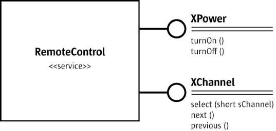

= OpenOffice开发者手册
BladeMasterKing <wang_jiansheng@hotmail.com>
v1.0 , 2020-07-06
:doctype: book
:encoding: utf-8
:lang: zh_cn
:toc: left
:numbered:

:toc:

== 起步
=== 简介
[%heardbreaks]
UNO(Universal Network Objects)是OpenOffice的基本组件，支持的编程语言是JAVA和C++

==== 第一次接触
[%heardbreaks]
自从OpenOffice 2.0 开始，获得一个使用UNO功能和office功能的工作环境很简单。下面演示了如何编写和构建一个初始化UNO的小程序，这意味着从内部连接office，或者在必要时开启一个新的office进程，并且它告诉你它是否能够获取ofice service manager对象提供的office component context。

代码：
[source,java]
----
public class FirstUnoContact{
    public static void main(String[] args){
        try{
            //获取远程office组件上下文
            com.sun.star.uno.XComponentContext xContext = com.sun.star.comp.helper.Bootstrap.bootstrap();
            System.out.println("Connected to a running office ...");
            com.sun.star.lang.XMultiComponentFactory xMCF = xContext.getServiceManager();
            String available = (xMCF != null ? "available" : "not available");
            System.outprintln("remote ServiceManager is" + available);
        } catch(java.lang.Exception e){
            e.printStackTrace();
        } finally {
            System.exit(0);
        }
    }
}
----

==== Service Managers
[%heardbreaks]
UNO服务管理器，可以被认为是创建服务的工厂。目前，将服务看作UNO对象就足够了，这些对象可用于执行特定的任务。稍后，我们将为术语服务给出更精确的定义。例如，以下服务是可用的

* com.sun.star.frame.Desktop + 
维护加载的文档：用于加载文档，获取当前文档，并访问所有加载的文档
* com.sun.star.configuration.ConfigurationProvider + 
生产访问OpenOffice的配置，在软件 Tools > Options对话框的配置
* com.sun.star.sdb.DatabaseContext + 
保存在OpenOffice中注册的数据库
* com.sun.star.system.SystemShellExecute
执行在当前平台注册的应用注册的系统命令或文档
* com.sun.star.text.GlobalSettings
管理文本文档的全局视图和打印设置

服务总是有一个组件上下文，包含创建服务的服务管理器和其他用于服务的数据。
_FirstUnoContact_ 类文件被认为是一个OpenOffice进程的客户端，在这方面OpenOffice是服务端。服务端有自己的组件上下文和服务管理器，这些允许客户端程序访问来使用 _office_ 功能，客户端程序初始化UNO并从OpenOffice进程得到组件上下文。在内部，初始化流程创建本地服务管理器，建立一个运行OpenOffice进程(如果有必要将启动一个新的进程)的管道连接并返回远程组件上下文。第一步，这是唯一需要了解的内容。_com.sun.star.comp.helper.Bootstrap.bootstrap()_ 方法初始化UNO并返回一个运行的OpenOffice进程的远程组件上下文(RemoteComponentContext)，你可以发现关于引导UNO的更多细节，在UNO概念中，不同连接类型的机会以及如何建立到UNO服务器进程的连接。

在第一步初始化之后，可以调用 _com.sun.star.uno.XComponentContext:getServiceManager()_ 从组件上下文来获取远程服务管理器，提供通过API来访问office 的功能。

==== 失败的连接
远程连接在以下条件下可能会失败： 

* 客户端程序应该能检测到错误。例如有时网桥可能不可用，连接到office、执行某个任务然后退出的简单客户端应该停止工作，并在出现错误时通知用户。 
* 需要长时间运行的客户端不应该假设对初始对象的引用在客户机的整个运行时都是有效的。即使因为某种原因客户端连接中断，也应该在不久后恢复。当连接失败时，一个健壮的、长时间运行的客户端应该停止当前的工作，通知用户连接不可用，并释放对远程进程的引用。当用户尝试重复最后一个操作时，客户端应该尝试重新构建连接，不要因为连接暂时不可用而强迫用户重新启动程序。

当网桥不可用并尝试访问时，客户端连接抛出异常(com.sun.star.lang.DisposedException)，每当在程序中访问远程时，以将远程引用设置为null并相应地通知用户这样的方式捕获此异常。如果您的客户端被设计为运行较长时间，那么当您发现新的远程引用为空时，请做好获取这些引用的准备。

处理连接丢失的更复杂的方法是在底层桥接对象上注册侦听器。在章节UNO进程间通信中展示了怎样写连接感知的客户端。

=== 如何在OpenOffice中获取对象
____
我们上下文中的对象是一个软件工件，它具有您可以调用的方法。对象需要使用OpenOffice.org做一些事情。但是你从哪里得到它们呢?
____

==== 新建对象
通常，新建对象或首次访问必要的对象，由OpenOffice的服务管理器来提供。在 _FirstLoadComponent_ 实例中，远程服务管理器创建了远程 _Desktop_ 对象用来处理应用窗口和加载文档。
[source,java]
----
Object desktop = xRemoteServiceManager.createInstanceWithContext(
"com.sun.star.frame.Desktop", xRemoteContext);
----

==== 文档对象
文档对象代表文件已经使用OpenOffice打开，由 _Desktop_ 对象创建，其 _loadComponentFromURL()_ 方法可以实现这个目标。

==== 其他对象提供的对象
对象可以分发其他对象，有两个案例：

* 可以通过OpenOffice API中的get方法获得，被设计为提供该特性的对象不可分割的一部分的特性，从get方法获取对象是很常见的。例如， _getSheets()_ 是每个Calc文档必须的 ，_getText()_ 对于Writer文档是必须的，_getDrawpages()_ 对于每个Draw文档是必须的。加载文档后，使用这些方法获取相应文档的Sheets、Text和Drawpages对象。特定于对象的get方法是获取对象的一项重要技术。
* 对于一个对象的体系结构来说，不被认为是不可或缺的特性可以通过一组通用的方法来访问。在OpenOffice中，这些特性被叫做属性，并使用了泛型方法，例如 _getPropertyValue(String propertyName)_ 方法来访问他们。在某些情况下，这样的非整体特性作为对象来提供，因此，getPropertyValue()方法可以是对象的另一个来源。例如，电子表格的页面样式有 _RightPageHeaderContent_ 和 _LeftPageHeaderContent_ 属性，它们包含电子表格文档的页面标题部分的对象。通用的 _getPropertyValue()_ 方法有时可以提供你需要的对象。

==== 对象集合
[%hardbreaks]
对象可以是一组类似对象中的元素，在集合中，要访问一个对象，你需要知道如何从集合中获取特定元素。OpenOffice的API允许四种方式在集合中提供元素。前三种方式是具有元素访问方法的对象，允许通过名称、索引或枚举进行访问。第四种方法是一个没有访问方法，但可以作为数组直接使用的元素序列。怎样使用这些元素集合稍后讨论。
对象的设计者根据对象的特殊条件，决定提供哪些机会，例如它如何远程执行，或者哪些访问方法最好与实现一起工作。

=== 使用对象

使用OpenOffice的API对象包含以下内容：

* 首先，我们将学习UNO对象、接口、服务、特性和属性的概念，并且了解UNO的使用方法。
* 然后，我们将首次使用OpenOffice.org文档，并给出OpenOffice.org API中最常见类型的用法提示。
* 最后，我们将介绍一些公共接口，这些接口允许您跨所有OpenOffice文档类型使用文本、表和绘图。

==== 对象、接口、服务
[%hardbreaks]
*对象*
在UNO中，对象是一种软件构件，它具有可以调用的方法和可以获取和设置的属性。对象提供的方法和属性通过它所支持的接口集合指定。
*接口*
接口指定一组属性和方法，它们共同定义对象的一个切面。例如， _com.sun.star.resource.XResourceBundle_ 接口指定了 _Parent_ 属性， _getLocale()_ 和 _getDirectElement()_ 方法。
[source,java]
----
module com { module sun { module star { module resource { interface
XResourceBundle: com::sun::star::container::XNameAccess {
    [attribute] XResourceBundle Parent;
    com::sun::star::lang::Locale getLocale();
    any getDirectElement([in] string key);
};
}; }; }; };
----
[%hardbreaks]
为了允许重用这些接口规范，接口可以继承一个或多个其他接口（例如， _com.sun.star.resource.XResourceBundle_ 继承了 _com.sun.star.container.XNameAccess_ 所有的属性和方法）。OpenOffice 2.0 引入了接口的多重继承，即实现多个接口的能力。
严格来说，UNO中不需要接口的属性。每个属性能够表示为获取属性值的一种方法和设置属性值的另一种方法的组合（或者只使用一个方法获取只读属性的值）。然而，在UNO的接口中包含属性有两个很好的理由：第一，这种get和set值结合的方式已经足够广泛来保证额外的扩展；第二，通过属性，接口设计者可以更好地表达对象不同特性之间的细微差别。属性可用于那些不被认为是对象的整体或结构部分的特性，显式方法被保留用于访问核心特性。在历史上，UNO对象通常支持一组许多独立的接口，这些接口对应于它的许多不同方面。使用多继承接口，就不那么需要这样做了，因为一个对象现在只支持一个接口，该接口继承自构成对象各个方面的所有其他接口。
*服务*
历史上，在UNO中“服务”一词的含义并不明确。从OpenOffice 2.0 开始，底层概念变得更加清晰。不幸的是，在UNO中“服务”这个术语还有两种不同的含义。在下面，我们将使用术语“新型服务”来表示实体，符合清晰的OpenOffice 2.0 的概念，而我们使用“旧式服务”来表示一个实体，只符合历史，更模糊的概念。使问题更加复杂的是，在UNO之外的上下文中，服务这个术语通常具有不同的含义。
虽然从技术上讲应该不再需要老式的服务，但是OpenOffice的API仍然广泛地使用它们以保持向后兼容。因此，在使用OpenOffice的API时，请准备好同时使用这两种服务概念。
*新型服务*
[source,java]
----
module com { module sun { module star { module bridge {
    serviceUnoUrlResolver: XUnoUrlResolver;
}; }; }; };
----
[%hardbreaks]
指定支持某个接口（例如 _com.sun.star.bridge.XUnoUrlResolver_）的对象，在某个服务名称（如 _com.sun.star.bridge.UnoUrlResolver_）下可用，在组件上下文的服务管理器。(在形式上，“新型服务”被称为基于单接口的服务。)
各种UNO语言绑定提供了特殊的构造，只要给定合适的组件上下文，就可以容易地获得这种新型服务的实例;请参阅Java语言绑定和c++语言绑定。
*旧型服务（正式称谓是“基于累加的服务”）*
[source,java]
----
module com { module sun { module star { module frame {serviceDesktop {
    service Frame;
    interface XDesktop;
    interface XComponentLoader;
    interface com::sun::star::document::XEventBroadcaster;
};
}; }; }; };
----
用于指定以下任何一项：

* 一般的约定是，如果一个对象被记录为支持某个旧样式的服务，那么您可以期望该对象支持由服务本身导出的所有接口和任何继承的服务。例如， _com.sun.star.frame.XFrames:queryFrames_ 返回了一序列的对象，它应该全部支持旧型服务 _com.sun.star.frame.Frame_ ，这些所有的接口都是 _com.sun.star.frame.Frame_ 导出的。
* 另外，一个旧形式的服务可以指定一个或多个属性：
[source,java]
----
module com { module sun { module star { module frame {service Frame {
    interface com::sun::star::frame::XFrame;
    interface com::sun::star::frame::XDispatchProvider;
    // ...
    [property] string Title;
    [property, optional] XDispatchRecorderSupplier RecorderSupplier;
    // ...
};
}; }; }; };
----
与接口属性相似的是，它们描述了对象的附加特性,主要的区别是接口属性可以直接访问，而旧式服务的属性通常通过像 _com.sun.star.beans.XPropertySet_ 这样的通用接口访问，通常，接口属性用于表示对象的整体特性，而属性则表示附加的、更不稳定的特性。

* 一些旧式服务打算在组件上下文的服务管理器中可用。例如，_com.sun.star.frame.Desktop_ 服务能够在组件上下文的服务管理器的 _"com.sun.star.frame.Desktop"_ 服务名称下实例化。（问题是无法判断给定的旧式服务是否打算在组件上下文中可用;而使用新样式的服务则会显式地显示该意图）
* 其他旧式服务被设计成由其他服务继承的通用超级服务。例如，_com.sun.star.document.OfficeDocument_ 服务作为所有不同类型的具体文档服务的通用基础，像 _com.sun.star.text.TextDocument_ 和 _com.sun.star.drawing.DrawingDocument_ 。（多继承接口现在是表达这种通用基础服务的首选机制。）
* 而其他旧式服务只列出属性，根本不导出任何接口。与其他类型的旧式服务那样指定特定对象支持的接口不同，此类服务用于记录一组相关属性，例如，_com.sun.star.document.MediaDescriptor_ 服务列举出所有可以传递给 _com.sun.star.frame.XComponentLoader:loadComponentFromURL_ 的属性。

属性是对象的一个特性，通常不被认为是对象的整体或结构部分，因此可以通过通用的 _getPropertyValue()/setPropertyValue()_ 方法来处理，而不是通过专门的get方法，比如getPrinter()来处理。旧式服务提供一种特殊的语法来列出对象的所有属性。包含属性的对象只需要支持 _com.sun.star.beans.XPropertySet_ 接口准备处理各种属性。典型的例子是字符或段落格式的属性。使用属性，可以通过调用 _setPropertyValues()_ 来设置对象的多个特性，这将极大地提高远程性能。例如，段落支持 _setPropertyValues()_ 方法是通过 _com.sun.star.beans.XMultiPropertySet_ 接口。

==== 使用服务
引入接口和服务的概念有以下原因：

* *接口和服务将规范从实现中剥离* +
接口或服务的规范是抽象的，也就是说，它没有定义支持特定功能的对象如何在内部完成此工作。通过OpenOffice的API的抽象规范，可以从API中提取实现，并在需要时安装不同的实现。
* *服务名允许按规范名而不是按类名创建实例* +
在Java或c++中，使用new操作符创建类实例。这种方法受到限制:您获得的类是硬编码的。在不编辑代码的情况下，您不能稍后通过另一个类来交换它。服务的概念解决了这个问题。OpenOffice中的中心对象工厂(全局服务管理器)被要求创建可用于特定目的的对象，而无需定义其内部实现。这是可能的，因为可以根据服务名称从工厂订购服务，并且工厂决定返回哪个服务实现。获得哪个实现没有区别，您只使用定义良好的服务接口。

*接口*

如果抽象接口是细粒度的（如果它们很小，并且只描述了一个物体的单一方面），则其可重用性更强。为了描述对象的许多方面，对象可以实现这些细粒度接口中的多个接口。由于能够实现多个接口，因此可以使用相同的代码访问类似对象的类似方面。例如，许多对象支持文本：文本可以在文档主体、文本框、页眉和页脚、脚注、表格单元格和绘图形状中找到。这些对象都支持相同的接口，因此过程可以使用getText()从这些对象中检索文本。

下图展示了旧式服务 _com.sun.star.text.TextDocument_ 的服务、接口和方法，使用UML符号显示的。在此图中，服务显示在左侧。服务之间的箭头表示上层服务(箭头)提供的服务被低层服务继承。这些服务导出的接口显示在右侧。OpenOffice的API中的所有接口名称都以X开头，以便与其他实体的名称区别开来。每个接口都包含方法，这些方法列在接口下面。

image::img/txtdocument-extends-officedocument.png[TextDocument继承了OfficeDocument的方法]

[%hardbreaks]
_TextDocument_ 对象提供了 _com.sun.star.text.TextDocument_ 服务，服务实现了 _XTextDocument_ , _XSearchable_ , _XRefreshable_ 三个接口，这些接口提供了例如 _getText()_ 方法将文本添加到文档，_findAll()_ 来查找整篇文档。
如箭头所示，_com.sun.star.text.TextDocument_ 也继承了 _com.sun.star.document.OfficeDocument_ 提供的所有接口，所以这些也提供给 _TextDocument_ 对象。这些接口处理OpenOffice应用程序常见的任务：打印 _XPrintable_，排序 _XStorable_，修改 _XModifiable_，模型处理 _XModel_。
图中显示的接口只是 _TextDocument_对象的强制接口，TextDocument具有可选的属性和接口，其中包括属性CharacterCount、ParagraphCount和WordCount，以及接口XPropertySet，如果属性存在，则必须支持该接口。OpenOffice中TextDocument服务的实现还支持必需的和所有可选的接口。在TextDocument这一章详细描述了TextDocument的用法。
c++和Java在访问方法时要求提供接口名。旧式的服务可能提供几个接口来跟踪。新型服务更容易使用，因为它们只有一个接口: multiple-inheritance接口，所以所有方法都通过同一个接口访问。

[%hardbreaks]
*使用接口*
每个UNO对象都必须通过其接口访问这一事实在Java和 c++等语言中具有影响，在这些语言中，编译器需要正确的对象引用类型，然后才能从它调用方法。在Java或c++中，通常只需在访问对象实现的接口之前强制转换对象。当使用UNO对象时，情况就不同了:当您希望访问对象支持的接口的方法，但编译器还不知道时，您必须要求UNO环境为您获取适当的引用。只有这样，你才能安全地抛下它。
ava UNO环境有一个为此目的的方法queryInterface()。乍一看，它看起来很复杂，但是一旦您理解了queryInterface()是关于跨进程边界安全转换UNO类型的，您将很快习惯它。看一下第二个示例FirstLoadComponent.java(如果您在计算机上安装了SDK，则在示例目录中)，其中创建了一个新的桌面对象，然后使用queryInterface()方法获取com.sun.star.frame.XComponentLoader接口。

[source,java]
----
Object desktop = xRemoteServiceManager.createInstanceWithContext( "com.sun.star.frame.Desktop", xRemoteContext);
XComponentLoader xComponentLoader = (XComponentLoader) UnoRuntime.queryInterface(XComponentLoader.class, desktop);
----
我们通知服务管理器它的工厂调用 _createInstanceWithContext()_ 方法创建 _com.sun.star.frame.Desktop_  这个方法被定义为返回一个Java对象类型，这并不奇怪——毕竟工厂必须能够返回任何类型:
[source,java]
----
java.lang.Object createInstanceWithContext(String serviceName, XComponentContext context)
----
我们接收的对象是com.sun.star.frame.Desktop服务。要点是，虽然我们知道我们在工厂中订购的对象是一个DesktopUnoUrlResolver，并在其他接口中导出XComponentLoader接口，但是编译器不知道。因此，我们必须使用UNO运行时环境来询问或查询接口XComponentLoader，因为我们希望在这个接口上使用loadComponentFromURL()方法。方法queryInterface()确保我们获得一个可以转换为所需接口类型的引用，无论目标对象是本地对象还是远程对象.在Java UNO语言绑定中有两种queryInterface定义:

[source,java]
----
java.lang.Object UnoRuntime.queryInterface(java.lang.Class targetInterface, Object sourceObject)
java.lang.Object UnoRuntime.queryInterface(com.sun.star.uno.Type targetInterface, Object sourceObject)
----
因为UnoRuntime.queryInterface()被指定为返回java.lang。与工厂方法createInstanceWithContext()一样，我们仍然必须显式地将接口引用转换为所需的类型。区别在于，在queryInterface()之后，我们可以安全地将对象转换为我们的接口类型，而且最重要的是，该引用现在甚至可以与另一个进程中的对象一起工作。下面是queryInterface()调用，一步一步解释:
[source,java]
----
 XComponentLoader xComponentLoader = (XComponentLoader) UnoRuntime.queryInterface(XComponentLoader.class, desktop);
----
XComponentLoader是我们希望使用的接口，因此我们定义一个名为XComponentLoader的XComponentLoader变量(下端x)来存储我们从queryInterface中期望的接口。然后查询桌面对象的XComponentLoader接口，传入XComponentLoader.class作为目标接口，桌面作为源对象。最后，我们将结果转换为XComponentLoader，并将结果引用分配给变量XComponentLoader。如果源对象不支持我们要查询的接口，queryInterface()将返回null。

在Java中，当您有一个对象的引用，该对象已知支持您需要的接口，但您还没有适当的引用类型时，调用queryInterface()是必要的。幸运的是，您不仅可以从java.lang中使用queryInterface()。对象源类型，但是你也可以从另一个接口引用查询一个接口，像这样:
[source,java]
----
// loading a blank spreadsheet document gives us its XComponent interface: XComponent xComponent = xComponentLoader.loadComponentFromURL( "private:factory/scalc", "_blank", 0, loadProps);
  // now we query the interface XSpreadsheetDocument from xComponent
XSpreadsheetDocument xSpreadsheetDocument = (XSpreadsheetDocument)UnoRuntime.queryInterface(
XSpreadsheetDocument.class, xComponent);
----
此外，如果方法已经定义为返回接口类型，则不需要查询接口，但可以立即使用其方法。在上面的代码片段中，loadComponentFromURL方法被指定为返回com.sun.star.lang。如果您想要得到文档被关闭的通知，那么您可以直接在XComponent变量上调用XComponent方法addEventListener()和removeEventListener()。c++中对应的步骤是通过一个Reference<>模板完成的，该模板以源实例为参数:
[source,java]
----
 // instantiate a sample service with the servicemanager. Reference< XInterface > rInstance =
 rServiceManager->createInstanceWithContext( OUString::createFromAscii("com.sun.star.frame.Desktop" ), rComponentContext );
// Query for the XComponentLoader interface
Reference< XComponentLoader > rComponentLoader( rInstance, UNO_QUERY );
----
在OpenOffice.org Basic中，不需要查询接口;基本的运行时引擎会在内部处理这个问题。随着OpenOffice.org API中多继承接口的增加，显式查询Java或c++中特定接口的需求将减少。例如，假设的接口
[source,java]
----
interface XBase1 {   void fun1();
  };
  interface XBase2 {
      void fun2();
  };
  interface XBoth { // inherits from both XBase1 and XBase2
      interface XBase1;
      interface XBase2;
  };
  interface XFactory {
      XBoth getBoth();};
----
您可以直接在通过XFactory.getBoth()获得的引用上调用fun1()和fun2()，而无需查询XBase1或XBase2。

*使用属性*
对象必须通过允许您使用属性的接口提供其属性。这些接口的最基本形式是接口com.sun.star.beans.XPropertySet。属性还有其他接口，比如com.sun.star.beans。XMultiPropertySet，它通过一个方法调用获取和设置多个属性。当属性出现在服务中时，始终支持XPropertySet。

在XPropertySet中，有两种方法进行属性访问，在Java中定义如下:
[source,java]
----
void setPropertyValue(String propertyName, Object propertyValue)
  Object getPropertyValue(String propertyName)
----
在FirstLoadComponent示例中，XPropertySet接口用于设置单元格对象的CellStyle属性。cell对象是com.sun.star.sheet。SheetCell，因此也支持com.sun.star.table。CellProperties服务，它有一个CellStyle属性。下面的代码解释了这个属性是如何设置的:
[source,java]
----
 // query the XPropertySet interface from cell object XPropertySet xCellProps =
 (XPropertySet)UnoRuntime.queryInterface(XPropertySet.class, xCell);
// set the CellStyle property xCellProps.setPropertyValue("CellStyle", "Result");
----
现在可以开始使用OpenOffice.org文档了。

==== 示例:处理电子表格文档
在本例中，我们将要求远程服务管理器提供远程桌面对象，并使用其loadComponentFromURL()方法创建一个新的电子表格文档。从文档中我们获得了它的sheets容器，我们在其中通过名称插入和访问一个新的工作表。在新的工作表中，我们将值输入A1和A2，并将它们汇总到A3中。汇总单元格的单元格样式将获得单元格样式结果，以便以斜体、粗体和下划线显示。最后，我们将新工作表设置为活动工作表，以便用户可以看到它。将这些导入行添加到上面的FirstConnection示例中:
[source,java]
----
import com.sun.star.beans.PropertyValue;
import com.sun.star.lang.XComponent;
import com.sun.star.sheet.XSpreadsheetDocument; import com.sun.star.sheet.XSpreadsheets; import com.sun.star.sheet.XSpreadsheet;
import com.sun.star.sheet.XSpreadsheetView; import com.sun.star.table.XCell;
import com.sun.star.frame.XModel;
import com.sun.star.frame.XController;
import com.sun.star.frame.XComponentLoader;
----
编辑useConnection方法如下:
[source,java]
----
protected void useConnection() throws java.lang.Exception { try {
// get the remote office component context
xRemoteContext = com.sun.star.comp.helper.Bootstrap.bootstrap(); System.out.println("Connected to a running office ...");
xRemoteServiceManager = xRemoteContext.getServiceManager(); }
catch( Exception e) { e.printStackTrace(); System.exit(1);
}
  try {
        // get the Desktop, we need its XComponentLoader interface to load a
new document
Object desktop = xRemoteServiceManager.createInstanceWithContext(
"com.sun.star.frame.Desktop", xRemoteContext);
 // query the XComponentLoader interface from the desktop
XComponentLoader xComponentLoader = (XComponentLoader)UnoRuntime.queryInterface(
XComponentLoader.class, desktop);
        // create empty array of PropertyValue structs, needed for
loadComponentFromURL
PropertyValue[] loadProps = new PropertyValue[0];
        // load new calc file
XComponent xSpreadsheetComponent = xComponentLoader.loadComponentFromURL(
"private:factory/scalc", "_blank", 0, loadProps);
        // query its XSpreadsheetDocument interface, we want to use
getSheets()
XSpreadsheetDocument xSpreadsheetDocument = (XSpreadsheetDocument)UnoRuntime.queryInterface(
XSpreadsheetDocument.class, xSpreadsheetComponent);
// use getSheets to get spreadsheets container
XSpreadsheets xSpreadsheets = xSpreadsheetDocument.getSheets();
        //insert new sheet at position 0 and get it by name, then query its
XSpreadsheet interface
xSpreadsheets.insertNewByName("MySheet", (short)0);
Object sheet = xSpreadsheets.getByName("MySheet");
XSpreadsheet xSpreadsheet = (XSpreadsheet)UnoRuntime.queryInterface(
XSpreadsheet.class, sheet);
        // use XSpreadsheet interface to get the cell A1 at position 0,0 and
enter 21 as value
XCell xCell = xSpreadsheet.getCellByPosition(0, 0); xCell.setValue(21);
// enter another value into the cell A2 at position 0,1 xCell = xSpreadsheet.getCellByPosition(0, 1); xCell.setValue(21);
// sum up the two cells
xCell = xSpreadsheet.getCellByPosition(0, 2); xCell.setFormula("=sum(A1:A2)");
        // we want to access the cell property CellStyle, so query the cell's
XPropertySet interface
XPropertySet xCellProps = (XPropertySet)UnoRuntime.queryInterface( XPropertySet.class, xCell);
// assign the cell style "Result" to our formula, which is available out of the box
xCellProps.setPropertyValue("CellStyle", "Result");
        // we want to make our new sheet the current sheet, so we need to ask
the model
        // for the controller: first query the XModel interface from our
spreadsheet component
XModel xSpreadsheetModel = (XModel)UnoRuntime.queryInterface(XModel.class, xSpreadsheetComponent);
        // then get the current controller from the model
XController xSpreadsheetController = xSpreadsheetModel.getCurrentController();
        // get the XSpreadsheetView interface from the controller, we want to
call its method
        // setActiveSheet
XSpreadsheetView xSpreadsheetView = (XSpreadsheetView)UnoRuntime.queryInterface(
XSpreadsheetView.class, xSpreadsheetController);
        // make our newly inserted sheet the active sheet using setActiveSheet
xSpreadsheetView.setActiveSheet(xSpreadsheet); }
catch( com.sun.star.lang.DisposedException e ) { //works from Patch 1 xRemoteContext = null;
throw e; }
}
----
或者，您可以从示例目录中添加FirstLoadComponent.java到当前项目中，它包含上面所示的更改。

==== 常见的类型
到目前为止，方法参数和返回值的文字和通用Java类型一直被当作OpenOffice.org API是为Java创建的。但是，必须理解UNO被设计成独立于语言的，因此具有自己的一组类型，必须将这些类型映射到语言绑定所需的适当类型。本节将简要描述类型映射。有关类型映射的详细信息，请参阅Professional UNO。

===== 基本类型
基本UNO类型(术语“basic”与OpenOffice.org basic无关)作为结构体的成员、方法返回类型或方法参数出现。下表显示了基本UNO类型，如果可用，还显示了它们与Java、c++和OpenOffice.org基本类型的确切映射。

.基本类型表
[width="100%",options="header,footer"]
|====================
| UNO | 类型描述 | JAVA | C++ | Basic
| void | 空值,只作为方法返回值 | void | void | - 
| boolean | boolean类型,true或false | boolean | sal_Bool | Boolean 
| byte | 有符号的8位整数字节 | byte | sal_Int8 | Integer 
| short | 有符号的16位整数字节 | short | sal_Int16 | Integer
| unsigned short | 无符号的16位整数字节| - | sal_uInt16 | -
| long | 有符号的32位整数字节 | int | sal_Int32 | Long
| unsigned long | 无符号的32位整数字节 | - | sal_uInt32 | -
| hyper | 有符号64位整数字节 | long | sal_Int64 | -
| unsigned long | 无符号的64位整数字节 | - | sal_uInt64 | -
| float | 单精度浮点型 | float | float | Single
| double | 双精度浮点型 | double | double | Double
| char | 16位Unicode字符类型(更准确地说:UTF-16代码单元) | char | sal_Unicode | -
|====================
对于在该表中没有精确映射的类型，有一些特殊条件。在有关类型的相应部分中检查有关这些类型的详细信息UNO语言绑定中的映射。

*字符串*

UNO认为字符串是简单类型，但由于它们在有些环境需要特殊处理，我们在这里单独讨论。

.字符串类型表
[width="100%",options="header,footer"]
|==========
| UNO | 描述 | JAVA | C++ | Basic
| string | Unicode字符串类型(更准确地说:Unicode标量值的字符串) | java.lang.String | rtl::OUString | String
|==========
在Java中，像使用本机java.lang.String对象一样使用UNO字符串。在c++中，本地字符字符串必须通过SAL转换函数转换为UNO Unicode字符串，通常是rtl::OUString类中的createFromAscii()函数:
[source,c++]
----
//C++
static OUString createFromAscii( const sal_Char * value ) throw();
----
在Basic中，Basic字符串透明地映射到UNO字符串。

*枚举和常量*

OpenOffice API使用许多枚举类型(称为枚举)和常量组(称为常量组)。枚举用来列出a中的每一个可能的值特定的上下文。常量组定义属性、参数、返回值和结构成员的可能值。例如，这是一个enum
[source,java]
----
com.sun.star.table.CellVertJustify
----
它描述了用于垂直调整表单元格内容的可能值。单元格的垂直调整是由它们的属性 _com.sun.star.table.CellProperties:VertJustify_ 决定的。根据 _CellVertJustify_，此属性的可能值是 _STANDARD_ 、_TOP_、_CENTER_和_BOTTOM_。
[source,java]
----
// adjust a cell content to the upper cell border
// The service com.sun.star.table.Cell includes the service
com.sun.star.table.CellProperties
// and therefore has a property VertJustify that controls the vertical cell
adjustment
// we have to use the XPropertySet interface of our Cell to set it
xCellProps.setPropertyValue("VertJustify",
com.sun.star.table.CellVertJustify.TOP);
----
OpenOffice基本了解枚举类型和常量组。它们的用法很简单:
[source,Basic]
----
'OpenOffice.org Basic
oCellProps.VertJustify = com.sun.star.table.CellVertJustify.TOP
----
在c++中枚举和常量组与范围操作符一起使用::
[source,c++]
----
//C++
rCellProps->setPropertyValue(OUString::createFromAscii( "VertJustify"),
::com::sun::star::table::CellVertJustify.TOP);
----

*Struct*

OpenOffice API中的结构用于创建其他UNO类型的组合。它们对应于仅由公共成员变量组成的C结构体或Java类。虽然struct不封装数据，但它们更容易作为一个整体传输，而不是来回封送get()和set()调用。特别是，这对远程通信有好处。
方法可以访问struct成员。(点)操作符如in:
[source,java]
----
aProperty.Name = "ReadOnly";
----
在Java、c++和OpenOffice Basic中，关键字new实例化结构。在OLE自动化中，使用com.sun.star.reflection。CoreReflection获得UNO结构。不要使用服务管理器创建结构体。
[source,java]
----
//In Java:
com.sun.star.beans.PropertyValue aProperty
= new com.sun.star.beans.PropertyValue();
'In OpenOffice.org Basic
Dim aProperty as new com.sun.star.beans.PropertyValue
----

*Any*

OpenOffice API经常使用any类型，它是其他环境中已知的变体类型的对应物。any类型包含一个任意的UNO类型。any类型特别用于通用的UNO接口。
出现any的例子是以下常用方法的方法参数和返回值:

.Any
[width="100%",options="header,footer"]
|====================
| 接口 | 返回任意类型 | 任意类型参数
| XPropertySet | any getPropertyValue(string propertyName) | void setPropertyValue(any value)
| XNameContainer | any getByName(string name) | void replaceByName(string name,any element) void insertByName(string name,any element)
| XIndexContainer | any getByIndex(long index) | void replaceByIndex(long index, any element) void insertByIndex(long index, any element)
| XEnumeration | any nextElement() | -
|====================
[%hardbreaks]
_any_ 类型也出现在 _com.sun.star.beans.PropertyValue_ 的结构中。
这个 _struct_ 有两个成员变量，_Name_ 和 _Value_，并且普遍存在于 _PropertyValue_ 结构体的集合中，其中每个 _PropertyValue_ 都是一个键值对，通过名称和值描述属性。如果需要设置这种 _PropertyValue struct_的值，则必须指定 _any_类型，并且如果从 _PropertyValue_读取，则必须能够解释包含的 _any_。如何做到这一点取决于你的语言。
在Java中，any类型被映射到 _java.lang.Object_，但是还有一个特殊的Java类 _com.sun.star.uno.Any_，主要用于普通对象不明确的情况。这里有两条简单的经验法则:

* 当你想传递一个any值时，总是传递一个java.lang.Object或Java UNO对象。
例如，如果使用setPropertyValue()设置目标对象中具有非接口类型的属性，则必须传入 _java.lang.Object_的新值。如果新值是Java的原始类型，使用对应的对象类型:
[source,java]
----
xCellProps.setPropertyValue("CharWeight", new Double(200.0));
----
另一个例子是你想为 _loadComponentFromURL_使用的PropertyValue结构:
[source,java]
----
com.sun.star.beans.PropertyValue aProperty = new
com.sun.star.beans.PropertyValue();
aProperty.Name = "ReadOnly";
aProperty.Value = Boolean.TRUE;
----
* 当接收到any实例时，始终使用 _com.sun.star.uno.AnyConverter_ 检索其值。
需要仔细查看 _AnyConverter_。例如，如果您希望获得一个包含原始Java类型的属性，您必须知道getPropertyValue()返回一个java.lang.Object，该对象包含包装在any值中的基元类型。
com.sun.star.uno.AnyConverter是此类对象的转换器。实际上，它可以做的不仅仅是转换，您可以在Java UNO引用中找到它的规范。下面的列表总结了AnyConverter中的转换函数:
[source,java]
----
static java.lang.Object toArray(java.lang.Object object)
static boolean toBoolean(java.lang.Object object)
static byte toByte(java.lang.Object object)
static char toChar(java.lang.Object object)
static double toDouble(java.lang.Object object)
static float toFloat(java.lang.Object object)
static int toInt(java.lang.Object object)
static long toLong(java.lang.Object object)
static java.lang.Object toObject(Class clazz, java.lang.Object object)
static java.lang.Object toObject(Type type, java.lang.Object object)
static short toShort(java.lang.Object object)
static java.lang.String toString(java.lang.Object object)
static Type toType(java.lang.Object object)
static int toUnsignedInt(java.lang.Object object)
static long toUnsignedLong(java.lang.Object object)
static short toUnsignedShort(java.lang.Object object)
----
它的用法很简单:
[source,java]
----
import com.sun.star.uno.AnyConverter;
long cellColor = AnyConverter.toLong(xCellProps.getPropertyValue("CharColor"));
----
为了方便，对于接口类型，你可以直接使用 _UnoRuntime.queryInterface()_而不需要首先调用 _AnyConverter.getobject()_:
[source,java]
----
import com.sun.star.uno.AnyConverter;import com.sun.star.uno.UnoRuntime;
Object ranges = xSpreadsheet.getPropertyValue("NamedRanges");
XNamedRanges ranges1 = (XNamedRanges) UnoRuntime.queryInterface(
XNamedRanges.class, AnyConverter.toObject(XNamedRanges.class, r));
XNamedRanges ranges2 = (XNamedRanges)
UnoRuntime.queryInterface( XNamedRanges.class, r);
----
在OpenOffice Basic中，any类型变成了变体:
[source,Basic]
----
'OpenOffice.org Basic
Dim cellColor as Variant
cellColor = oCellProps.CharColor
----
在c++中，对于 _Any_类型都有特殊的操作符:
[source,c++]
----
//C++ has >>= and <<= for Any (the pointed brackets are always left)
sal_Int32 cellColor;
Any any;
any = rCellProps->getPropertyValue(OUString::createFromAscii( "CharColor" ));
// extract the value from any
any >>= cellColor;
----

*Sequence*

序列是一种UNO类型值的同构集合，元素数量可变。在大多数当前语言绑定中，序列映射到数组。尽管这样的集合有时被实现为具有UNO中的元素访问方法的对象(例如，通过 _com.sun.star.container.XEnumeration_接口)，还有一个sequence类型，用于影响远程性能的场合。在API参考中，序列总是用尖括号写的:
[source,java]
----
// a sequence of strings is notated as follows in the API reference
sequence< string > aStringSequence;
----
在Java中，将序列视为数组。(但不要对空序列使用 _null_，而是使用通过 _new_ 创建的数组，长度为零。)此外，请记住，只有在创建Java对象数组时才会创建引用数组，而不会分配实际的对象。因此，必须使用new来创建数组本身，然后必须再次对每个对象使用new，并将新对象分配给数组。 _loadComponentFromURL_ 经常需要 _PropertyValue_ 结构的空序列:
[source,java]
----
// create an empty array of PropertyValue structs for loadComponentFromURL
PropertyValue[] emptyProps = new PropertyValue[0];
----
需要一个 _PropertyValue_ 结构序列来使用 _loadComponentFromURL()_ 的加载参数。_loadComponentFromURL()_ 和 _com.sun.star.document.MediaDescriptor_ 中可能存在的参数值。
[source,java]
----
// create an array with one PropertyValue struct for loadComponentFromURL, it contains references only
PropertyValue[] loadProps = new PropertyValue[1];
// instantiate PropertyValue struct and set its member fields
PropertyValue asTemplate = new PropertyValue();
asTemplate.Name = "AsTemplate";
asTemplate.Value = Boolean.TRUE;
// assign PropertyValue struct to first element in our array of references to PropertyValue structs
loadProps[0] = asTemplate;
// load calc file as template
XComponent xSpreadsheetComponent = xComponentLoader.loadComponentFromURL("file:///X:/share/samples/english/spreadsheets/OfficeSharingAssoc.sxc", "_blank", 0, loadProps);
----
在OpenOffice Basic中，一个简单的 _Dim_ 创建一个空数组。
[source,Basic]
----
'OpenOffice.org Basic
Dim loadProps() 'empty array
----
使用new和Dim创建一系列struct。
[source,Basic]
----
'OpenOffice.org Basic
Dim loadProps(0) as new com.sun.star.beans.PropertyValue 'one PropertyValue
----
在c++中，有一个用于序列的类模板。可以通过省略所需的元素数量来创建空序列。
[source,c++]
----
//C++
Sequence< ::com::sun::star::beans::PropertyValue > loadProperties; // empty sequence
----
如果您传递了一些元素，您将得到一个请求长度的数组。
[source,c++]
----
//C++
Sequence< ::com::sun::star::beans::PropertyValue > loadProps( 1 );
// the structs are default constructed
loadProps[0].Name = OUString::createFromAscii( "AsTemplate" );
loadProps[0].Handle <<= true;
Reference< XComponent > rComponent = rComponentLoader->loadComponentFromURL(OUString::createFromAscii("private:factory/swriter"), OUString::createFromAscii("_blank"), 0, loadProps);
----

===== 元素访问
[%hardbreak]
我们已经在如何 *在OpenOffice中获取对象一节* 中看到，对象集也可以通过元素访问方法提供。三种最重要的元素访问接口是 _com.sun.star.container.XNameContainer_ , _com.sun.star.container。XIndexContainer_ 和 _com.sun.star.container.XEnumeration_。
这三个元素访问接口是OpenOffice API的细粒度接口如何允许一致的对象设计的示例。
这三个接口都继承了 _XElementAccess_;因此，它们包括方法
[source,java]
----
type getElementType()
boolean hasElements()
----
查找关于一组元素的基本信息。方法hasElements()告诉集合是否包含任何元素;getElementType()方法告诉集合包含哪种类型。在Java和c++中，您可以通过com.sun.star.uno获取关于UNO类型的信息。类型，cf, Java UNO和c++ UNO引用。
_com.sun.star.container.XIndexContainer_ 和 _com.sun.star.container.XNameContainer_ 接口具有并行设计。考虑在UML表示法中这两个接口。

image::img/Indexed-and-Named-Container.png[Indexed and Named Container]

[%hardbreaks]
_XIndexAccess/XNameAccess_ 接口用于获取元素。_XIndexReplace/XNameReplace_ 接口允许您替换现有元素而不改变集合中的元素数量，而 _XIndexContainer/XNameContainer_ 接口允许您通过插入和删除元素来增加和减少元素数量。
许多命名或索引对象集不支持 _XIndexContainer_ 或 _XNameContainer_ 的整个继承层次结构，因为每个子类添加的功能并不总是符合任何元素集的逻辑。
_XEumerationAccess_ 接口与 _XElementAccess_ 接口下的命名和索引容器的工作方式不同。_XEnumerationAccess_ 不提供像 _XNameAccess_ 和 _XIndexAccess_ 这样的单一元素，但它创建了对象的枚举，该对象有方法去下一个元素，只要有更多的元素。

image::img/Enumerated-Container.png[Enumerated Container]

[%hardbreaks]
对象集有时支持所有元素访问方法，有些也只支持名称、索引或枚举访问。始终在API引用中查找各种类型，以查看哪些访问方法可用。
例如，接口com.sun.star.sheet上的方法getSheets()。指定XSpreadsheetDocument返回com.sun.star.sheet。从XNameContainer继承的XSpreadsheets接口。此外，API引用告诉您所提供的对象支持 _com.sun.star.sheet.Spreadsheets_ 服务，它定义除了XSpreadsheets之外的其他元素访问接口。
下面提供了一些示例，说明如何使用XNameAccess、XIndexAccess和XEnumerationAccess。

*Name Access*

按名称分发元素的基本接口是 _com.sun.star.container.XNameAccess_ 接口。它有三种方法:
[source,java]
----
any getByName( [in] string name)
sequence<string> getElementNames()
boolean hasByName( [in] string name)
----
在上面的FirstLoadComponent.java示例中，方法 _getSheets()_ 返回一个 _com.sun.star.sheet.XSpreadsheets_ 接口，它继承了 _XNameAccess_。因此，您可以使用getByName()从XSpreadsheets容器中通过名称获取工作表“MySheet”:
[source,java]
----
XSpreadsheets xSpreadsheets = xSpreadsheetDocument.getSheets();
Object sheet = xSpreadsheets.getByName("MySheet");
XSpreadsheet xSpreadsheet = (XSpreadsheet)UnoRuntime.queryInterface(XSpreadsheet.class, sheet);
// use XSpreadsheet interface to get the cell A1 at position 0,0 and enter 42 as value
XCell xCell = xSpreadsheet.getCellByPosition(0, 0);
----
由于getByName()返回一个any，在调用电子表格对象的方法之前，您必须使用AnyConverter.toObject()和/或UnoRuntime.queryInterface()。

*Index Access*

按索引分发元素的接口是 _com.sun.star.container.XIndexAccess_ 接口。它有两种方法:
[source,java]
----
any getByIndex( [in] long index)
long getCount()
----
FirstLoadComponent示例允许演示XIndexAccess。API引用告诉我们getSheets()返回的服务是com.sun.star.sheet。电子表格服务，不仅支持接口com.sun.star.sheet。XSpreadsheets，还有XIndexAccess。因此，表格可以通过索引访问，而不只是通过名称执行查询XIndexAccess接口从我们的xSpreadsheets变量:
[source,java]
----
XIndexAccess xSheetIndexAccess = (XIndexAccess)UnoRuntime.queryInterface(XIndexAccess.class, xSpreadsheets);
Object sheet = XSheetIndexAccess.getByIndex(0);
----

*Enumeration Access*

com.sun.star.container的接口。XEnumerationAccess创建枚举，它允许在一组对象之间移动。它有一个方法:
[source,java]
----
com.sun.star.container.XEnumeration createEnumeration()
----
从createEnumeration()获得的枚举对象支持接口com.sun.star.container.XEnumeration。通过这个接口，只要枚举中有更多的元素，我们就可以一直从枚举中提取元素。XEnumeration提供了以下方法:
[source,java]
----
boolean hasMoreElements()
any nextElement()
----
这意味着构建循环，如:
[source,java]
----
while (xCells.hasMoreElements()) {
    Object cell = xCells.nextElement();
    // do something with cell
}
----
[%hardbreaks]
例如，在电子表格中，您可以找出哪些单元格包含公式。生成的单元集作为XEnumerationAccess提供。
使用公式查询单元格的接口是 _com.sun.star.sheet.XCellRangesQuery_ 定义了一个方法XSheetCellRanges queryContentCells(short cellFlags)，该方法查询具有在常量组com.sun.star.sheet.CellFlags中定义的内容的单元格。其中一个标记是公式。从queryContentCells()中，我们接收到一个带有com.sun.star.sheet的对象。XSheetCellRanges接口，它有以下方法:
[source,java]
----
XEnumerationAccess getCells()
String getRangeAddressesAsString()
sequence< com.sun.star.table.CellRangeAddress > getRangeAddresses()
----
方法getCells()可以使用 _XEnumerationAccess_ 列出我们的FirstLoadComponent示例中的电子表格文档中的所有公式单元格和包含公式。
[source,java]
----
XCellRangesQuery xCellQuery = (XCellRangesQuery)UnoRuntime.queryInterface(XCellRangesQuery.class, sheet);
XSheetCellRanges xFormulaCells = xCellQuery.queryContentCells((short)com.sun.star.sheet.CellFlags.FORMULA);
XEnumerationAccess xFormulas = xFormulaCells.getCells();
XEnumeration xFormulaEnum = xFormulas.createEnumeration();
while (xFormulaEnum.hasMoreElements()) {
    Object formulaCell = xFormulaEnum.nextElement();
    // do something with formulaCell
    xCell = (XCell)UnoRuntime.queryInterface(XCell.class, formulaCell);
    XCellAddressable xCellAddress = (XCellAddressable)UnoRuntime.queryInterface(XCellAddressable.class, xCell);
    System.out.print("Formula cell in column " +
    xCellAddress.getCellAddress().Column
    + ", row " + xCellAddress.getCellAddress().Row
    + " contains " + xCell.getFormula());
}
----

*如何知道用哪种类型*

[%hardbreaks]
一个常见的问题是，在从方法接收到对象之后，决定对象真正具有什么功能。通过观察Java IDE中的代码完成情况，您可以发现从方法返回的对象的基本接口。您将注意到 _loadComponentFromURL()_ 返回一个 _com.sun.star.lang.XComponent_。
通过在NetBeans IDE中按Alt + F1，你可以阅读关于你正在使用的接口和服务的规范。
但是，方法只能指定为返回一种接口类型。从方法获得的接口通常比方法返回的接口支持更多的接口(特别是当这些接口的设计早于UNO中多继承接口类型的可用性时)。此外，接口不会告诉对象包含的任何属性。
因此，您应该使用本手册来了解如何工作。然后开始编写代码，使用代码完成和API引用。
此外，您可以尝试InstanceInspector，这是一个Java工具，它是OpenOffice SDK示例的一部分。它是一个Java组件，可以向office注册，并显示当前使用的对象的接口和属性。
在OpenOffice Basic中，可以使用以下基本属性检查对象。
[source,Basic]
----
sub main
oDocument = thiscomponent
msgBox(oDocument.dbg_methods)
msgBox(oDocument.dbg_properties)
msgBox(oDocument.dbg_supportedInterfaces)
end sub
----
对于复杂对象，这些msgBox调用将在屏幕外运行。试试下面的方法:
[source,Basic]
----
sub main
oDocument = thiscomponent
GlobalScope.BasicLibraries.LoadLibrary( "Tools" )
Call Tools.WritedbgInfo(oDocument)
end sub
----
这将生成一个新的Writer文档，其中包含检索到的信息。

===== 示例：文本、表格、图形入门

本节的目标是简要概述OpenOffice API中所有文档类型都通用的那些机制。OpenOffice的三个主要应用领域是文本、表格和绘图形状。要点是:文本、表格和绘图形状可以出现在所有三种文档类型中，无论您处理的是 _Writer_、 _Calc_ 或 _Draw/Impress_ 文件，但它们在任何地方都以相同的方式处理。掌握了通用机制后，就能够在所有文档类型中插入和使用文本、表格和绘图了。

*用于文本、表格和绘图的通用机制*

[%hardbreaks]
我们想强调共同点，因此我们从允许操作现有文本、表格和绘图的公共接口和属性开始。然后，我们将演示在每种文档类型中创建文本、表格和绘图的不同技术。
使用现有文本、表格和绘图的关键接口和属性如下:对于文本，接口 _com.sun.star.text.XText_ 包含更改实际文本和其他文本内容的方法(除了传统文本段落之外，文本内容的例子还有文本表、文本字段、图形对象和类似的东西，但这些内容不是在所有上下文中都可用的)。当我们在这里谈到文本时，我们指的是任何文本——文本文档中的文本、文本框架、页眉和页脚、表格单元格或绘图形状中的文本。_XText_ 是OpenOffice中所有文本的关键。

[%hardbreaks]
_com.sun.star.text.XText_ 的接口能够设置或获取作为单个字符串的文本，并定位文本的开头和结尾。此外，_XText_ 可以在文本中的任意位置插入字符串，并创建文本游标来选择和格式化文本。最后，XText通过 _insertTextContent_ 和 _removeTextContent_ 方法处理文本内容，尽管并非所有文本都接受常规文本以外的文本内容。实际上，XText通过继承 _com.sun.star.text.XSimpleText_ 涵盖了所有这些内容继承自 _com.sun.star.text.XTextRange_。
文本格式是通过 _com.sun.star.style.ParagraphProperties_ 和 _com.sun.star.style.CharacterProperties_ 服务中描述的属性进行的。
下面的示例方法 _manipulatetext()_ 添加文本，然后使用文本光标使用 _CharacterProperties_ 选择和格式化几个单词，然后插入更多文本。方法 _manipulatetext()_ 只包含 _XText_ 最基本的方法，所以它可以处理每个文本对象。特别是，它避免了 _insertTextContent()_，因为除了可以插入到所有文本对象中的常规文本之外，没有文本内容。
[source,java]
----
protected void manipulateText(XText xText) throws com.sun.star.uno.Exception {
    // simply set whole text as one string 
    xText.setString("He lay flat on the brown, pine-needled floor of the forest, "
    + "his chin on his folded arms, and high overhead the wind blew in the tops "
    + "of the pine trees.");
    // create text cursor for selecting and formatting
    XTextCursor xTextCursor = xText.createTextCursor();
    XPropertySet xCursorProps = (XPropertySet)UnoRuntime.queryInterface(
    XPropertySet.class, xTextCursor);
    // use cursor to select "He lay" and apply bold italic
    xTextCursor.gotoStart(false);
    xTextCursor.goRight((short)6, true);
    // from CharacterProperties
    xCursorProps.setPropertyValue("CharPosture",com.sun.star.awt.FontSlant.ITALIC);
    xCursorProps.setPropertyValue("CharWeight",new Float(com.sun.star.awt.FontWeight.BOLD));
    // add more text at the end of the text using insertString
    xTextCursor.gotoEnd(false);
    xText.insertString(xTextCursor, " The mountainside sloped gently where he lay; "
    + "but below it was steep and he could see the dark of the oiled road "
    + "winding through the pass. There was a stream alongside the road "
    + "and far down the pass he saw a mill beside the stream and the falling water "
    + "of the dam, white in the summer sunlight.", false);
    // after insertString the cursor is behind the inserted text, insert more text
    xText.insertString(xTextCursor, "\n \"Is that the mill?\" he asked.",false);
}
----
在表和单元格中，_com.sun.star.table.XCellRange_ 接口允许检索单元格和单元格的子例程。有了单元格后，可以通过接口 _com.sun.star.table.XCell_ 使用其公式或数值。

表格格式在文本表格和电子表格中有部分不同。文本表使用 _com.sun.star.text.TextTable_ 中指定的属性。而电子表格使用 _com.sun.star.table.CellProperties_。此外，还有一些表游标允许选择和格式化单元格范围和所包含的文本。但是自从一个 _com.sun.star.text.TextTableCursor_ 的工作原理与 _com.sun.star.sheet.SheetCellCursor_ 非常不同。我们将在关于文本和电子表格文档的章节中讨论它们。
[source,java]
----
protected void manipulateTable(XCellRange xCellRange) throws
com.sun.star.uno.Exception {
    String backColorPropertyName = "";
    XPropertySet xTableProps = null;
    // enter column titles and a cell value
    // Enter "Quotation" in A1, "Year" in B1. We use setString because we want to change the whole
    // cell text at once
    XCell xCell = xCellRange.getCellByPosition(0,0);
    XText xCellText = (XText)UnoRuntime.queryInterface(XText.class,xCell);
    xCellText.setString("Quotation");
    xCell = xCellRange.getCellByPosition(1,0);
    xCellText = (XText)UnoRuntime.queryInterface(XText.class, xCell);
    xCellText.setString("Year");
    // cell value
    xCell = xCellRange.getCellByPosition(1,1);
    xCell.setValue(1940);
    // select the table headers and get the cell properties
    XCellRange xSelectedCells = xCellRange.getCellRangeByName("A1:B1");
    XPropertySet xCellProps = (XPropertySet)UnoRuntime.queryInterface(
    XPropertySet.class, xSelectedCells);
    // format the color of the table headers and table borders
    // we need to distinguish text and spreadsheet tables:
    // - the property name for cell colors is different in text and sheet cells
    // - the common property for table borders is com.sun.star.table.TableBorder, but
    // we must apply the property TableBorder to the whole text table,
    // whereas we only want borders for spreadsheet cells with content.
    // XServiceInfo allows to distinguish text tables from spreadsheets
    XServiceInfo xServiceInfo = (XServiceInfo)UnoRuntime.queryInterface(XServiceInfo.class, xCellRange);
    // determine the correct property name for background color and the XPropertySet interface
    // for the cells that should get colored border lines
    if (xServiceInfo.supportsService("com.sun.star.sheet.Spreadsheet")) {
        backColorPropertyName = "CellBackColor";
        // select cells
        xSelectedCells = xCellRange.getCellRangeByName("A1:B2");
        // table properties only for selected cells
        xTableProps = (XPropertySet)UnoRuntime.queryInterface(
        XPropertySet.class, xSelectedCells);
    } else if(xServiceInfo.supportsService("com.sun.star.text.TextTable")) {
        backColorPropertyName = "BackColor";
        // table properties for whole table
        xTableProps = (XPropertySet)UnoRuntime.queryInterface(
        XPropertySet.class, xCellRange);
    }
    // set cell background color
    xCellProps.setPropertyValue(backColorPropertyName, new
    Integer(0x99CCFF));
    // set table borders
    // create description for blue line, width 10
    // colors are given in ARGB, comprised of four bytes for alpha-redgreen-
    blue as in 0xAARRGGBB
    BorderLine theLine = new BorderLine();
    theLine.Color = 0x000099;
    theLine.OuterLineWidth = 10;
    // apply line description to all border lines and make them valid
    TableBorder bord = new TableBorder();
    bord.VerticalLine = bord.HorizontalLine = bord.LeftLine = bord.RightLine = bord.TopLine = bord.BottomLine = theLine;
    bord.IsVerticalLineValid = bord.IsHorizontalLineValid =
    bord.IsLeftLineValid = bord.IsRightLineValid =
    bord.IsTopLineValid = bord.IsBottomLineValid = true;
    xTableProps.setPropertyValue("TableBorder", bord);
}
----
在绘制形状时，_com.sun.star.drawing.XShape_ 接口用于确定形状的位置和大小。

其他一切都是基于属性的格式问题，可以使用多种属性。org提供了11种不同的图形，它们是GUI(图形用户界面)中绘图工具的基础。其中六种形状有各自的属性，反映出它们的特征。这六种形状是:

* _com.sun.star.drawing.EllipseShape_ 用于圆形和椭圆.
* _com.sun.star.drawing.RectangleShape_ 用于盒子
* _com.sun.star.drawing.TextShape_ 用于文本框
* _com.sun.star.drawing.CaptionShape_ 用于标签
* _com.sun.star.drawing.MeasureShape_ 用于计量
* _com.sun.star.drawing.ConnectorShape_ 指的是可以“粘”到其他形状上以在它们之间画连接线的线。

五个形状没有单独的属性，它们共享在 _com.sun.star.drawing.PolyPolygonBezierDescriptor_ 服务中定义的属性:

* _com.sun.star.drawing.LineShape_ 线和箭头
* _com.sun.star.drawing.PolyLineShape_ 直线构成的开放图形
* _com.sun.star.drawing.PolyPolygonShape_ 一个或多个多边形组成的形状
* _com.sun.star.drawing.ClosedBezierShape_ 用于闭合的贝塞尔图形
* _com.sun.star.drawing.PolyPolygonBezierShape_ 多个多边形和贝塞尔图形组成的图形

这11种形状都使用了以下服务的属性:

* _com.sun.star.drawing.Shape_ 描述了所有形状的基本属性，如形状所属的层、防止移动和调整大小、样式名称、3D转换和名称。
* _com.sun.star.drawing.LineProperties_ 决定了形状的外观
* _com.sun.star.drawing.Text_ 本身没有属性，只有包含
** _com.sun.star.drawing.TextProperties_ 影响单元格中的编号、形状增长和文本对齐、文本动画和书写方向的文本属性。
** _com.sun.star.style.ParagraphProperties_ 与段落格式有关。
** _com.sun.star.style.CharacterProperties_ 格式化字符。
* _com.sun.star.drawing.ShadowProperties_ 处理图形的阴影
* _com.sun.star.drawing.RotationDescriptor_ 设置图形的旋转和裁剪
* _com.sun.star.drawing.FillProperties_ 只用于闭合的图形，用于描述图形如何填充
* _com.sun.star.presentation.Shape_ 向文档中的图形添加特效

考虑下面的例子，展示这些属性是如何工作的:
[source,java]
----
protected void manipulateShape(XShape xShape) throws com.sun.star.uno.Exception {
    // for usage of setSize and setPosition in interface XShape see method useDraw() below
    XPropertySet xShapeProps = (XPropertySet)UnoRuntime.queryInterface(XPropertySet.class, xShape);
    // colors are given in ARGB, comprised of four bytes for alpha-red-greenblue as in 0xAARRGGBB
    xShapeProps.setPropertyValue("FillColor", new Integer(0x99CCFF));
    xShapeProps.setPropertyValue("LineColor", new Integer(0x000099));
    // angles are given in hundredth degrees, rotate by 30 degrees
    xShapeProps.setPropertyValue("RotateAngle", new Integer(3000));
}
----

*创建文本、表格、图形*

以上三种 _manipulateXXX_ 方法均以文本、表格和形状对象为参数并改变它们。下面的方法展示了如何创建这样的文件对象在各种文档类型中。注意，所有文档都有自己的文档服务工厂来创建要插入到文档中的对象。除此之外这在很大程度上取决于文档类型。本节只演示不同的程序，解释可以在关于文本、电子表格和绘图文档的章节中找到。

首先，使用一个方便的小方法来创建新文档。
[source,java]
----
protected XComponent newDocComponent(String docType) throws java.lang.Exception {
    String loadUrl = "private:factory/" + docType;
    xRemoteServiceManager = this.getRemoteServiceManager(unoUrl);
    Object desktop = xRemoteServiceManager.createInstanceWithContext("com.sun.star.frame.Desktop", xRemoteContext);
    XComponentLoader xComponentLoader = (XComponentLoader)UnoRuntime.queryInterface(XComponentLoader.class, desktop);
    PropertyValue[] loadProps = new PropertyValue[0];
    return xComponentLoader.loadComponentFromURL(loadUrl, "_blank", 0,loadProps);
}
----

*Writer中的文本、表格和图形*

_useWriter_ 方法创建一个writer文档并操作它的文本，然后使用文档的内部服务管理器实例化一个文本表和一个形状，插入它们并操作表和形状。有关更详细的信息，请参考文本文档。
[source,java]
----
protected void useWriter() throws java.lang.Exception {
    try {
        // create new writer document and get text, then manipulate text
        XComponent xWriterComponent = newDocComponent("swriter");
        XTextDocument xTextDocument = (XTextDocument)UnoRuntime.queryInterface(XTextDocument.class,xWriterComponent);
        XText xText = xTextDocument.getText();
        manipulateText(xText);
        // get internal service factory of the document
        XMultiServiceFactory xWriterFactory = (XMultiServiceFactory)UnoRuntime.queryInterface(XMultiServiceFactory.class, xWriterComponent);
        // insert TextTable and get cell text, then manipulate text in cell
        Object table = xWriterFactory.createInstance("com.sun.star.text.TextTable");
        XTextContent xTextContentTable = (XTextContent)UnoRuntime.queryInterface(XTextContent.class, table);
        xText.insertTextContent(xText.getEnd(), xTextContentTable,false);
        XCellRange xCellRange = (XCellRange)UnoRuntime.queryInterface(XCellRange.class, table);
        XCell xCell = xCellRange.getCellByPosition(0, 1);
        XText xCellText = (XText)UnoRuntime.queryInterface(XText.class,xCell);
        manipulateText(xCellText);
        manipulateTable(xCellRange);
        // insert RectangleShape and get shape text, then manipulate text
        Object writerShape = xWriterFactory.createInstance("com.sun.star.drawing.RectangleShape");
        XShape xWriterShape = (XShape)UnoRuntime.queryInterface(XShape.class, writerShape);
        xWriterShape.setSize(new Size(10000, 10000));
        XTextContent xTextContentShape = (XTextContent)UnoRuntime.queryInterface(XTextContent.class,writerShape);
        xText.insertTextContent(xText.getEnd(), xTextContentShape,false);
        XPropertySet xShapeProps = (XPropertySet)UnoRuntime.queryInterface(XPropertySet.class, writerShape);
        // wrap text inside shape
        xShapeProps.setPropertyValue("TextContourFrame", new Boolean(true));
        XText xShapeText = (XText)UnoRuntime.queryInterface(XText.class,writerShape);
        manipulateText(xShapeText);
        manipulateShape(xWriterShape);
    } catch( com.sun.star.lang.DisposedException e ) {
        //works from Patch 1
        xRemoteContext = null;
        throw e;
    }
}
----

*Calc中的文本、表格和图形*

_useCalc_ 方法创建calc文档，使用其文档工厂创建形状并操作单元格文本、表格和形状。电子表格文档这一章讨论电子表格的所有方面。
[source,java]
----
protected void useCalc() throws java.lang.Exception {
    try {
        // create new calc document and manipulate cell text
        XComponent xCalcComponent = newDocComponent("scalc");
        XSpreadsheetDocument xSpreadsheetDocument = (XSpreadsheetDocument)UnoRuntime.queryInterface(XSpreadsheetDocument .class, xCalcComponent);
        Object sheets = xSpreadsheetDocument.getSheets();
        XIndexAccess xIndexedSheets = (XIndexAccess)UnoRuntime.queryInterface(XIndexAccess.class, sheets);
        Object sheet = xIndexedSheets.getByIndex(0);
        //get cell A2 in first sheet
        XCellRange xSpreadsheetCells = (XCellRange)UnoRuntime.queryInterface(XCellRange.class, sheet);
        XCell xCell = xSpreadsheetCells.getCellByPosition(0,1);
        XPropertySet xCellProps = (XPropertySet)UnoRuntime.queryInterface(XPropertySet.class, xCell);
        xCellProps.setPropertyValue("IsTextWrapped", new Boolean(true));
        XText xCellText = (XText)UnoRuntime.queryInterface(XText.class,xCell);
        manipulateText(xCellText);
        manipulateTable(xSpreadsheetCells);
        // get internal service factory of the document
        XMultiServiceFactory xCalcFactory = (XMultiServiceFactory)UnoRuntime.queryInterface(XMultiServiceFactory.class, xCalcComponent);
        // get Drawpage
        XDrawPageSupplier xDrawPageSupplier = (XDrawPageSupplier)UnoRuntime.queryInterface(XDrawPageSupplier.class,sheet);
        XDrawPage xDrawPage = xDrawPageSupplier.getDrawPage();
        // create and insert RectangleShape and get shape text, then manipulate text
        Object calcShape = xCalcFactory.createInstance("com.sun.star.drawing.RectangleShape");
        XShape xCalcShape = (XShape)UnoRuntime.queryInterface(XShape.class, calcShape);
        xCalcShape.setSize(new Size(10000, 10000));
        xCalcShape.setPosition(new Point(7000, 3000));
        xDrawPage.add(xCalcShape);
        XPropertySet xShapeProps = (XPropertySet)UnoRuntime.queryInterface(XPropertySet.class, calcShape);
        // wrap text inside shape
        xShapeProps.setPropertyValue("TextContourFrame", new Boolean(true));
        XText xShapeText = (XText)UnoRuntime.queryInterface(XText.class,calcShape);
        manipulateText(xShapeText);
        manipulateShape(xCalcShape);
    } catch( com.sun.star.lang.DisposedException e ) {
        //works from Patch 1
        xRemoteContext = null;
        throw e;
    }
}
----

*Draw中的图形和文本*

_useDraw_ 方法创建一个绘制文档，并使用其文档工厂实例化和添加一个形状，然后对该形状进行操作。绘图文档和演示文档这一章对绘图和演示提供了更多的信息。
[source,java]
----
protected void useDraw() throws java.lang.Exception {
    try {
        //create new draw document and insert ractangle shape
        XComponent xDrawComponent = newDocComponent("sdraw");
        XDrawPagesSupplier xDrawPagesSupplier = (XDrawPagesSupplier)UnoRuntime.queryInterface(XDrawPagesSupplier.class, xDrawComponent);
        Object drawPages = xDrawPagesSupplier.getDrawPages();
        XIndexAccess xIndexedDrawPages = (XIndexAccess)UnoRuntime.queryInterface(XIndexAccess.class, drawPages);
        Object drawPage = xIndexedDrawPages.getByIndex(0);
        XDrawPage xDrawPage = (XDrawPage)UnoRuntime.queryInterface(XDrawPage.class, drawPage);
        // get internal service factory of the document
        XMultiServiceFactory xDrawFactory = (XMultiServiceFactory)UnoRuntime.queryInterface(XMultiServiceFactory.class, xDrawComponent);
        Object drawShape = xDrawFactory.createInstance("com.sun.star.drawing.RectangleShape");
        XShape xDrawShape = (XShape)UnoRuntime.queryInterface(XShape.class, drawShape);
        xDrawShape.setSize(new Size(10000, 20000));
        xDrawShape.setPosition(new Point(5000, 5000));
        xDrawPage.add(xDrawShape);
        XText xShapeText = (XText)UnoRuntime.queryInterface(XText.class,
        drawShape);
        XPropertySet xShapeProps = (XPropertySet)UnoRuntime.queryInterface(XPropertySet.class, drawShape);
        // wrap text inside shape
        xShapeProps.setPropertyValue("TextContourFrame", new Boolean(true));
        manipulateText(xShapeText);
        manipulateShape(xDrawShape);
    } catch( com.sun.star.lang.DisposedException e ) {
        //works from Patch 1
        xRemoteContext = null;
        throw e;
    }
}
----

== 专业UNO

本章提供了关于UNO的深入信息以及在各种编程语言中使用UNO的信息。共分四部分:

* 专业UNO - 概述了UNO的体系结构。
* 专业UNO - API概念一节提供了有关API参考的背景信息。
* 专业UNO - UNO概念部分描述了UNO的机制，即它展示了UNO对象如何相互连接和通信。
* 专业UNO - UNO语言绑定小节详细介绍了来自Java、c++、OpenOffice Basic、COM自动化和CLI的UNO的使用。

=== 概述

UNO（通用网络对象）的目标是为跨编程语言和平台边界的网络对象提供一个环境。 UNO对象在任何地方运行和通信。 UNO通过提供以下基本框架来实现此目标：

* UNO对象以称为UNOIDL（UNO接口定义语言）的抽象元语言指定，该语言类似于CORBA IDL或MIDL。 根据UNOIDL规范，可以生成依赖于语言的头文件和库，以目标语言实现UNO对象。 编译和绑定库形式的UNO对象称为组件。组件必须支持某些基本接口才能在UNO环境中运行。
* 为了在目标环境中实例化组件，UNO使用工厂概念。该工厂称为服务管理器。它维护着一个已注册组件的数据库，这些组件可以通过名称来识别，并且可以通过名称来创建。服务管理器可能会要求Linux加载和实例化用C++编写的共享对象，或者可能会调用本地Java VM来实例化Java类。这对开发人员而言是透明的，无需关心组件的实现语言。通信仅通过UNOIDL中指定的接口调用进行。
* UNO提供了桥梁，可以在进程之间以及以不同实现语言编写的对象之间发送方法调用并接收返回值。 为此，远程网桥使用特殊的UNO远程协议（URP），套接字和管道均支持该协议。 桥接器的两端都必须是UNO环境，因此需要一种特定于语言的UNO运行时环境，以便以任何受支持的语言连接到另一个UNO进程。 这些运行时环境作为语言绑定提供。
* OpenOffice的大多数对象都可以在UNO环境中进行通信。OpenOffice可编程功能的规范称为OpenOffice API。

=== API概念

[%hardbreaks]
OpenOffice API是一种独立于语言的方法，用于指定OpenOffice的功能。其主要目标是提供一种API，以访问OpenOffice的功能，使用户能够通过自己的解决方案和新功能扩展功能，并使OpenOffice的内部实现可互换。

OpenOffice路线图的长期目标是将现有的OpenOffice拆分为多个小组件，这些小组件结合在一起即可提供完整的OpenOffice功能。这样的组件是可管理的，它们相互交互以提供高级功能，并且即使这些新的实现以不同的编程语言实现，它们也可以与提供相同功能的其他实现互换。当达到此目标时，API，组件和基本概念将提供一个构建工具包，它使OpenOffice不仅适用于具有预定义和静态功能的Office套件，而且适用于各种专用解决方案。本部分为您提供了对OpenOffice API背后概念的透彻理解。

在API参考中，存在UNOIDL数据类型，这些数据类型在API之外是未知的。该参考提供了抽象规范，有时使您不知道它们如何映射到您可以实际使用的实现。API参考的数据类型在“数据类型”中进行了说明。了解API参考中介绍了API规范与OpenOffice实现之间的关系。

=== 数据类型

API参考中的数据类型是UNO类型，必须将其映射到可以与OpenOffice API一起使用的任何编程语言的类型。在第一步中，介绍了最重要的UNO类型。但是，关于UNO中的简单类型，接口，属性和服务，还有很多要说的。如果您在UNO的专业水平上工作，那么您将想知道这些实体之间的特殊标志，条件和关系。

本节从希望使用OpenOffice API的开发人员的角度说明API参考的类型。如果您有兴趣编写自己的组件，并且必须定义新的接口和类型，请参阅“编写UNO组件”一章，其中描述了如何编写自己的UNOIDL规范以及如何创建UNO组件。

=== 简单类型

UNO提供了一组预定义的简单类型，下表中列出了这些类型

[width="100%",options="header,footer"]
|====================
| UNO类型 | 描述
| void | 空类型，仅用作方法返回类型在any之中。
| boolean | true或false
| byte | 有符号的8位整数类型（范围从-128到127，包括端点）。
| short | 带符号的16位整数类型（范围从-32768到32767，包括端点）。
| unsigned short | 无符号16位整数类型（过时）。
| long | 有符号的32位整数类型（范围从-2147483648到2147483647，含端点）。
| unsigned long | 无符号的32位整数类型（过时）。
| hyper | 有符号的64位整数类型（范围从
−9223372036854775808至9223372036854775807，含端点）。
| unsigned hyper | 无符号64位整数类型（过时）。
| float | IEC 60559单精度浮点型。
| double | IEC 60559双精度浮点型。
| char | 表示单个Unicode字符（更确切地说：单个UTF-16代码单元）。
| string | 表示Unicode字符串（更准确地说：Unicode标量值的字符串）。
| type | 描述所有UNO类型的元类型。
| any | 可以代表所有其他类型的值的特殊类型
|====================

关于语言绑定的章节Java语言绑定，C ++语言绑定，OpenOffice Basic和Automation Bridge描述了如何将这些类型映射到目标语言的类型

=== 任意类型

特殊类型any可以代表所有其他UNO类型的值。在目标语言中，任何类型都需要特殊处理。 Java中有一个AnyConverter，而C ++中有特殊的运算符。有关详细信息，请参见UNO语言绑定。

=== 接口

[%hardbreaks]
UNO对象之间的通信基于对象接口。 可以从对象的外部或内部看到接口。

接口从对象的外部提供对象的功能或特殊方面。接口通过发布覆盖对象某个方面的一组操作来提供对对象的访问，而无需告知对象内部信息。

接口的概念很自然，在日常生活中经常使用。接口允许创建彼此适合的事物而无需了解它们的内部细节。 一个简单的例子就是一个适合标准插座的电源插头或一个适合所有工作的手套。 它们都通过标准化使事物协同工作所必须满足的最低条件而起作用。

一个更高级的示例是简单电视系统的“远程控制方面”。电视系统的一个可能功能是遥控器。 远程控制功能可以通过 _XPower_ 和 _XChannel_ 接口来描述。下图显示了具有以下接口的 _RemoteControl_ 对象：

_XPower_接口具有功能 _turnOn()_ 和 _turnOff()_ 以控制电源，而 _XChannel_ 接口具有功能 _select()_，_next()_，_previous()_ 以控制当前通道。这些接口的用户不在乎是否使用电视机随附的原始遥控器或通用遥控器，只要它能够执行这些功能即可。仅当界面所接口的某些功能无法与遥控器一起使用时，用户才会感到不满意。

从对象内部或从实现UNO对象的人员的角度来看，接口是抽象规范。OpenOffice API中所有接口的抽象规范的优势在于，用户和实施者可以签订合同，同意遵守该接口规范。 严格按照规范使用OpenOffice API的程序将始终有效，而实现者只要遵守合同，就可以对对象进行任何操作。

UNO使用接口类型来描述UNO对象的这些切面。按照惯例，所有接口名称都以字母X开头，以将它们与其他类型区分开。所有接口类型都必须直接或在继承层次结构中继承 _com.sun.star.uno.XInterface_ 根接口。_XInterface_ 在使用UNO接口中进行了说明。接口类型定义方法（有时也称为操作）以提供对指定UNO对象的访问。

接口允许通过封装对象数据的专用方法（成员函数）访问对象内部的数据。这些方法始终具有参数列表和返回值，并且它们可以定义智能错误处理的异常。

OpenOffice API中的异常概念可与Java或C ++中已知的异常概念相提并论。 没有明确说明，所有操作都可以引发 _com.sun.star.uno.RuntimeException_，但是必须指定所有其他异常。 UNO异常在“异常处理”部分中进行了说明。

请考虑以下两个示例，以UNOIDL（UNO接口定义语言）符号表示接口。UNOIDL接口类似于Java接口，并且方法看起来类似于Java方法签名。但是，在以下示例中，请注意方括号中的标志：
[source,java]
----
// base interface for all UNO interfaces
interface XInterface{
    any queryInterface( [in] type aType );
    [oneway] void acquire();
    [oneway] void release();
};
// fragment of the Interface com.sun.star.io.XInputStream
interface XInputStream: com::sun::star::uno::XInterface{
    long readBytes( [out] sequence<byte> aData,[in] long nBytesToRead )
    raises(com::sun::star::io::NotConnectedException,com::sun::star::io::BufferSizeExceededException,com::sun::star::io::IOException);
    ...
};
----
[oneway]标志指示如果基础方法调用系统确实支持此功能，则可以异步执行操作。 例如，UNO远程协议（URP）桥是支持单向呼叫的系统。

WARNING: 尽管规格和UNO单向功能的实现没有一般性问题，但是在几种API远程使用方案中，单向调用会在OpenOffice中导致死锁。因此，不要在新的OpenOffice UNO API中引入新的单向方法。

也有参数标志。 每个参数定义都以方向标记in，out或inout开头以指定参数的使用：

* _in_ 指定该参数仅用作输入参数
* _out_ 指定该参数仅用作输出参数
* _inout_ 指定该参数将用作输入和输出参数

这些参数标志未出现在API参考中。方法详细信息中说明了参数是[out]或[inout]参数的事实。

由方法组成的接口构成服务规范的基础。

=== 服务

我们已经看到，单继承接口仅描述对象的一个切面。但是，对象具有多个切面是很常见的。 UNO使用多重继承接口和服务来指定可以具有多个方面的完整对象。

OpenOffice对象只能从一个父对象继承服务，包括接口。但是，对象可以实现多个接口。 继承的方法可以由对象的父对象提供；实现的方法必须由对象本身提供。尽管OpenOffice不支持真正的多重继承，但是对象可以实现多个接口，这使它们看起来具有从其他几个对象继承的方法。在OpenOffice中使用术语多继承接口时，它实际上是指多接口实现。

第一步，将一个对象的所有各个切面（通常由单继承接口表示）组合在一起，形成一个多继承接口类型。 如果可以通过调用特定的工厂方法获得此类对象，则只需执行此步骤。指定了工厂方法以返回给定的多重继承接口类型的值。但是，如果这样的对象在全局组件上下文中可用作常规服务，则必须在第二步中提供服务描述。该服务描述将采用新样式，将服务名称（在该服务名称下，组件上下文中的服务可用）映射到给定的多继承接口类型。

为了向后兼容，还有一些老式的服务，这些服务包括一组支持特定功能的单继承接口和属性。 这样的服务也可以包括其他旧式服务。旧式服务的主要缺点在于，它不清楚是否描述可以通过特定工厂方法获得的对象（因此将没有新式服务描述），或者它是否描述了可以通过特定工厂方法获得的对象。可以在全局组件上下文中使用，因此将有一种新型的服务描述。

从UNO对象的用户的角度来看，该对象提供一个或有时甚至几个独立的，多重继承接口或API参考中描述的旧式服务。通过在接口中分组的方法调用以及通过属性（也通过特殊接口进行处理）来利用服务。因为仅通过接口提供对功能的访问，所以实现与想要使用对象的用户无关。

从UNO对象的实现者的角度来看，使用多重继承接口和旧式服务来独立于编程语言来定义功能，并且不给出有关对象内部实现的说明。支持所有指定的接口和属性。UNO对象有可能实现多个独立的多继承接口或旧式服务。有时，实现两个或多个独立的多继承接口或服务很有用，因为它们具有相关的功能，或者因为它们支持对象的不同视图。

RemoteControl服务图显示了接口和服务之间的关系。具有多个接口的老式服务的语言独立规范用于实现满足该规范的UNO对象。这种UNO对象有时称为“组件”，尽管该术语更正确地用于描述UNO环境内的部署实体。该插图使用了直接支持多个接口的旧式服务描述； 对于新样式的服务描述，唯一的区别是它将仅支持一个多重继承接口，而该继承又会继承其他接口。

具有电视机和遥控器的电视系统的功能可以根据服务规格来描述。上述 _XPower_ 和 _XChannel_ 接口将成为服务规范 _RemoteControl_ 的一部分。新服务TVSet由三个接口 _XPower_，_XChannel_ 和 _XStandby_ 组成，用于控制电源，频道选择，附加电源功能 _Standby()_ 和 _timer()_ 函数。

==== 引用接口

在服务定义中对接口的引用意味着该服务的实现必须提供指定的接口。但是，可选接口也是可能的。 如果多继承接口继承了一个可选接口，或者旧式服务包含一个可选接口则任何给定的UNO对象可能支持也可能不支持此接口。如果您使用UNO对象的可选接口，请始终检查 _queryInterface()_ 的结果是否等于null并做出相应的反应-否则，如果没有可选接口，您的代码将与实现不兼容，并且可能会导致null指针异常。以下UNOIDL片段显示了OpenOffice API中旧式 _com.sun.star.text.TextDocument_ 服务的规范的片段。 注意方括号中的标志是可选的，这使接口 _XFootnotesSupplier_ 和 _XEndnotesSupplier_ 成为非强制性的。

[source,java]
----
// com.sun.star.text.TextDocument
service TextDocument
{
...
interface com::sun::star::text::XTextDocument;
interface com::sun::star::util::XSearchable;
interface com::sun::star::util::XRefreshable;
[optional] interface com::sun::star::text::XFootnotesSupplier;
[optional] interface com::sun::star::text::XEndnotesSupplier;
...
};
----

==== 服务架构

新型服务可以具有构造函数，类似于接口方法：
[source,java]
----
service SomeService: XSomeInterface {
    create1();
    create2([in] long arg1, [in] string arg2);
    create3([in] any... rest);
};
----
在上面的示例中，存在三个显式构造函数，分别名为create1，create2和create3。 第一个没有参数，第二个有两个普通参数，第三个有一个特殊的rest参数，可以接受任意数量的任意值。 构造函数参数只能是[in]，rest参数必须是构造函数的唯一参数，并且必须为any类型； 另外，与接口方法不同，服务构造函数不指定返回类型。

各种语言绑定将UNO构造函数映射到特定于语言的构造，可以在给定组件上下文的客户端代码中使用它们来获取那些服务的实例。 一般约定（例如，遵循Java和C ++语言绑定）是将每个构造函数映射到具有相同名称的静态方法（resp。函数），该方法以<idls> com.sun作为第一个参数。 star.uno.XComponentContext </ idls>，后跟构造函数中指定的所有参数，并返回一个（适当类型的）服务实例。 如果无法获取实例，则会引发com.sun.star.uno.DeploymentException。 例如，上面的SomeService将映射到以下Java 1.5类：
[source,java]
----
public class SomeService {
    public static XSomeInterface create1(com.sun.star.uno.XComponentContext context) { ... }
    public static XSomeInterface create2(com.sun.star.uno.XComponentContext context, int arg1, String arg2) {... }
    public static XSomeInterface create3(com.sun.star.uno.XComponentContext context, Object... rest) { ... }
}
----
服务构造函数还可以具有异常规范（“raises(Exception1，...)”），其处理方式与异常规范相同接口方法。（如果构造函数没有异常规范，则只能抛出运行时异常，尤其是 _com.sun.star.uno.DeploymentException_。）

如果使用缩写形式编写了新式服务，请服务SomeService:XSomeInterface; 那么它有一个隐式构造函数。隐式构造函数的确切行为是特定于语言的，但通常被称为 _create_，除了 _com.sun.star.uno.XComponentContext_ 之外不接受任何参数，并且可能仅抛出运行时异常。

==== 包含属性

建立OpenOffice API的结构时，设计人员发现了认为办公室环境中的对象将具有大量的质量，这些质量似乎并不是对象结构的一部分，而是看起来是对基础对象的表面变化。 同样很清楚的是，并非某种类型的每个物体都具有所有的特质。因此，引入了属性的概念，而不是为每种质量定义一个复杂的可选接口和非可选接口的谱系。属性是对象中通过名称通过通用接口提供的用于属性访问的数据，其中包含getPropertyValue（）和setPropertyValue（）访问方法。属性的概念还有其他优点，并且还有更多有关属性的知识。 请参阅属性以获取有关属性的更多信息。

旧式服务可以直接在UNOIDL规范中列出支持的属性。属性定义具有特定类型的成员变量，该变量可以在实现组件上通过特定名称访问。可以通过附加标志为属性添加更多限制。 以下旧式服务引用了一个接口和三个可选属性。所有已知的API类型都可以是有效的属性类型：

[source,java]
----
// com.sun.star.text.TextContent
service TextContent {
    interface com::sun::star::text::XTextContent;
    [optional, property] com::sun::star::text::TextContentAnchorType AnchorType;
    [optional, readonly, property] sequence<com::sun::star::text::TextContentAnchorType> AnchorTypes;
    [optional, property] com::sun::star::text::WrapTextMode TextWrap;
};
----

可能的属性标志是：

* _optional_  该属性不必由实现组件支持。
* _readonly_  该属性的值不能使用更改 [IDL: com.sun.star.beans.XPropertySet]。
* _bound_  属性值的更改被广播到 _com.sun.star.beans.XPropertyChangeListener_（如果已通过 _com.sun.star.beans.XPropertySet_ 注册）。
* _constrained_  该属性在其值更改之前广播事件，听众有权否决更改。
* _maybeambiguous_  在某些情况下，例如在具有不同值的多个选择中，可能无法确定属性值。
* _maybedefault_  该值可能存储在样式表或环境中，而不是对象本身。
* _maybevoid_  除了属性类型的范围外，该值可以为空。 它类似于数据库中的空值。
* _removable_  该属性是可移动的，用于动态属性。
* _transient_  如果对象已序列化，则不会存储该属性

==== 其他服务的参考

旧式服务可以包括其他旧式服务。这样的参考可以是可选的。一个服务包含在另一个服务中与实现继承无关，仅将规范组合在一起。实施者是继承还是委托必要的功能，还是从头开始实施，取决于它。

以下UNOIDL示例中的旧式服务 _com.sun.star.text.Paragraph_ 包含一个强制性服务 _com.sun.star.text.TextContent_ 和五个可选服务。每个 _Paragraph_ 都必须是 _TextContent_。 它可以是 _TextTable_，用于支持段落和字符的格式设置属性：

[source,java]
----
// com.sun.star.text.Paragraph
service Paragraph {
    service com::sun::star::text::TextContent;
    [optional] service com::sun::star::text::TextTable;
    [optional] service com::sun::star::style::ParagraphProperties;
    [optional] service com::sun::star::style::CharacterProperties;
    [optional] service com::sun::star::style::CharacterPropertiesAsian;
    [optional] service com::sun::star::style::CharacterPropertiesComplex;
    ...
};
----
如果上面示例中的所有旧式服务都是多继承接口类型，则结构将类似：多继承接口类型 _Paragraph_ 将继承强制接口 _TextContent_ 和可选接口 _TextTable_，_ParagraphProperties_ 等。

==== 组件中的服务实现

组件是一个共享库或Java存档，其中包含以UNO支持的一种目标编程语言实现的一个或多个服务的实现。 这样的组件必须满足基本要求，并且对于不同的目标语言而言大多是不同的，并且必须支持所实现服务的规范。 这意味着必须实现所有指定的接口和属性。 组件必须在UNO运行时系统中注册。注册后，可以通过在适当的服务工厂订购服务实例并通过接口访问功能来使用所有已实现的服务。

根据我们的电视机和远程控制服务的示例规范，组件Remote TV Impl可以模拟远程电视系统：

这样的 _RemoteTV_ 组件可以是jar文件或共享库。它包含两个服务实现，_TVSet_ 和 _RemoteControl_。 将 _RemoteTV_ 组件注册到全局服务管理器后，用户可以调用服务管理器的工厂方法并请求 _TVSet_ 或 _RemoteControl_ 服务。然后他们可以在 _XPower_，_XChannel_ 和 _XStandby_ 接口上使用其功能。当稍后提供具有更好性能或新功能的这些服务的新实现时，只要新功能得以实现，就可以在不破坏现有代码的情况下替换旧组件。 通过添加接口引入。

=== Structs

_struct_ 类型定义记录中的几个元素。结构的元素是在结构内具有唯一名称的UNO类型。 结构的缺点是不封装数据，但是缺少 _get()_ 和 _set()_ 方法可以帮助避免在UNO桥上进行方法调用的开销。 UNO支持结构类型的单一继承。派生 _structs_ 递归继承父级及其父级的所有元素。
[source,c++]
----
// com.sun.star.lang.EventObject
/** specifies the base for all event objects and identifies the
source of the event.
*/
struct EventObject {
    /** refers to the object that fired the event.
    */
    com::sun::star::uno::XInterface Source;
};
// com.sun.star.beans.PropertyChangeEvent
struct PropertyChangeEvent : com::sun::star::lang::EventObject {
    string PropertyName;
    boolean Further;
    long PropertyHandle;
    any OldValue;
    any NewValue;
};
----

OpenOffice 2.0的新功能是多态结构类型。多态结构类型模板类似于普通结构类型，但是它具有一个或多个类型参数，并且其成员可以将这些参数作为类型。多态结构类型模板本身并不是UNO类型-必须使用实际的类型实参实例化才能用作类型。
[source,c++]
----
// A polymorphic struct type template with two type parameters:
struct Poly<T,U> {
    T member1;
    T member2;
    U member3;
    long member4;
};
// Using an instantiation of Poly as a UNO type:
interface XIfc {
    Poly<boolean, any> fn();
};
----
在示例中，_Poly <boolean，any>_ 将是实例化的多态结构类型，其形式与普通结构类型相同
[source,c++]
----
struct PolyBooleanAny {
    boolean member1;
    boolean member2;
    any member3;
    long member4;
};
----
添加多态结构类型主要是为了支持丰富的接口类型属性，这些属性的表达方式 _maybeambiguous_，_maybedefault_ 或 _maybevoid_（请参阅 _com.sun.star.beans.Ambiguous_，_com.sun.star.beans.Defaulted_，_com.sun.star.beans.Optional_），但它们在其他情况下也可能有用。

=== 预定义值

API提供了许多预定义的值，这些值用作方法参数或由方法返回。 在UNO IDL中，预定义值有两种不同的数据类型：常量和枚举。

==== const

const定义有效的UNO IDL类型的命名值。该值取决于指定的类型，并且可以是文字（整数，浮点数或字符），其他const类型的标识符或使用运算符的算术项：+，-，*，/，~，&， |，%，^，<<，>>。

由于在const中可以选择多种类型和值，因此const有时会用于构建对组合值进行编码的位向量。
[source,c++]
----
const short ID = 23;
const boolean ERROR = true;
const double PI = 3.1415;
----
通常，const定义是常量组的一部分。

==== 常量

常量类型定义了一组命名的const值。 常量组中的const由组名和const名称表示。 在下面的UNO IDL示例中，_ImageAlign.RIGHT_ 引用值2：
[source,c++]
----
constants ImageAlign {
    const short LEFT = 0;
    const short TOP = 1;
    const short RIGHT = 2;
    const short BOTTOM = 3;
};
----

==== 枚举

枚举类型等效于C ++中的枚举类型。它包含一个或多个表示有枚举类型的长值的标识符的有序列表。 默认情况下，这些值是按顺序编号的，从0开始并为每个新值加1。 如果为枚举值分配了值，则所有后续的没有预定义值的枚举值都将从该分配的值开始获取值。
[source,c++]
----
// com.sun.star.uno.TypeClass
enum TypeClass {
    VOID,
    CHAR,
    BOOLEAN,
    BYTE,
    SHORT,
    ...
};
enum Error {
    SYSTEM = 10, // value 10
    RUNTIME, // value 11
    FATAL, // value 12
    USER = 30, // value 30
    SOFT // value 31
};
----
如果在调试过程中使用了枚举，则应该能够通过计算枚举在API参考中的位置来得出枚举的数值。 但是，切勿在程序中使用文字数字值而不是枚举。

WARNING: 一旦指定并发布了枚举类型，您就可以相信以后不会对其进行扩展，因为那样会破坏现有代码。 但是，可以将新的const值添加到常量组。

==== 序列

序列类型是一组相同类型的元素，具有可变数量的元素。在UNO IDL中，used元素始终引用现有的已知类型或其他序列类型。在所有其他类型定义中，序列可以作为普通类型出现。
[source,c++]
----
sequence< com::sun::star::uno::XInterface >
sequence< string > getNamesOfIndex( sequence< long > indexes );
----

=== 模块

模块是名称空间，类似于C ++中的名称空间或Java中的程序包。它们将服务，接口，结构，异常，枚举，typedef，常量组和子模块与相关的功能内容或行为进行分组。 它们被用来在API中指定一致的块，这允许结构良好的API。 例如，模块 _<idlmodule>com.sun.star.text</idlmodule>_ 包含用于文本处理的接口和其他类型。 其他一些典型的模块是
_<idlmodule>com.sun.star.uno</idlmodule>_，
_<idlmodule>com.sun.star.drawing</idlmodule>_，
_<idlmodule>com.sun.star.sheet</idlmodule>_ 和
_<idlmodule>com.sun.star.table</idlmodule>_。模块内的标识符不会与其他模块中的标识符发生冲突，因此同一个名称可能多次出现。API参考的全局索引表明确实发生了这种情况。

尽管这些模块似乎与OpenOffice的各个部分相对应，但API模块与OpenOffice应用程序Writer，Calc和Draw之间没有直接关系。 在计算和绘图中使用模块 _<idlmodule>com.sun.star.text</idlmodule>_ 的接口。 诸如 _<idlmodule>com.sun.star.style</idlmodule>_ 之类的模块或
_<idlmodule>com.sun.star.document</idlmodule>_ 提供的通用服务和接口并非特定于OpenOffice的任何一部分。

您在API参考中看到的模块是通过在模块说明中嵌套UNO IDL类型来定义的。 例如，模块 _<idlmodule>com.sun.star.uno</idlmodule>_ 包含接口 _XInterface_：
[source,c++]
----
module com {
module sun {
module star {
module uno {
interface XInterface {
...
};
};
};
};
};
----

=== 异常

异常类型向函数的调用者指示错误。异常的类型给出了所发生错误类型的基本描述。另外，UNO IDL异常类型包含允许对错误进行精确说明和详细描述的元素。异常类型支持继承，这通常用于定义错误的层次结构。异常仅用于引发错误，而不能用作方法参数或返回类型。

UNO IDL要求所有异常必须继承自 _com.sun.star.uno.Exception_。这是UNO运行时的前提条件。
[source,c++]
----
// com.sun.star.uno.Exception is the base exception for all exceptions
exception Exception {
    string Message;
    Xinterface Context;
};
// com.sun.star.uno.RuntimeException is the base exception for serious problems
// occuring at runtime, usually programming errors or problems in the runtime environment
exception RuntimeException : com::sun::star::uno::Exception {
};
// com.sun.star.uno.SecurityException is a more specific RuntimeException
exception SecurityException : com::sun::star::uno::RuntimeException {
};
----
异常只能由指定的操作抛出。相反，_com.sun.star.uno.RuntimeException_ 总是会发生。

WARNING: UNO基本接口 _com.sun.star.uno.XInterface_ 的方法 _acquire()_ 和发行版是上述规则的例外。 它们是可能甚至不会引发运行时异常的唯一操作。 但是在Java和C ++程序中，您不直接使用这些方法，它们由相应的语言绑定处理。